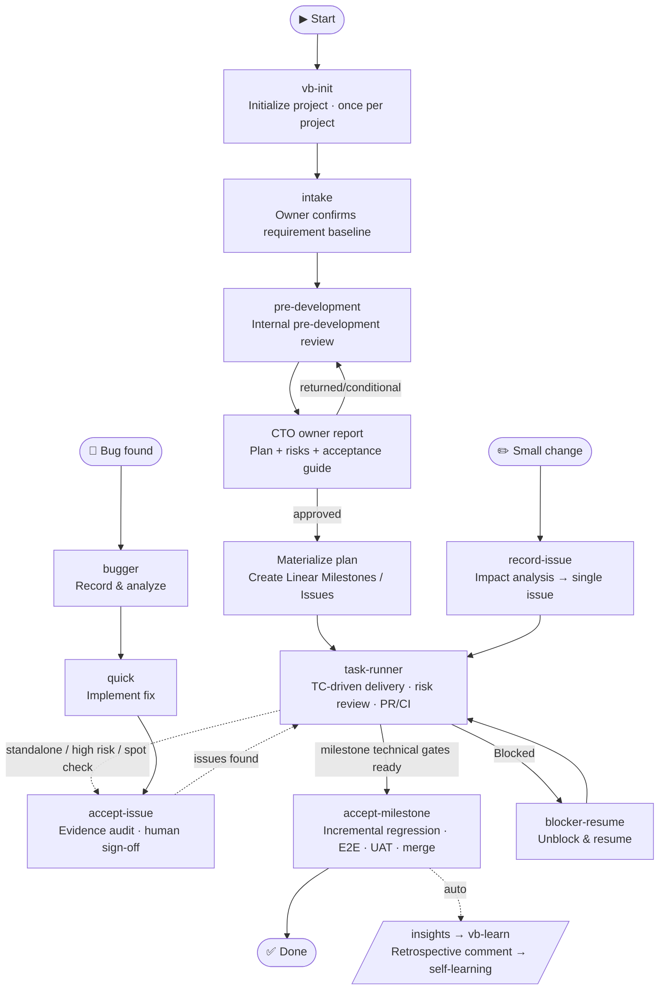

# VibeRig

VibeRig is a multi-platform AI coding plugin for Linear-native software delivery. It turns rough requirements into local Docs as Code contracts, maps accepted planning output into Linear issues, routes execution through suitable subagents, and records proof, acceptance, and learning back into Linear.

Chinese documentation: [README.zh-CN.md](./README.zh-CN.md)



## Contents

1. [Prerequisites](#prerequisites)
2. [Install](#install)
3. [Manual Usage](#manual-usage)
4. [Built-In Skills And Subagents](#built-in-skills-and-subagents)
5. [Workflow](#workflow)

## Prerequisites

- An AI coding host with plugin support: [Codex](docs/install/en/codex.md), [Claude Code](docs/install/en/claude.md), or [Cursor](docs/install/en/cursor.md).
- A Linear workspace VibeRig can connect to. No separate account setup is needed ahead of time — VibeRig ships its own Linear MCP server config (`.mcp.json`) pointing at `https://mcp.linear.app/mcp`, and `vb-init` checks login status before registering a Linear project, triggering the OAuth flow on the spot if you aren't logged in yet.

## Install

Pick your platform and copy the install guide to your AI assistant:

| Platform | Install guide |
|---|---|
| Codex | [docs/install/en/codex.md](docs/install/en/codex.md) |
| Claude Code | [docs/install/en/claude.md](docs/install/en/claude.md) |
| Cursor | [docs/install/en/cursor.md](docs/install/en/cursor.md) |

Chinese guides: [codex](docs/install/zh-CN/codex.zh-CN.md) · [claude](docs/install/zh-CN/claude.zh-CN.md) · [cursor](docs/install/zh-CN/cursor.zh-CN.md)

## Manual Usage

Use VibeRig by asking Codex to run the relevant skill in a target project.

Typical prompts:

- `Use vb-init for this repo.`
- `Use intake to handle this requirement: ...` (it automatically runs the pre-development review after baseline confirmation)
- `Continue pre-development for payment-refactor.` (only to resume or address returned items)
- `Use task-runner for milestone ms-1 (or Linear issue ABC-123).`
- `Use accept-issue for ABC-123.` (standalone, high risk, or spot check) / `Use accept-milestone for ms-1.`
- `Use record-issue for this small change: ...`

Project-local files created or used by VibeRig:

```text
.vibeRig/
  project.yaml
  prd/
    <prd-id>/prd.md
    archive/
  requirements/
    <req-id>/
      requirement.yaml   # status + PRD decision + owner approval + milestones
      intake.md
      prd.md              # only when a new PRD is automatically required
      research/<domain>.md
      research/feasibility.md
      architecture.md
      acceptance.json
      acceptance-guide.md
      test-plan.md
      test-cases.json
      risk-register.json
      release-plan.md
      delivery-plan.md
      traceability.json
      pre-development-review.md
      linear.yaml
    archive/
.worktrees/
  milestone-<req-id>-<n>/
```

Linear is the task and status surface. Local requirement documents are contracts, not issues.

## Built-In Skills And Subagents

### Core Workflow Skills

- `vb-init`: initializes `.vibeRig/project.yaml`, `.vibeRig/prd/`, `.vibeRig/requirements/` (with archives), `.worktrees/`, Linear container-project registration, gate policy, PR policy, default routing, and builds the project agent team.
- `intake`: the only default human-facing entry for new requirements; runs a product-manager interview, obtains one owner baseline confirmation, then automatically starts pre-development.
- `pre-development`: orchestrates PRD decisions, domain research, CTO architecture red/white-team review, acceptance and testing, risk/release planning, delivery drafts, and DoR into one owner approval package.
- `prd-brainstorm`: either interviews for a standalone product PRD or synthesizes one internally from confirmed Intake context without repeating owner questions.
- `tech-research`: internal domain research protocol for frontend, backend, data, security, operations, QA, and other routed subagents; the main agent owns synthesis and files.
- `architecture-design`: CTO synthesis of domain evidence, including independent red-team attacks, white-team responses, and final decisions.
- `define-acceptance`: creates structured ACs, engineering checks, and an owner-executable `acceptance-guide.md`; approved with the full package.
- `split-milestones`: drafts milestones by independently acceptable user value before approval, then materializes the approved plan into Linear.
- `split-issues`: drafts the full issue landscape before approval, then materializes only the next milestone with Rolling Wave vertical slices; no assignee or subagent.
- `record-issue`: fast lane for small changes — impact analysis → single issue; escalates to the full pipeline when impact is large.
- `task-runner`: executes a milestone or issue with AC/TC-driven TDD, targeted verification, risk-routed review, current-commit CI, the correct PR path, and per-TC Proof Packets.
- `accept-issue`: evidence audit and human sign-off for standalone, high-risk, or explicitly sampled issues; reuses valid current-commit evidence and runs only missing, invalid, or manual checks. Ordinary milestone issues do not require individual sign-off.
- `accept-milestone`: syncs latest main, aggregates Issue Evidence, runs milestone regression, E2E, and owner UAT, then reviews and merges the standing PR and completes state, learning, and archival.
- `insights`: generates post-acceptance retrospectives and writes them as Linear comments (input for `vb-learn`).
- `blocker-resume`: inspects blocked Linear work and either resumes through task execution or asks for the missing decision.

### Implementation Skills

- `agent-sop`: risk-routes implementation, targeted verification, and reviewers without always invoking Test QA, Final QA, and every specialist review.
- `bugger`: records a bug in Linear, analyzes root cause, and proposes a fix approach for user confirmation. Use before `quick`.
- `quick`: implements a small, already-confirmed single-issue task (a confirmed bug fix or a tiny scoped change) in place, no branch/worktree, commits, records evidence in Linear, and hands off to `accept-issue`.
- `merge-issue`: merges a standalone issue's own PR to main after `accept-issue` has passed, for issues that aren't tied to any milestone.
- `incremental-implementation`: delivers changes in thin vertical slices. Use for any change touching more than one file.
- `source-driven-development`: grounds every implementation decision in official documentation for version-sensitive framework code.
- `test-driven-development`: drives implementation and bug fixes with tests (Prove-It Pattern).

### Design and Quality Skills

- `api-and-interface-design`: guides stable REST/GraphQL endpoint and TypeScript contract design.
- `browser-testing-with-devtools`: debugs and tests frontend features using Chrome DevTools MCP tools.
- `code-simplification`: reduces complexity and improves readability of existing code without changing behavior.
- `documentation-and-adrs`: creates or updates Architecture Decision Records and API docs.
- `security-and-hardening`: hardens code against vulnerabilities for untrusted input, authentication, and external integrations.
- `uiux-design`: routes UI design, redesign, critique, accessibility review, handoff, and design-to-code workflows.

### Skill Curation Skills

- `skillos-lite`: proposes SkillOS-style `insert`, `update`, `deprecate`, or `noop` skill curation operations from accepted work; confirmed changes still go through `skill-builder`.
- `skill-builder`: creates or updates Codex skills with reliable trigger descriptions, concise SKILL.md workflows, and validation checklists.

### Routing and Agent Skills

- `subagent-routing`: chooses and briefs specialized subagents while keeping Linear updates and final workflow decisions in the main agent.
- `agent-creator`: helps create or update project-local Codex custom subagents.

### Cross-Agent Utility Skills

- `use-claude`: calls the local Claude CLI from any agent session.
- `use-codex`: calls Codex via its MCP server tools from any agent session.
- `use-gemini`: calls Gemini via MCP tools for web search or large-context analysis from any agent session.

### Bundled Subagents

- `researcher`: source-grounded repository, documentation, web, and feasibility research.
- `frontend_architect`, `backend_architect`, and `data_architect`: focused pre-development architecture research for their respective domains.
- `security_auditor`: security design or code review through `design_threat_model` and `code_security_review` modes.
- `reliability_engineer`: SRE, performance, release, observability, smoke, and rollback analysis.
- `qa`: test design or independent coverage review through `test_design` and `test_review`; it does not write tests.
- `uiux_design`: UI/UX research, UIFLOW/DESIGN/Pencil work, and component handoff, with report-only pre-development mode.
- `architecture_red_team`: independently attacks one architecture, failure-mode, security, or delivery focus.
- `implementation`: bounded code implementation from a minimal Task Brief and related AC/TC.
- `test_engineer`: implements approved automated TC and returns RED/GREEN evidence.
- `code_review`: independent correctness, maintainability, architecture-contract, and evidence review.
- `integrator`: cross-Issue dependency, contract, current-commit evidence, and milestone integration-readiness review.

VibeRig dynamically selects the minimum necessary team through `subagent-routing`; unaffected specialists are not invoked. Project-specific payment, billing, compliance, framework, or domain roles remain the responsibility of `update-team`. Subagents must not update Linear, write Proof Packets, or make final acceptance decisions. Post-acceptance learning runs directly through `insights → vb-learn`; there is no separate `self_learner` agent.

## Workflow

1. Initialize the project with `vb-init` (container Linear Project, `.vibeRig/prd/` and `.vibeRig/requirements/` with archives).
2. The owner only needs to invoke `intake`. A product-manager interview completes goals, actors, flows, business rules, scope, constraints, success metrics, and acceptance concerns; the owner confirms the consolidated requirement baseline once.
3. `intake` automatically enters `pre-development`: it decides whether a PRD is needed, routes domain subagents for feasibility research, has the CTO synthesize architecture through red/white-team review, and produces acceptance criteria, an owner verification guide, tests, risk/release plans, traceability, and local Milestone/Issue drafts. No Linear planning objects are created yet.
4. The CTO reports once through `pre-development-review.md`, covering the recommendation, cost/timeline, risks, delivery plan, and executable owner acceptance steps. Approval materializes Linear Milestones and only the next milestone's Issues; a return reruns only affected stages.
5. Execute with `task-runner <milestone-id or issue-id>`, human-invoked only: one persistent integration branch (`milestone/<req-id>-<n>`) per milestone; sequential work reuses the invocation worktree, while concurrent issues alone receive disposable worktrees. Task Briefs contain only related ACs, TCs, contracts, and risks. Every issue produces a commit, the proper PR/standing-PR update, and per-TC evidence:
   - concurrent milestone issues open a PR into the integration branch, merged by `task-runner` only after quality gates and current-commit CI pass;
   - issues run sequentially inside the milestone loop keep updating the one standing integration-branch → main PR, merged only by `accept-milestone`;
   - a standalone issue with no milestone opens its own PR straight to main, merged by `merge-issue` after `accept-issue` passes. When all issues in a milestone finish, the milestone becomes `pending_acceptance`.
6. Ordinary milestone issues flow directly from valid technical Evidence to `accept-milestone`; use `accept-issue` only for standalone, high-risk, or sampled work. Milestone acceptance runs latest-main sync → current-commit CI → milestone TCs/incremental regression/E2E → owner UAT → explicit approval → standing-PR merge → state/learning/archival, without rerunning every issue's already-valid unit evidence.
7. For small changes use `record-issue` (impact analysis → single issue). For bugs use `bugger` → `quick` → `accept-issue`.
