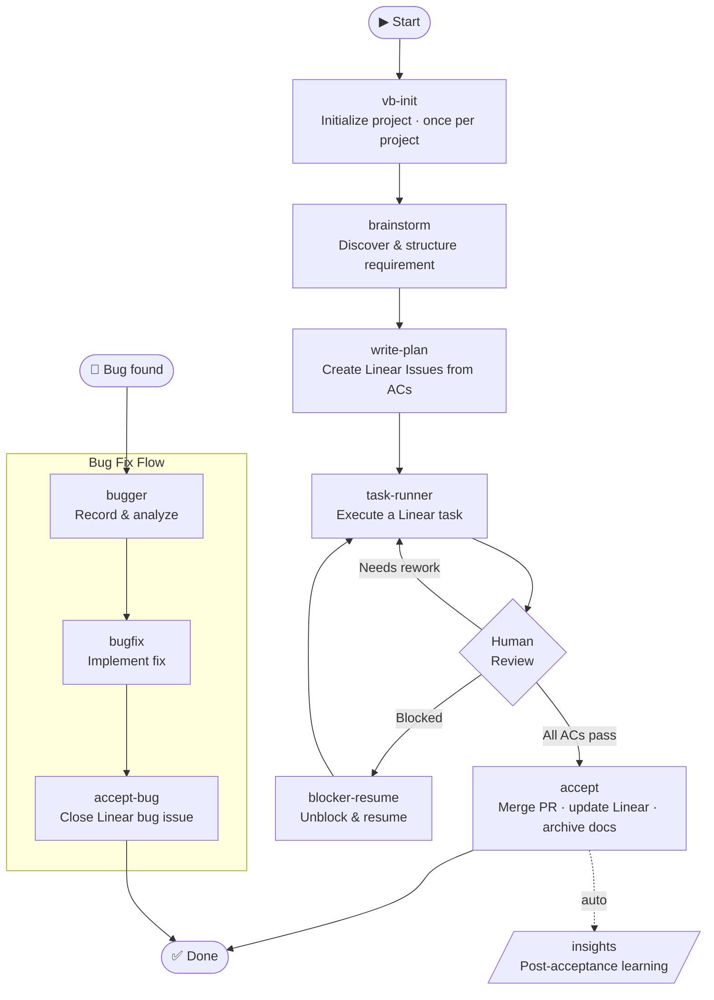

# VibeRig

VibeRig is a Codex plugin for Linear-native software delivery. It turns rough requirements into local Docs as Code contracts, maps accepted planning output into Linear issues, routes execution through suitable Codex subagents, and records proof, acceptance, and learning back into Linear.

Chinese documentation: [README.zh-CN.md](./README.zh-CN.md)



## Contents

1. [Prerequisites](#prerequisites)
2. [Install](#install)
3. [Update](#update)
4. [Manual Usage](#manual-usage)
5. [Built-In Skills And Subagents](#built-in-skills-and-subagents)
6. [Workflow](#workflow)

## Prerequisites

- Cursor with plugin support enabled. See [Cursor Plugins documentation](https://cursor.com/cn/docs/plugins) for details.
- Linear plugin installed and authenticated. VibeRig uses Linear to create and update projects, documents, issues, comments, and status transitions.

## Install

Clone the repository into Cursor's local plugin directory:

```sh
git clone --branch cursor https://github.com/JsonLee12138/vibeRig.git ~/.cursor/plugins/local/vibe-rig
```

Restart Cursor after cloning so the plugin and its skills are loaded.

## Update

Pull the latest changes in the plugin directory:

```sh
cd ~/.cursor/plugins/local/vibe-rig
git pull origin cursor
```

Restart Cursor after updating so newly added skills are loaded.

## Manual Usage

Use VibeRig by asking Codex to run the relevant skill in a target project.

Typical prompts:

- `Use vb-init for this repo.`
- `Use brainstorm for this requirement: ...`
- `Use write-plan for .vibeRig/requirements/<requirement-id>.`
- `Use task-runner for Linear issue ABC-123.`
- `Use accept: all ACs are accepted for ABC-123.`
- `Use accept-bug for Linear bug issue ABC-456.`
- `Use insights for the accepted Linear work.`

Project-local files created or used by VibeRig:

```text
.vibeRig/
  project.yaml
  requirements/
.worktrees/
  <issue-key>-<short-slug>/
```

Linear is the task and status surface. Local requirement documents are contracts, not issues.

## Built-In Skills And Subagents

### Core Workflow Skills

- `vb-init`: initializes `.vibeRig/project.yaml`, `.vibeRig/requirements/`, `.worktrees/`, Linear project registration, gate policy, PR policy, default routing, and builds the project agent team.
- `brainstorm`: turns a rough idea into local Docs as Code requirement contracts.
- `write-plan`: creates or updates Linear issues and sub-issues from local acceptance criteria.
- `task-runner`: executes a Linear task in the current Codex session, delegates to a suitable subagent, validates, submits a PR, and writes a Linear proof packet.
- `accept`: records explicit human acceptance or rejection for a requirement-backed Linear issue with a PR. On full acceptance it merges the PR, updates Linear final status, runs insights with any confirmed skill updates through `skill-builder`, archives accepted requirement docs, and cleans the task worktree when safe.
- `accept-bug`: records explicit human acceptance for a bug fix tracked in Linear. No PR required — the fix is already committed by `bugfix`. Updates Linear status to Done.
- `insights`: generates conservative post-acceptance learning candidates and routes skill-library curation proposals.
- `blocker-resume`: inspects blocked Linear work and either resumes through task execution or asks for the missing decision.

### Implementation Skills

- `agent-sop`: runs staged implementation, validation, QA, and rework orchestration.
- `bugger`: records a bug in Linear, analyzes root cause, and proposes a fix approach for user confirmation. Use before `bugfix`.
- `bugfix`: implements a confirmed bug fix, commits, records evidence in Linear, and hands off to `accept-bug`.
- `incremental-implementation`: delivers changes in thin vertical slices. Use for any change touching more than one file.
- `source-driven-development`: grounds every implementation decision in official documentation for version-sensitive framework code.
- `test-driven-development`: drives implementation and bug fixes with tests (Prove-It Pattern).

### Design and Quality Skills

- `api-and-interface-design`: guides stable REST/GraphQL endpoint and TypeScript contract design.
- `browser-testing-with-devtools`: debugs and tests frontend features using Chrome DevTools MCP tools.
- `code-simplification`: reduces complexity and improves readability of existing code without changing behavior.
- `documentation-and-adrs`: creates or updates Architecture Decision Records and API docs.
- `security-and-hardening`: hardens code against vulnerabilities for untrusted input, authentication, and external integrations.
- `uiux-design`: routes UI design, redesign, critique, accessibility review, handoff, and design-to-code workflows.

### Skill Curation Skills

- `skillos-lite`: proposes SkillOS-style `insert`, `update`, `deprecate`, or `noop` skill curation operations from accepted work; confirmed changes still go through `skill-builder`.
- `skill-builder`: creates or updates Codex skills with reliable trigger descriptions, concise SKILL.md workflows, and validation checklists.

### Routing and Agent Skills

- `subagent-routing`: chooses and briefs specialized subagents while keeping Linear updates and final workflow decisions in the main agent.
- `agent-creator`: helps create or update project-local Codex custom subagents.

### Cross-Agent Utility Skills

- `use-claude`: calls the local Claude CLI from any agent session.
- `use-codex`: calls Codex via its MCP server tools from any agent session.
- `use-gemini`: calls Gemini via MCP tools for web search or large-context analysis from any agent session.

### Bundled Subagents

- `code_review`: code review across correctness, readability, architecture, security, and performance.
- `gemini_research`: Gemini-backed deep web search and large-context repository analysis.
- `integrator`: coordinates multi-task work, dependency status, branch/PR readiness, and merge risks.
- `qa`: acceptance review, test strategy, edge cases, and validation evidence.
- `researcher`: technical research across local code, documentation, and implementation constraints.
- `security_auditor`: security-focused code review with vulnerability detection and threat modeling.
- `self_learner`: extracts lessons learned and reinforces successful patterns after accept/handoff.
- `test_engineer`: test strategy, test writing, and coverage analysis.
- `uiux_design`: produces or validates UIFLOW.md and DESIGN.md, and prepares component-ready implementation handoff.

Specialized implementation, QA, review, research, or integration subagents are project/user agents. VibeRig routes to them through `subagent-routing`; subagents must not update Linear or make final acceptance decisions.

## Workflow

1. Initialize the project with `vb-init`.
2. Discover and structure a requirement with `brainstorm`. The skill produces a local Docs as Code contract under `.vibeRig/requirements/<requirement-id>/`:
   - `brief.md` — requirement title and background
   - `research.md` — optional technical research notes
   - `contract.json` / `contract.schema.json` — structured feature contract
   - `architecture.md` — design decisions and component boundaries
   - `acceptance.json` / `acceptance.md` — acceptance criteria
   - `validation.md` — validation approach and edge cases
   - `diagrams/main-flow.mmd`, `diagrams/states.mmd` — optional Mermaid diagrams

   Review and adjust these files before moving to the next step.
3. Convert accepted planning output into Linear issues with `write-plan`.
4. Execute a Linear issue with `task-runner`; VibeRig defaults to a project-local `.worktrees/<issue-key>-<short-slug>/` worktree, validates the result, submits or updates a PR, writes the proof packet to Linear, and moves the issue to a human-acceptance/review state.
5. Manually call `accept` after reviewing the work. Full acceptance merges the PR into the target base branch, updates the final Linear status, runs post-acceptance insights and SkillOS-lite curation, applies any confirmed skill updates through `skill-builder`, archives the accepted requirement docs, and then removes the task worktree when safe.
6. For bugs, use `bugger` to analyze and record the bug in Linear, then `bugfix` to implement the fix, then `accept-bug` to close it out.
7. Apply proposed skill, workflow, or curation updates only when they are explicitly confirmed or pre-authorized in the acceptance request.
