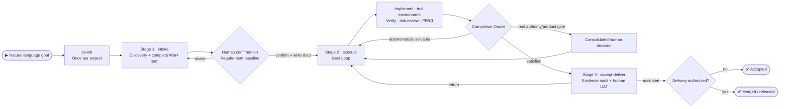

# VibeRig

VibeRig is a goal-driven software-development harness. It uses three human stages—requirement discovery and confirmation, an autonomous Execute Goal Loop, and evidence-based human acceptance—to turn natural-language goals into Docs as Code contracts, verified changes, and traceable delivery without making users orchestrate internal skills.

Chinese documentation: [README.zh-CN.md](./README.zh-CN.md)



## Contents

1. [Prerequisites](#prerequisites)
2. [Install](#install)
3. [Manual Usage](#manual-usage)
4. [Built-In Skills And Subagents](#built-in-skills-and-subagents)
5. [Workflow](#workflow)

## Prerequisites

- An AI coding host with plugin support: [Codex](docs/install/en/codex.md), [Claude Code](docs/install/en/claude.md), or [Cursor](docs/install/en/cursor.md).
- A Linear workspace VibeRig can connect to. No separate account setup is needed ahead of time — VibeRig ships its own Linear MCP server config (`.mcp.json`) pointing at `https://mcp.linear.app/mcp`, and `vb-init` checks login status before registering a Linear project, triggering the OAuth flow on the spot if you aren't logged in yet.

## Install

Pick your platform and copy the install guide to your AI assistant:

| Platform | Install guide |
|---|---|
| Codex | [docs/install/en/codex.md](docs/install/en/codex.md) |
| Claude Code | [docs/install/en/claude.md](docs/install/en/claude.md) |
| Cursor | [docs/install/en/cursor.md](docs/install/en/cursor.md) |

Chinese guides: [codex](docs/install/zh-CN/codex.zh-CN.md) · [claude](docs/install/zh-CN/claude.zh-CN.md) · [cursor](docs/install/zh-CN/cursor.zh-CN.md)

## Manual Usage

Describe the desired outcome in the target project. VibeRig infers the stage; explicit skill names are mainly for initialization, knowledge queries, and maintenance.

Typical prompts:

- `Use vb-init for this repo.`
- `Login sometimes times out. Find the real cause, confirm the direction with me, fix it, and take it to a PR.`
- `I want team-level permissions. First help me discover the complete requirement.`
- `Continue ABC-123 and keep repairing and verifying until its goal is reached.`
- `Help me accept ABC-123 and give me exact UAT steps.`
- `Learn from ABC-123 and save the experience to the knowledge base.` (uses `vb-wiki`)
- `Turn this confirmed capability into a tool skill.` (uses `vb-learn` and requires explicit authority)

Project-local files created or used by VibeRig:

```text
.vibeRig/
  project.yaml
  prd/
    <prd-id>/prd.md
    archive/
  requirements/
    <req-id>/
      requirement.yaml   # status + PRD decision + owner approval + milestones
      intake.md
      work-item.json      # problem, causal model, proposal, impact, scope, acceptance, tests, target
      prd.md              # only when a new PRD is automatically required
      research/<domain>.md
      research/feasibility.md
      architecture.md
      acceptance.json
      acceptance-guide.md
      test-plan.md
      test-cases.json
      risk-register.json
      release-plan.md
      delivery-plan.md
      traceability.json
      pre-development-review.md
      linear.yaml
    archive/
.worktrees/
  milestone-<req-id>-<n>/
```

Linear is the task and status surface. Local requirement documents are contracts, not issues.

## Built-In Skills And Subagents

### Core Workflow Skills

- `vb-init`: initializes `.vibeRig/project.yaml`, `.vibeRig/prd/`, `.vibeRig/requirements/` (with archives), `.worktrees/`, Linear container-project registration, gate policy, PR policy, default routing, and builds the project agent team.
- `intake`: unified discovery for features, bugs, small changes, debt, and risks; inspects current reality, builds a complete Work Item, and writes it only after one human confirmation.
- `execute`: holds the Goal Contract and continuously implements, resolves test environments, verifies, reviews, and reaches the technical delivery target.
- `accept-deliver`: audits Evidence, guides human UAT, records explicit acceptance, and performs separately authorized merge or release actions.
- `pre-development`: internal L2/L3 capability for research, architecture, AC/TC, risk, and delivery planning; it does not add another human approval stage.
- `prd-brainstorm`: either interviews for a standalone product PRD or synthesizes one internally from confirmed Intake context without repeating owner questions.
- `tech-research`: internal domain research protocol for frontend, backend, data, security, operations, QA, and other routed subagents; the main agent owns synthesis and files.
- `architecture-design`: CTO synthesis of domain evidence, including independent red-team attacks, white-team responses, and final decisions.
- `define-acceptance`: creates structured ACs, engineering checks, and an owner-executable `acceptance-guide.md`; approved with the full package.
- `split-milestones`: drafts milestones by independently acceptable user value before approval, then materializes the approved plan into Linear.
- `split-issues`: drafts the full issue landscape before approval, then materializes only the next milestone with Rolling Wave vertical slices; no assignee or subagent.
- `record-issue` and `bugger`: legacy compatibility surfaces that normalize into `intake`.
- `quick`, `task-runner`, and `blocker-resume`: legacy execution surfaces that restore or create a Goal Contract and enter `execute`.
- `accept-issue`, `accept-milestone`, and `merge-issue`: legacy acceptance/delivery surfaces that select an `accept-deliver` scope or mode.
- `insights`: produces an evidence-backed retrospective and novelty decision; accepted work with no reusable knowledge ends as `zero-atoms`.
- `vb-wiki`: supports explicit project-knowledge queries; writes are triggered by novelty, repeated defects, milestones, or batch thresholds instead of every acceptance.

### Implementation Skills

- `agent-sop`: internal `execute` protocol for risk-adaptive implementation, verification, and review; L0 does not require a subagent, while L2/L3 add independent checks as needed.
- `incremental-implementation`: delivers changes in thin vertical slices. Use for any change touching more than one file.
- `source-driven-development`: grounds every implementation decision in official documentation for version-sensitive framework code.
- `test-driven-development`: drives implementation and bug fixes with tests (Prove-It Pattern).

### Design and Quality Skills

- `api-and-interface-design`: guides stable REST/GraphQL endpoint and TypeScript contract design.
- `browser-testing-with-devtools`: debugs and tests frontend features using Chrome DevTools MCP tools.
- `code-simplification`: reduces complexity and improves readability of existing code without changing behavior.
- `documentation-and-adrs`: creates or updates Architecture Decision Records and API docs.
- `security-and-hardening`: hardens code against vulnerabilities for untrusted input, authentication, and external integrations.
- `uiux-design`: routes UI design, redesign, critique, accessibility review, handoff, and design-to-code workflows.

### Skill Curation Skills

- `vb-learn`: creates or refines exactly one global tool skill only when the user explicitly requests it or approves one `vb-wiki` promotion proposal.
- `skillos-lite`: proposes `insert`, `update`, `deprecate`, or `noop` operations only when the user explicitly requests skill-library curation; it is not part of default post-acceptance learning.
- `skill-builder`: creates or updates Codex skills with reliable trigger descriptions, concise SKILL.md workflows, and validation checklists.

### Routing and Agent Skills

- `subagent-routing`: chooses and briefs specialized subagents while keeping Linear updates and final workflow decisions in the main agent.
- `agent-creator`: helps create or update project-local Codex custom subagents.

### Cross-Agent Utility Skills

- `use-claude`: calls the local Claude CLI from any agent session.
- `use-codex`: calls Codex via its MCP server tools from any agent session.
- `use-gemini`: calls Gemini via MCP tools for web search or large-context analysis from any agent session.

### Bundled Subagents

- `researcher`: source-grounded repository, documentation, web, and feasibility research.
- `frontend_architect`, `backend_architect`, and `data_architect`: focused pre-development architecture research for their respective domains.
- `security_auditor`: security design or code review through `design_threat_model` and `code_security_review` modes.
- `reliability_engineer`: SRE, performance, release, observability, smoke, and rollback analysis.
- `qa`: test design or independent coverage review through `test_design` and `test_review`; it does not write tests.
- `uiux_design`: UI/UX research, UIFLOW/DESIGN/Pencil work, and component handoff, with report-only pre-development mode.
- `architecture_red_team`: independently attacks one architecture, failure-mode, security, or delivery focus.
- `implementation`: bounded code implementation from a minimal Task Brief and related AC/TC.
- `test_engineer`: implements approved automated TC and returns RED/GREEN evidence.
- `code_review`: independent correctness, maintainability, architecture-contract, and evidence review.
- `integrator`: cross-Issue dependency, contract, current-commit evidence, and milestone integration-readiness review.

VibeRig uses `subagent-routing` to choose the minimum capability set first, then select model/reasoning from provider-, task-family-, risk-, and accepted-observation evidence; L0 defaults to no subagent. Reversible low-risk work with a deterministic oracle may use at most 10% reproducible challenger exploration, while acceptance, security, merge, release, and other protected paths exploit only. Subagents must not update Linear, write Proof Packets, or make final acceptance decisions. After acceptance, `insights` retains model/agent route observations and comparable-group analysis; `insights → vb-wiki` remains novelty- or batch-gated, and `vb-learn` still requires separate user authority.

## Workflow

1. Initialize once with `vb-init`; local harness operation does not depend on Linear being available.
2. Describe the goal naturally. `intake` inspects the repository and existing records, discovers a complete Work Item, and asks for one requirement-baseline confirmation before writing `intake.md`, `work-item.json`, and `requirement.yaml`.
3. L0/L1 work enters `execute` directly. L2/L3 work internally uses `pre-development` for technical planning without creating a new human approval stage.
4. `execute` loops through Understand → Plan → Implement → Verify → Review → Repair. Missing test configuration is resolved with fixtures, fakes, stubs, ephemeral dependencies, or sandboxes. It pauses only for product decisions, authority boundaries, non-simulatable real environments, or three no-progress attempts.
5. Once the Completion Oracle is satisfied, `accept-deliver` audits current-commit Evidence and presents the shortest exact human UAT. Rejected work returns to the same Goal Loop.
6. Explicit acceptance creates an acceptance record. Commit, PR, merge, and release actions follow the requested target and separate authority; merge or release is never inferred from acceptance alone.
7. Evidence is retained by default. Accepted subagent/model route observations enter the retrospective; `update-team` changes derived routing only with at least five comparable samples, no quality or Critical-safety regression, and a material cost or latency gain. Knowledge compilation and tool-skill promotion keep their separate novelty and explicit-authority gates.
