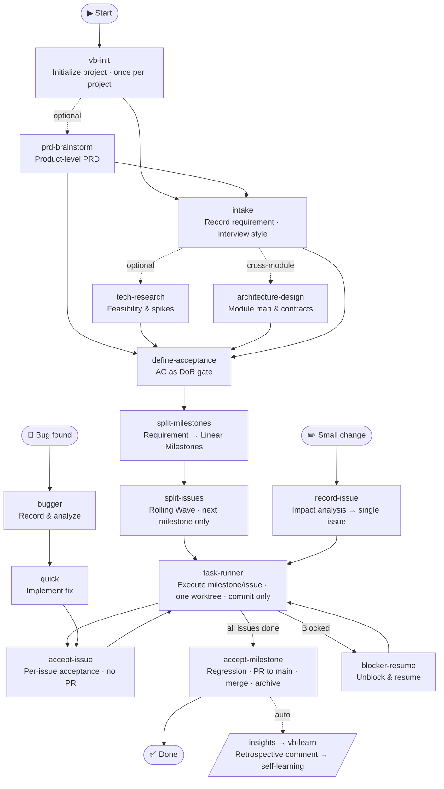

# VibeRig

VibeRig is a multi-platform AI coding plugin for Linear-native software delivery. It turns rough requirements into local Docs as Code contracts, maps accepted planning output into Linear issues, routes execution through suitable subagents, and records proof, acceptance, and learning back into Linear.

Chinese documentation: [README.zh-CN.md](./README.zh-CN.md)



## Contents

1. [Prerequisites](#prerequisites)
2. [Install](#install)
3. [Manual Usage](#manual-usage)
4. [Built-In Skills And Subagents](#built-in-skills-and-subagents)
5. [Workflow](#workflow)

## Prerequisites

- An AI coding host with plugin support: [Codex](docs/install/en/codex.md), [Claude Code](docs/install/en/claude.md), or [Cursor](docs/install/en/cursor.md).
- A Linear workspace VibeRig can connect to. No separate account setup is needed ahead of time — VibeRig ships its own Linear MCP server config (`.mcp.json`) pointing at `https://mcp.linear.app/mcp`, and `vb-init` checks login status before registering a Linear project, triggering the OAuth flow on the spot if you aren't logged in yet.

## Install

Pick your platform and copy the install guide to your AI assistant:

| Platform | Install guide |
|---|---|
| Codex | [docs/install/en/codex.md](docs/install/en/codex.md) |
| Claude Code | [docs/install/en/claude.md](docs/install/en/claude.md) |
| Cursor | [docs/install/en/cursor.md](docs/install/en/cursor.md) |

Chinese guides: [codex](docs/install/zh-CN/codex.zh-CN.md) · [claude](docs/install/zh-CN/claude.zh-CN.md) · [cursor](docs/install/zh-CN/cursor.zh-CN.md)

## Manual Usage

Use VibeRig by asking Codex to run the relevant skill in a target project.

Typical prompts:

- `Use vb-init for this repo.`
- `Use intake to record this requirement: ...`
- `Use define-acceptance for req-0001.`
- `Use split-milestones for req-0001.` / `Use split-issues for ms-1.`
- `Use task-runner for milestone ms-1 (or Linear issue ABC-123).`
- `Use accept-issue for ABC-123.` / `Use accept-milestone for ms-1.`
- `Use record-issue for this small change: ...`

Project-local files created or used by VibeRig:

```text
.vibeRig/
  project.yaml
  prd/
    <prd-id>/prd.md
    archive/
  requirements/
    <req-id>/
      requirement.yaml   # requirement status + prd link + milestone list (4-state)
      intake.md
      research/
      architecture.md
      acceptance.json
      linear.yaml
    archive/
.worktrees/
  milestone-<req-id>-<n>/
```

Linear is the task and status surface. Local requirement documents are contracts, not issues.

## Built-In Skills And Subagents

### Core Workflow Skills

- `vb-init`: initializes `.vibeRig/project.yaml`, `.vibeRig/prd/`, `.vibeRig/requirements/` (with archives), `.worktrees/`, Linear container-project registration, gate policy, PR policy, default routing, and builds the project agent team.
- `intake`: records a requirement interview-style; produces `intake.md` + `requirement.yaml`; syncs a Linear Document only (no Milestone/Issue).
- `prd-brainstorm`: product-level PRD via interview (scope / non-goals / user stories / priority); Document sync only.
- `tech-research`: user-triggered feasibility research with concurrent per-domain subagent discussion; produces `research/feasibility.md` + spikes.
- `architecture-design`: module boundaries, interface contracts, and data flow with mandatory adversarial review; its module map decides milestone boundaries.
- `define-acceptance`: drafts ACs, confirms each with the user, writes `acceptance.json` (schema-validated). This is the DoR gate for splitting.
- `split-milestones`: first skill to write Linear structure — requirement → Milestones (big-tech 4-criteria), backfills `requirement.yaml`.
- `split-issues`: Rolling Wave — splits only the next milestone into 1–2-day vertically sliced issues; creates issues without assignee or subagent.
- `record-issue`: fast lane for small changes — impact analysis → single issue; escalates to the full pipeline when impact is large.
- `task-runner`: executes a milestone (all issues) or a single issue; one worktree + one integration branch per milestone; routes subagents at execution time; commit-only (PR happens in accept-milestone).
- `accept-issue`: per-issue acceptance — verify ACs, commit, status, step-by-step acceptance comment; then insights retrospective + vb-learn.
- `accept-milestone`: milestone acceptance — full regression, rebase on latest main, PR to main and merge, Linear records, `requirement.yaml` state, archival, retrospective + self-learning.
- `insights`: generates post-acceptance retrospectives and writes them as Linear comments (input for `vb-learn`).
- `blocker-resume`: inspects blocked Linear work and either resumes through task execution or asks for the missing decision.

### Implementation Skills

- `agent-sop`: runs staged implementation, validation, QA, and rework orchestration.
- `bugger`: records a bug in Linear, analyzes root cause, and proposes a fix approach for user confirmation. Use before `quick`.
- `quick`: implements a small, already-confirmed single-issue task (a confirmed bug fix or a tiny scoped change) in place, no branch/worktree, commits, records evidence in Linear, and hands off to `accept-issue`.
- `merge-issue`: merges a standalone issue's own PR to main after `accept-issue` has passed, for issues that aren't tied to any milestone.
- `incremental-implementation`: delivers changes in thin vertical slices. Use for any change touching more than one file.
- `source-driven-development`: grounds every implementation decision in official documentation for version-sensitive framework code.
- `test-driven-development`: drives implementation and bug fixes with tests (Prove-It Pattern).

### Design and Quality Skills

- `api-and-interface-design`: guides stable REST/GraphQL endpoint and TypeScript contract design.
- `browser-testing-with-devtools`: debugs and tests frontend features using Chrome DevTools MCP tools.
- `code-simplification`: reduces complexity and improves readability of existing code without changing behavior.
- `documentation-and-adrs`: creates or updates Architecture Decision Records and API docs.
- `security-and-hardening`: hardens code against vulnerabilities for untrusted input, authentication, and external integrations.
- `uiux-design`: routes UI design, redesign, critique, accessibility review, handoff, and design-to-code workflows.

### Skill Curation Skills

- `skillos-lite`: proposes SkillOS-style `insert`, `update`, `deprecate`, or `noop` skill curation operations from accepted work; confirmed changes still go through `skill-builder`.
- `skill-builder`: creates or updates Codex skills with reliable trigger descriptions, concise SKILL.md workflows, and validation checklists.

### Routing and Agent Skills

- `subagent-routing`: chooses and briefs specialized subagents while keeping Linear updates and final workflow decisions in the main agent.
- `agent-creator`: helps create or update project-local Codex custom subagents.

### Cross-Agent Utility Skills

- `use-claude`: calls the local Claude CLI from any agent session.
- `use-codex`: calls Codex via its MCP server tools from any agent session.
- `use-gemini`: calls Gemini via MCP tools for web search or large-context analysis from any agent session.

### Bundled Subagents

- `code_review`: code review across correctness, readability, architecture, security, and performance.
- `integrator`: coordinates multi-task work, dependency status, branch/PR readiness, and merge risks.
- `qa`: acceptance review, test strategy, edge cases, and validation evidence.
- `researcher`: deep web search, large-context repository/document analysis, and source-grounded technical research.
- `security_auditor`: security-focused code review with vulnerability detection and threat modeling.
- `self_learner`: extracts lessons learned and reinforces successful patterns after accept/handoff.
- `test_engineer`: test strategy, test writing, and coverage analysis.
- `uiux_design`: produces or validates UIFLOW.md and DESIGN.md, and prepares component-ready implementation handoff.

Specialized implementation, QA, review, research, or integration subagents are project/user agents. VibeRig routes to them through `subagent-routing`; subagents must not update Linear or make final acceptance decisions.

## Workflow

1. Initialize the project with `vb-init` (container Linear Project, `.vibeRig/prd/` and `.vibeRig/requirements/` with archives).
2. Optionally run `prd-brainstorm` for product-level scope (not required for every requirement). Then record the requirement interview-style with `intake` → `.vibeRig/requirements/<req-id>/intake.md` + `requirement.yaml`. Optionally add `tech-research` (feasibility) and `architecture-design` (mandatory for cross-module work — its module map decides milestone boundaries). Exploration skills sync Linear Documents only; no Milestones or Issues yet.
3. Define acceptance criteria with `define-acceptance` — each AC confirmed with you before it is written to `acceptance.json`. This is the DoR gate.
4. Split the requirement into Linear Milestones with `split-milestones` (big-tech 4-criteria), then split only the next milestone into issues with `split-issues` (Rolling Wave; 1–2-day vertical slices; no assignee, no subagent at creation time).
5. Execute with `task-runner <milestone-id or issue-id>`, human-invoked only (never auto-chained by another skill): one persistent integration branch (`milestone/<req-id>-<n>`) per milestone; a fresh, disposable worktree per issue; subagents routed at execution time. Each issue always ends in a PR, never a bare push:
   - issues split off to run concurrently inside the milestone loop open a PR into the integration branch, merged by `task-runner` itself as soon as that issue's QA passes;
   - issues run sequentially inside the milestone loop keep updating the one standing integration-branch → main PR, merged only by `accept-milestone`;
   - a standalone issue with no milestone opens its own PR straight to main, merged by `merge-issue` after `accept-issue` passes. When all issues in a milestone finish, the milestone becomes `pending_acceptance`.
6. Accept per issue with `accept-issue` (verify ACs, commit, step-by-step acceptance comment, insights retrospective + vb-learn) — never touches a PR. Accept the milestone with `accept-milestone`: full regression → rebase on latest remote main → resolve conflicts with your confirmation → merge the integration-branch → main PR that `task-runner` already kept up to date → Linear acceptance comment + Project Update → `requirement.yaml` state → retrospective + self-learning → archival when it is the last milestone.
7. For small changes use `record-issue` (impact analysis → single issue). For bugs use `bugger` → `quick` → `accept-issue`.
