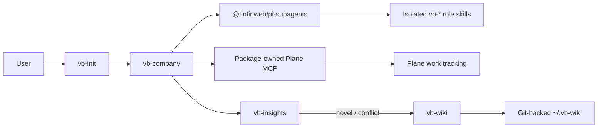

# VibeRig for Pi

VibeRig is a Pi-native virtual software company. A parent delivery lead coordinates isolated
project analysts, architects, frontend/backend engineers, implementers, test engineers, reviewers,
security auditors, verifiers, debuggers, reliability engineers, and a knowledge curator.

This branch targets Pi only. It does not preserve Codex, Claude Code, Cursor, Linear, or legacy
VibeRig skill compatibility.

Chinese documentation: [README.zh-CN.md](./README.zh-CN.md)

## Architecture


```mermaid
flowchart LR
  U["User"] --> I["vb-init"]
  I --> C["vb-company"]
  C --> A["@tintinweb/pi-subagents"]
  A --> R["Isolated vb-* role skills"]
  C --> M["Package-owned Plane MCP"]
  M --> P["Plane work tracking"]
  C --> N["vb-insights"]
  N -->|"novel / conflict"| W["vb-wiki"]
  W --> G["Git-backed ~/.vb-wiki"]
```

Plane owns project work tracking. `vb-wiki` owns long-term knowledge. Plane Pages are not used as a
knowledge store.

## Install

Requirements:

- Node.js 20.19 or newer;
- Pi 0.80 or newer;
- `uvx` for the official Plane MCP server, pinned to `plane-mcp-server==0.2.9`;
- a Plane workspace and API key.

```bash
pnpm install
pnpm run build
pi install /absolute/path/to/vb-plugin
```

Before starting Pi, export:

```bash
export PLANE_BASE_URL="http://47.108.174.41:18090"
export PLANE_WORKSPACE_SLUG="<workspace-slug>"
export PLANE_API_KEY="<api-key>"
```

Then start Pi in the target project and run:

```text
/skill:vb-init
```

`vb-init` discovers or creates one persistent Plane Project, writes its non-secret ID to
`.pi/viberig.yaml`, and generates project-local agents, role skills, model routing, and policy.
The package owns `pi-mcp-adapter`; project `.mcp.json` is not created or modified.

See [Pi + Plane](docs/install/zh-CN/pi-plane.md) for the complete setup and acceptance flow.

## Skills

Public workflow skills:

- `vb-init`: initialize the Pi project and Plane binding;
- `vb-company`: coordinate the smallest required employee team;
- `vb-wiki`: query and maintain accepted long-term knowledge.

Project initialization installs private role skills such as `vb-architecture`, `vb-frontend`,
`vb-backend`, `vb-testing`, `vb-review`, `vb-security`, and `vb-verification` for isolated
subagents. `vb-insights` converts accepted evidence into knowledge candidates; only the parent may
write them through `vb-wiki`.

## Model Routing

Defaults:

- implementation and test authoring: `xiaomi-token-plan-cn/mimo-v2.5`;
- review, security, architecture, verification, and council aggregation:
  `openai-codex/gpt-5.6-sol`;
- knowledge curation: `openai-codex/gpt-5.6-sol`.

Override project model tiers in `.pi/viberig.yaml`. Callers may not override an Agent model at
dispatch time.

## Validation

```bash
pnpm run lint
pnpm run test
pnpm run build
pnpm run test:pi-package-load
```
