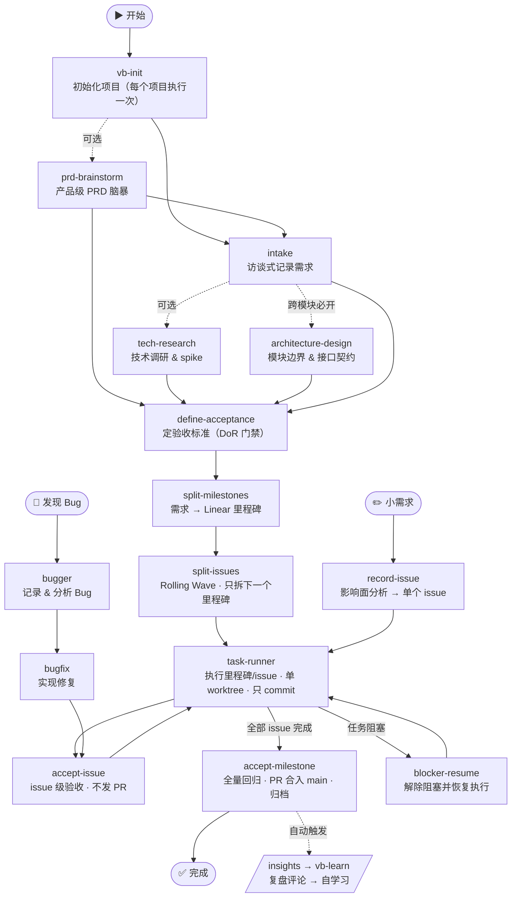

# VibeRig

VibeRig 是一个面向 Linear-native 软件交付的多平台 AI 编码插件。它把模糊需求整理成本地 Docs as Code 契约，把已确认的计划映射到 Linear issues，通过合适的 subagents 执行任务，并把证据、验收结果和经验沉淀写回 Linear。

英文文档：[README.md](./README.md)



## 目录

1. [前置条件](#前置条件)
2. [安装](#安装)
3. [人工使用方法](#人工使用方法)
4. [内置 skills 和 subagents](#内置-skills-和-subagents)
5. [运行流程](#运行流程)

## 前置条件

- 支持 plugin 的 AI 编码宿主：[Codex](docs/install/zh-CN/codex.zh-CN.md)、[Claude Code](docs/install/zh-CN/claude.zh-CN.md) 或 [Cursor](docs/install/zh-CN/cursor.zh-CN.md)。
- 一个 VibeRig 能连接的 Linear workspace。无需提前单独配置账号——VibeRig 自带 Linear MCP server 配置（`.mcp.json`），指向 `https://mcp.linear.app/mcp`；`vb-init` 在注册 Linear project 之前会先校验登录态，未登录会当场触发 OAuth 授权。

## 安装

选择平台，把安装指南全文复制给 AI：

| 平台 | 安装指南 |
|---|---|
| Codex | [docs/install/zh-CN/codex.zh-CN.md](docs/install/zh-CN/codex.zh-CN.md) |
| Claude Code | [docs/install/zh-CN/claude.zh-CN.md](docs/install/zh-CN/claude.zh-CN.md) |
| Cursor | [docs/install/zh-CN/cursor.zh-CN.md](docs/install/zh-CN/cursor.zh-CN.md) |

English: [codex](docs/install/en/codex.md) · [claude](docs/install/en/claude.md) · [cursor](docs/install/en/cursor.md)

## 人工使用方法

在目标项目中，直接让 Codex 使用对应的 VibeRig skill。

常用提示词：

- `用 vb-init 初始化这个仓库`
- `用 intake 记录这个需求：...`
- `用 define-acceptance 给 req-0001 定验收标准`
- `用 split-milestones 拆分 req-0001` / `用 split-issues 拆分 ms-1`
- `用 task-runner 执行里程碑 ms-1（或 Linear issue ABC-123）`
- `用 accept-issue 验收 ABC-123` / `用 accept-milestone 验收 ms-1`
- `用 record-issue 记录这个小改动：...`

VibeRig 会创建或使用这些项目本地文件：

```text
.vibeRig/
  project.yaml
  prd/
    <prd-id>/prd.md
    archive/
  requirements/
    <req-id>/
      requirement.yaml   # 需求状态 + prd 关联 + 里程碑列表（四态）
      intake.md
      research/
      architecture.md
      acceptance.json
      linear.yaml
    archive/
.worktrees/
  milestone-<req-id>-<n>/
```

Linear 是任务和状态界面。本地 requirement docs 是契约，不是 issues。

## 内置 Skills 和 Subagents

### 核心流程 Skills

- `vb-init`：初始化 `.vibeRig/project.yaml`、`.vibeRig/prd/`、`.vibeRig/requirements/`（含 archive）、`.worktrees/`、Linear 容器 Project 注册、门禁策略、PR 策略、默认路由，并搭建项目 agent 团队。
- `intake`：访谈式记录需求，产出 `intake.md` + `requirement.yaml`；只同步 Linear Document，不建 Milestone/Issue。
- `prd-brainstorm`：访谈式产品级 PRD（范围/非目标/用户故事/优先级）；只同步 Document。
- `tech-research`：用户主动触发的技术调研；先调研后多 subagent 并发领域讨论，产出可行性结论与 spike 记录。
- `architecture-design`：模块边界、接口契约、数据流 + 强制对抗性校验；模块图直接决定里程碑怎么切。
- `define-acceptance`：逐条与用户确认后写入 `acceptance.json`（schema 校验）；是拆分的 DoR 门禁。
- `split-milestones`：第一个写 Linear 结构的 skill——需求 → Milestone（大厂四条标准），回填 `requirement.yaml`。
- `split-issues`：Rolling Wave——只拆下一个里程碑；1~2 天垂直切片；只建单，不指派、不选 subagent。
- `record-issue`：小需求快速入口——影响面分析 → 单个 issue；影响面大时升级走完整流程。
- `task-runner`：执行一个里程碑（全部 issue）或单个 issue；一个里程碑一个 worktree 一个集成分支；执行时现场路由 subagent；只 commit 不发 PR。
- `accept-issue`：issue 级验收——按 AC 验证、commit、改状态、写逐步操作的验收评论；随后 insights 复盘 + vb-learn 自学习。
- `accept-milestone`：里程碑验收——全量回归、拉最新 main、冲突与用户确认、PR 合入 main、Linear 记录、`requirement.yaml` 置态、复盘自学习、归档判定。
- `insights`：从已验收工作生成复盘结论并写入 Linear 评论区（作为 `vb-learn` 的学习输入）。
- `blocker-resume`：检查被阻塞的 Linear work，并决定恢复执行或请求缺失决策。

### 实现类 Skills

- `agent-sop`：编排分阶段实现、验证、QA 和基于证据的 rework。
- `bugger`：把 bug 记录到 Linear，分析根因，并提出修复方向供用户确认。在 `bugfix` 之前使用。
- `bugfix`：执行已确认的 bug fix，提交代码，记录证据到 Linear，交由 `accept-issue` 完成收尾。
- `incremental-implementation`：以薄垂直切片方式交付变更，适用于涉及多个文件的任何改动。
- `source-driven-development`：对版本敏感的框架代码，以官方文档为实现决策的唯一依据。
- `test-driven-development`：以测试驱动实现和 bug fix（Prove-It Pattern）。

### 设计与质量 Skills

- `api-and-interface-design`：指导稳定的 REST/GraphQL 接口和 TypeScript 契约设计。
- `browser-testing-with-devtools`：通过 Chrome DevTools MCP 工具对前端功能进行调试和测试。
- `code-simplification`：降低复杂度、提升代码可读性，不改变行为。
- `documentation-and-adrs`：创建或更新架构决策记录（ADR）和 API 文档。
- `security-and-hardening`：针对不可信输入、认证、外部集成场景加固代码安全。
- `uiux-design`：路由 UI 设计、改版、评审、无障碍检查、交付规范和设计转代码等工作流。

### Skill Curation Skills

- `skillos-lite`：基于已验收工作提出 SkillOS 风格的 `insert`、`update`、`deprecate` 或 `noop` skill curation 操作；已确认的变更仍然必须通过 `skill-builder`。
- `skill-builder`：创建或更新 Codex skills，包含可靠的触发描述、简洁的 SKILL.md 工作流和验证清单。

### 路由与 Agent Skills

- `subagent-routing`：选择并 brief 专用 subagent，同时保证 Linear 更新和最终流程决策只在主 agent 中发生。
- `agent-creator`：帮助创建或更新项目本地 Codex custom subagents。

### 跨 Agent 工具 Skills

- `use-claude`：在任意 agent 会话中调用本地 Claude CLI。
- `use-codex`：在任意 agent 会话中通过 MCP server 工具调用 Codex。
- `use-gemini`：在任意 agent 会话中通过 MCP 工具调用 Gemini，用于网络搜索或大上下文分析。

### 内置 Subagents

- `code_review`：从正确性、可读性、架构、安全和性能五个维度进行代码审查。
- `integrator`：协调多任务工作、依赖状态、分支/PR 就绪度和合并风险。
- `qa`：验收评审、测试策略、边界情况和验证证据。
- `researcher`：深度网络搜索、大上下文仓库/文档分析与有源可溯的技术调研。
- `security_auditor`：以安全为核心进行代码审查，包含漏洞检测和威胁建模。
- `self_learner`：在 accept/handoff 后提取经验教训并强化成功模式。
- `test_engineer`：测试策略、测试编写和覆盖率分析。
- `uiux_design`：产出或验证 UIFLOW.md 和 DESIGN.md，并准备组件级实现交付规范。

具体的实现、QA、review、调研或集成 subagent 是项目或用户自己的 agents。VibeRig 通过 `subagent-routing` 路由到它们；subagents 不应更新 Linear、不应做最终验收判断。

## 运行流程

1. 使用 `vb-init` 初始化项目（常驻容器 Linear Project、`.vibeRig/prd/` 与 `.vibeRig/requirements/` 及各自 archive）。
2. 按需先 `prd-brainstorm` 做产品级范围定义（并非每个需求都需要）。再用 `intake` 访谈式记录需求 → `.vibeRig/requirements/<req-id>/intake.md` + `requirement.yaml`。按需追加 `tech-research`（可行性调研，用户主动触发）、`architecture-design`（跨模块必开——模块图决定里程碑边界）。探索阶段只同步 Linear Document，不建任何 Milestone/Issue。
3. 使用 `define-acceptance` 定验收标准——每条 AC 先与你确认再写入 `acceptance.json`。这是拆分的 DoR 门禁。
4. 使用 `split-milestones` 把需求拆成 Linear 里程碑（大厂四条标准），再用 `split-issues` 只拆下一个待做里程碑（Rolling Wave；1~2 天垂直切片；建单时不指派、不选 subagent）。
5. 使用 `task-runner <里程碑id 或 issue-id>` 执行：一个里程碑一个 worktree 一个集成分支（`milestone/<req-id>-<n>`）；subagent 在执行时现场路由；每个 issue 完成只 commit（绝不发 PR）。全部 issue 完成后里程碑进入 `pending_acceptance`。
6. 用 `accept-issue` 做单点验收（按 AC 验证、commit、逐步操作的验收评论、insights 复盘 + vb-learn 自学习）；用 `accept-milestone` 做里程碑验收：全量回归 → 拉最新远程 main → 冲突与你确认后处理 → PR 合入 main → Linear 验收评论 + Project Update → 更新 `requirement.yaml` 状态 → 复盘自学习 → 最后一个里程碑触发归档。
7. 小改动走 `record-issue`（影响面分析 → 单个 issue）；Bug 走 `bugger` → `bugfix` → `accept-issue`。
