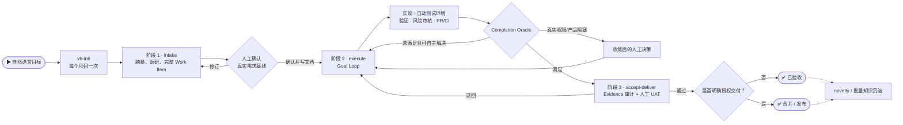

# VibeRig

VibeRig 是一个目标驱动的软件开发 Harness。它通过“需求脑暴与确认 → Execute Goal Loop → 人工验收与授权交付”三个阶段，把自然语言目标变成 Docs as Code 契约、可验证实现和可追溯 Evidence；用户不需要学习或手工串联内部 Skills。

英文文档：[README.md](./README.md)



## 目录

1. [前置条件](#前置条件)
2. [安装](#安装)
3. [人工使用方法](#人工使用方法)
4. [内置 skills 和 subagents](#内置-skills-和-subagents)
5. [运行流程](#运行流程)

## 前置条件

- 支持 plugin 的 AI 编码宿主：[Codex](docs/install/zh-CN/codex.zh-CN.md)、[Claude Code](docs/install/zh-CN/claude.zh-CN.md) 或 [Cursor](docs/install/zh-CN/cursor.zh-CN.md)。
- 一个 VibeRig 能连接的 Linear workspace。无需提前单独配置账号——VibeRig 自带 Linear MCP server 配置（`.mcp.json`），指向 `https://mcp.linear.app/mcp`；`vb-init` 在注册 Linear project 之前会先校验登录态，未登录会当场触发 OAuth 授权。

## 安装

选择平台，把安装指南全文复制给 AI：

| 平台 | 安装指南 |
|---|---|
| Codex | [docs/install/zh-CN/codex.zh-CN.md](docs/install/zh-CN/codex.zh-CN.md) |
| Claude Code | [docs/install/zh-CN/claude.zh-CN.md](docs/install/zh-CN/claude.zh-CN.md) |
| Cursor | [docs/install/zh-CN/cursor.zh-CN.md](docs/install/zh-CN/cursor.zh-CN.md) |

English: [codex](docs/install/en/codex.md) · [claude](docs/install/en/claude.md) · [cursor](docs/install/en/cursor.md)

## 人工使用方法

在目标项目中直接描述目标。VibeRig 自动识别阶段；只有初始化、明确查询知识或维护 Skill 时才需要记住具体名称。

常用提示词：

- `用 vb-init 初始化这个仓库`
- `这个登录问题偶发超时，帮我分析真实原因，确认方案后修复并做到 PR`
- `我想增加团队级权限，先和我把完整需求想清楚`
- `继续执行 ABC-123，未完成时自行修复和验证`
- `验收 ABC-123，给我可以照做的 UAT 步骤`
- `学习 ABC-123 的经验并沉淀到知识库`（使用 `vb-wiki`）
- `把这个已确认的能力做成一个工具 skill`（使用 `vb-learn`，需要明确授权）

VibeRig 会创建或使用这些项目本地文件：

```text
.vibeRig/
  project.yaml
  prd/
    <prd-id>/prd.md
    archive/
  requirements/
    <req-id>/
      requirement.yaml   # 需求状态 + PRD 决策 + 老板审批 + 里程碑列表
      intake.md
      work-item.json      # 问题、原因/假设、方案、影响、范围、验收、测试和目标
      prd.md              # 仅在自动判断需要新 PRD 时
      research/<domain>.md
      research/feasibility.md
      architecture.md
      acceptance.json
      acceptance-guide.md
      test-plan.md
      test-cases.json
      risk-register.json
      release-plan.md
      delivery-plan.md
      traceability.json
      pre-development-review.md
      linear.yaml
    archive/
.worktrees/
  milestone-<req-id>-<n>/
```

Linear 是任务和状态界面。本地 requirement docs 是契约，不是 issues。

## 内置 Skills 和 Subagents

### 核心流程 Skills

- `vb-init`：初始化 `.vibeRig/project.yaml`、`.vibeRig/prd/`、`.vibeRig/requirements/`（含 archive）、`.worktrees/`、Linear 容器 Project 注册、门禁策略、PR 策略、默认路由，并搭建项目 agent 团队。
- `intake`：所有未确认工作（功能、Bug、小改动、技术债和风险）的统一脑暴入口；检查现状并形成完整 Work Item，让用户一次确认后写入文档。
- `execute`：持有 Goal Contract，持续执行实现、自动测试环境、验证、风险审核和技术交付；可自主解决时不在 Skill 边界中断。
- `accept-deliver`：Evidence 审计、人工 UAT 和明确验收；merge/release 是验收后的独立授权。
- `pre-development`：仅为 L2/L3 Work Item 内部补充调研、架构、AC/TC、风险和交付计划；不新增人工审批阶段。
- `prd-brainstorm`：可独立访谈生成产品级 PRD，也可在开发前流程中从已确认 Intake 自动综合，不重复询问老板。
- `tech-research`：开发前内部领域调研协议；不同 subagent 分别研究前端、后端、数据、安全、运维、QA 等维度，主 agent 统一落盘。
- `architecture-design`：CTO 综合领域证据，完成端到端架构及红队攻击、白队回应和最终裁决。
- `define-acceptance`：生成结构化 AC、工程验证和老板可照做的 `acceptance-guide.md`；随完整方案一次审批。
- `split-milestones`：审批前按可验收用户价值生成本地草案；批准后才将相同计划写入 Linear。
- `split-issues`：审批前生成全局 Issue 草案；批准后按 Rolling Wave 只正式创建下一个里程碑的垂直切片，不指派、不选 subagent。
- `record-issue`、`bugger`：旧入口兼容层，统一转入 `intake`；不再维护“小需求”和“Bug”两套问题建模。
- `quick`、`task-runner`、`blocker-resume`：旧执行入口兼容层，统一恢复或创建 Goal Contract 后转入 `execute`。
- `accept-issue`、`accept-milestone`、`merge-issue`：旧验收/交付入口兼容层，只选择 `accept-deliver` 的范围或模式。
- `insights`：从已验收 Evidence 生成证据化复盘和 novelty 判断；没有新知识时以 `zero-atoms` 结束。
- `vb-wiki`：显式查询项目知识；写入由 novelty、重复缺陷、Milestone 或批量阈值触发，不再是每次验收的固定重型流程。

### 实现类 Skills

- `agent-sop`：`execute` 内部按风险编排实现、定向验证和 Reviewer；L0 不强制 Subagent，L2/L3 才逐级增加独立审核。
- `incremental-implementation`：以薄垂直切片方式交付变更，适用于涉及多个文件的任何改动。
- `source-driven-development`：对版本敏感的框架代码，以官方文档为实现决策的唯一依据。
- `test-driven-development`：以测试驱动实现和 bug fix（Prove-It Pattern）。

### 设计与质量 Skills

- `api-and-interface-design`：指导稳定的 REST/GraphQL 接口和 TypeScript 契约设计。
- `browser-testing-with-devtools`：通过 Chrome DevTools MCP 工具对前端功能进行调试和测试。
- `code-simplification`：降低复杂度、提升代码可读性，不改变行为。
- `documentation-and-adrs`：创建或更新架构决策记录（ADR）和 API 文档。
- `security-and-hardening`：针对不可信输入、认证、外部集成场景加固代码安全。
- `uiux-design`：路由 UI 设计、改版、评审、无障碍检查、交付规范和设计转代码等工作流。

### Skill Curation Skills

- `vb-learn`：只在用户明确要求创建工具 skill，或明确批准一个 `vb-wiki` 工具晋升提案时，创建或更新恰好一个全局 tool skill。
- `skillos-lite`：仅在用户显式要求 skill 库整理时提出 `insert`、`update`、`deprecate` 或 `noop` 操作；不属于验收后的默认自学习链路。
- `skill-builder`：创建或更新 Codex skills，包含可靠的触发描述、简洁的 SKILL.md 工作流和验证清单。

### 路由与 Agent Skills

- `subagent-routing`：选择并 brief 专用 subagent，同时保证 Linear 更新和最终流程决策只在主 agent 中发生。
- `agent-creator`：帮助创建或更新项目本地 Codex custom subagents。

### 跨 Agent 工具 Skills

- `use-claude`：在任意 agent 会话中调用本地 Claude CLI。
- `use-codex`：在任意 agent 会话中通过 MCP server 工具调用 Codex。
- `use-gemini`：在任意 agent 会话中通过 MCP 工具调用 Gemini，用于网络搜索或大上下文分析。

### 内置 Subagents

- `researcher`：有源可溯的代码、文档、网络和可行性证据调研。
- `frontend_architect`、`backend_architect`、`data_architect`：分别完成前端、后端和数据领域的开发前架构调研。
- `security_auditor`：以 `design_threat_model` 或 `code_security_review` 模式执行安全设计/代码审核。
- `reliability_engineer`：SRE、性能、发布、可观测性、Smoke 和回滚分析。
- `qa`：以 `test_design` 或 `test_review` 模式进行测试设计和独立覆盖审核，不编写测试代码。
- `uiux_design`：UI/UX 调研、UIFLOW/DESIGN/Pencil 设计与组件交付；开发前使用只读报告模式。
- `architecture_red_team`：按单一 focus 独立攻击架构、失败模式、安全或交付风险。
- `implementation`：消费最小 Task Brief 和相关 AC/TC，执行有边界的代码实现。
- `test_engineer`：把已批准 TC 实现为自动化测试并提供 RED/GREEN 证据。
- `code_review`：独立审核正确性、可维护性、架构符合性和证据质量。
- `integrator`：审核跨 Issue 依赖、契约、当前 commit 证据和里程碑集成就绪度。

VibeRig 通过 `subagent-routing` 先按 capability 选择最小必要阵容，再按 provider、任务族、风险和 accepted observations 动态选择 model/reasoning；L0 默认不启动 Subagent。低风险、可逆且有确定性 Oracle 的任务最多用 10% 稳定采样探索 challenger，accept/security/merge/release 等保护路径只 exploit。所有 Subagent 都不应更新 Linear、写 Proof Packet 或作最终验收判断。验收后 `insights` 保留模型/Agent 路由观察并做可比组分析，只有 novelty 或批量阈值触发 `insights → vb-wiki`；只有用户另行明确授权时才进入 `vb-learn`。

## 运行流程

1. 使用 `vb-init` 初始化项目；Linear 等外部集成不可用时，本地 Harness 仍可工作。
2. 用户自然描述目标。`intake` 检查代码与现有记录，逐步脑暴完整 Work Item，并在一次人工 Gate 中确认真实需求；确认后才写 `intake.md`、`work-item.json` 和 `requirement.yaml`。
3. L0/L1 直接进入 `execute`；L2/L3 在内部调用 `pre-development` 补技术计划。技术能力切换不形成新的人工审批。
4. `execute` 持续运行 Goal Loop：Understand → Plan → Implement → Verify → Review → Repair。缺少测试配置时自动选择 fake、stub、ephemeral dependency 或 sandbox；只有产品决策、权限、不可模拟真实环境或连续三次无进展才暂停。
5. Completion Oracle 满足后进入 `accept-deliver`。系统先审计当前 commit 的 Evidence，再给用户最短可执行 UAT；退回项自动回到同一 Goal Loop。
6. 用户明确验收通过后记录 acceptance。commit、PR、merge、release 按初始目标和单独 authority 执行；merge/release 不从验收通过自动推断。
7. Evidence 默认保留；Subagent/model route observation 在人工验收后进入 retrospective。`update-team` 只在至少 5 个可比样本、质量不退化、无 Critical 失败且成本或延迟改善达到阈值时调整派生路由；知识编译与工具 Skill 晋升仍分别受 novelty 和独立授权约束。
