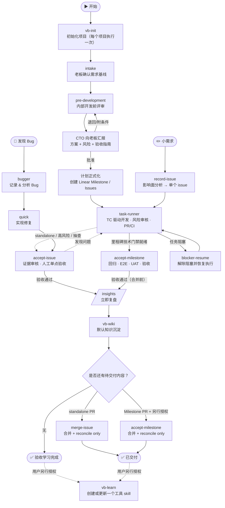

# VibeRig

VibeRig 是一个面向 Linear-native 软件交付的多平台 AI 编码插件。它把模糊需求整理成本地 Docs as Code 契约，把已确认的计划映射到 Linear issues，通过合适的 subagents 执行任务，把证据与验收结果写回 Linear，并在验收通过后立即把经验沉淀到本地知识库。

英文文档：[README.md](./README.md)



## 目录

1. [前置条件](#前置条件)
2. [安装](#安装)
3. [人工使用方法](#人工使用方法)
4. [内置 skills 和 subagents](#内置-skills-和-subagents)
5. [运行流程](#运行流程)

## 前置条件

- 支持 plugin 的 AI 编码宿主：[Codex](docs/install/zh-CN/codex.zh-CN.md)、[Claude Code](docs/install/zh-CN/claude.zh-CN.md) 或 [Cursor](docs/install/zh-CN/cursor.zh-CN.md)。
- 一个 VibeRig 能连接的 Linear workspace。无需提前单独配置账号——VibeRig 自带 Linear MCP server 配置（`.mcp.json`），指向 `https://mcp.linear.app/mcp`；`vb-init` 在注册 Linear project 之前会先校验登录态，未登录会当场触发 OAuth 授权。

## 安装

选择平台，把安装指南全文复制给 AI：

| 平台 | 安装指南 |
|---|---|
| Codex | [docs/install/zh-CN/codex.zh-CN.md](docs/install/zh-CN/codex.zh-CN.md) |
| Claude Code | [docs/install/zh-CN/claude.zh-CN.md](docs/install/zh-CN/claude.zh-CN.md) |
| Cursor | [docs/install/zh-CN/cursor.zh-CN.md](docs/install/zh-CN/cursor.zh-CN.md) |

English: [codex](docs/install/en/codex.md) · [claude](docs/install/en/claude.md) · [cursor](docs/install/en/cursor.md)

## 人工使用方法

在目标项目中，直接让 Codex 使用对应的 VibeRig skill。

常用提示词：

- `用 vb-init 初始化这个仓库`
- `用 intake 处理这个需求：...`（确认需求后会自动跑完开发前评审）
- `继续 req-0001 的 pre-development`（仅用于恢复中断或处理退回项）
- `用 task-runner 执行里程碑 ms-1（或 Linear issue ABC-123）`
- `用 accept-issue 验收 ABC-123`（standalone、高风险或抽查）/ `用 accept-milestone 验收 ms-1`
- `学习 ABC-123 的经验并沉淀到知识库`（使用 `vb-wiki`）
- `把这个已确认的能力做成一个工具 skill`（使用 `vb-learn`，需要明确授权）
- `用 record-issue 记录这个小改动：...`

VibeRig 会创建或使用这些项目本地文件：

```text
.vibeRig/
  project.yaml
  prd/
    <prd-id>/prd.md
    archive/
  requirements/
    <req-id>/
      requirement.yaml   # 需求状态 + PRD 决策 + 老板审批 + 里程碑列表
      intake.md
      prd.md              # 仅在自动判断需要新 PRD 时
      research/<domain>.md
      research/feasibility.md
      architecture.md
      acceptance.json
      acceptance-guide.md
      test-plan.md
      test-cases.json
      risk-register.json
      release-plan.md
      delivery-plan.md
      traceability.json
      pre-development-review.md
      linear.yaml
    archive/
.worktrees/
  milestone-<req-id>-<n>/
```

Linear 是任务和状态界面。本地 requirement docs 是契约，不是 issues。

## 内置 Skills 和 Subagents

### 核心流程 Skills

- `vb-init`：初始化 `.vibeRig/project.yaml`、`.vibeRig/prd/`、`.vibeRig/requirements/`（含 archive）、`.worktrees/`、Linear 容器 Project 注册、门禁策略、PR 策略、默认路由，并搭建项目 agent 团队。
- `intake`：新需求唯一默认人工入口；以产品经理方式补全需求并让老板一次确认基线，然后自动进入开发前评审。
- `pre-development`：自动编排 PRD 决策、分领域调研、CTO 架构红白队、验收与测试设计、风险/发布方案、交付草案和 DoR，最后生成老板审批包。
- `prd-brainstorm`：可独立访谈生成产品级 PRD，也可在开发前流程中从已确认 Intake 自动综合，不重复询问老板。
- `tech-research`：开发前内部领域调研协议；不同 subagent 分别研究前端、后端、数据、安全、运维、QA 等维度，主 agent 统一落盘。
- `architecture-design`：CTO 综合领域证据，完成端到端架构及红队攻击、白队回应和最终裁决。
- `define-acceptance`：生成结构化 AC、工程验证和老板可照做的 `acceptance-guide.md`；随完整方案一次审批。
- `split-milestones`：审批前按可验收用户价值生成本地草案；批准后才将相同计划写入 Linear。
- `split-issues`：审批前生成全局 Issue 草案；批准后按 Rolling Wave 只正式创建下一个里程碑的垂直切片，不指派、不选 subagent。
- `record-issue`：小需求快速入口——影响面分析 → 单个 issue；影响面大时升级走完整流程。
- `task-runner`：执行一个里程碑或单个 issue；按 AC/TC 做 TDD、定向验证和风险审核，读取当前 commit 的 CI，维护正确的 PR 路径并写逐 TC Proof Packet。
- `accept-issue`：standalone、高风险或显式抽查的单点验收；一旦验收通过，就以 accepted commit 立即执行 `insights → vb-wiki`，不等待合并或 Milestone 验收。普通里程碑 issue 不强制逐个验收。
- `accept-milestone`：同步最新 main 后汇总 Issue Evidence，执行里程碑回归、E2E 和老板 UAT；验收通过后立即执行 `insights → vb-wiki`，常驻 PR 合并仍是单独授权和交付步骤。
- `insights`：显式验收通过后立即生成证据化复盘并写入 Linear 评论区，包括已验收但未合并的工作；作为 `vb-wiki` 输入，不创建知识页或 skill 候选。
- `vb-wiki`：默认长期记忆编辑器，在显式验收通过后立即把证据编译成围绕概念、持续更新的全局/项目笔记；另行维护 current-state 检索目录与可选 qmd 搜索，查询时读取 canonical page 而非日志/片段，并可 lint 矛盾、过期、重复、断链和检索漂移。merge 状态只作来源元数据，工具晋升仍需知识提交后的独立判断。
- `blocker-resume`：检查被阻塞的 Linear work，并决定恢复执行或请求缺失决策。

### 实现类 Skills

- `agent-sop`：按风险编排实现、定向验证和 Reviewer；标准任务不重复启动 Test QA、Final QA 与全套专项审核。
- `bugger`：把 bug 记录到 Linear，分析根因，并提出修复方向供用户确认。在 `quick` 之前使用。
- `quick`：直接在当前工作区执行一个已确认的小任务（确认过的 bug fix 或一个很小的改动），不开分支/worktree，提交代码，记录证据到 Linear，交由 `accept-issue` 完成收尾。
- `merge-issue`：`accept-issue` 通过后合并 standalone issue PR；先校验当前内容仍与 accepted commit 一致，仅用 `reconcile_only` 补交付来源，不重复复盘、知识编辑或 promotion。
- `incremental-implementation`：以薄垂直切片方式交付变更，适用于涉及多个文件的任何改动。
- `source-driven-development`：对版本敏感的框架代码，以官方文档为实现决策的唯一依据。
- `test-driven-development`：以测试驱动实现和 bug fix（Prove-It Pattern）。

### 设计与质量 Skills

- `api-and-interface-design`：指导稳定的 REST/GraphQL 接口和 TypeScript 契约设计。
- `browser-testing-with-devtools`：通过 Chrome DevTools MCP 工具对前端功能进行调试和测试。
- `code-simplification`：降低复杂度、提升代码可读性，不改变行为。
- `documentation-and-adrs`：创建或更新架构决策记录（ADR）和 API 文档。
- `security-and-hardening`：针对不可信输入、认证、外部集成场景加固代码安全。
- `uiux-design`：路由 UI 设计、改版、评审、无障碍检查、交付规范和设计转代码等工作流。

### Skill Curation Skills

- `vb-learn`：只在用户明确要求创建工具 skill，或明确批准一个 `vb-wiki` 工具晋升提案时，创建或更新恰好一个全局 tool skill。
- `skillos-lite`：仅在用户显式要求 skill 库整理时提出 `insert`、`update`、`deprecate` 或 `noop` 操作；不属于验收后的默认自学习链路。
- `skill-builder`：创建或更新 Codex skills，包含可靠的触发描述、简洁的 SKILL.md 工作流和验证清单。

### 路由与 Agent Skills

- `subagent-routing`：选择并 brief 专用 subagent，同时保证 Linear 更新和最终流程决策只在主 agent 中发生。
- `agent-creator`：帮助创建或更新项目本地 Codex custom subagents。

### 跨 Agent 工具 Skills

- `use-claude`：在任意 agent 会话中调用本地 Claude CLI。
- `use-codex`：在任意 agent 会话中通过 MCP server 工具调用 Codex。
- `use-gemini`：在任意 agent 会话中通过 MCP 工具调用 Gemini，用于网络搜索或大上下文分析。

### 内置 Subagents

- `researcher`：有源可溯的代码、文档、网络和可行性证据调研。
- `frontend_architect`、`backend_architect`、`data_architect`：分别完成前端、后端和数据领域的开发前架构调研。
- `security_auditor`：以 `design_threat_model` 或 `code_security_review` 模式执行安全设计/代码审核。
- `reliability_engineer`：SRE、性能、发布、可观测性、Smoke 和回滚分析。
- `qa`：以 `test_design` 或 `test_review` 模式进行测试设计和独立覆盖审核，不编写测试代码。
- `uiux_design`：UI/UX 调研、UIFLOW/DESIGN/Pencil 设计与组件交付；开发前使用只读报告模式。
- `architecture_red_team`：按单一 focus 独立攻击架构、失败模式、安全或交付风险。
- `implementation`：消费最小 Task Brief 和相关 AC/TC，执行有边界的代码实现。
- `test_engineer`：把已批准 TC 实现为自动化测试并提供 RED/GREEN 证据。
- `code_review`：独立审核正确性、可维护性、架构符合性和证据质量。
- `integrator`：审核跨 Issue 依赖、契约、当前 commit 证据和里程碑集成就绪度。

VibeRig 通过 `subagent-routing` 动态选择最小必要阵容；未受影响的专业 Agent 不启动。项目特有的支付、计费、合规或框架角色由 `update-team` 补充。所有 subagent 都不应更新 Linear、写 Proof Packet 或作最终验收判断。默认学习链路在显式验收通过后立即执行 `insights → vb-wiki`，不再设置 `self_learner` Agent；只有用户另行明确授权时才进入 `vb-learn`。

## 运行流程

1. 使用 `vb-init` 初始化项目（常驻容器 Linear Project、`.vibeRig/prd/` 与 `.vibeRig/requirements/` 及各自 archive）。
2. 老板只需调用 `intake`。产品经理式访谈补全目标、用户、流程、业务规则、范围、约束、成功指标和验收关注点，老板一次确认需求基线。
3. `intake` 自动进入 `pre-development`：内部判断是否需要 PRD，按影响范围路由专业 subagents 做可行性调研，由 CTO 综合架构并完成红白队对抗，再生成验收标准、老板验证指南、测试用例、风险/发布方案、追踪表及 Milestone/Issue 本地草案。此阶段不创建 Linear 规划对象。
4. CTO 用 `pre-development-review.md` 一次向老板汇报推荐方案、成本/周期、风险、交付计划和可执行验收步骤。老板批准后才 materialize Linear Milestones，并按 Rolling Wave 正式创建下一个里程碑的 Issues；退回时只重跑受影响阶段。
5. 使用 `task-runner <里程碑id 或 issue-id>` 执行，只允许人为调用（不允许被其他 skill 自动串联）：一个里程碑一条持久集成分支（`milestone/<req-id>-<n>`）；顺序执行复用调用级 worktree，并发 issue 才各用一次性 worktree。Task Brief 只注入相关 AC/TC/契约，按风险路由 subagent。每个 issue 都产生 commit、PR/常驻 PR 更新和逐 TC Evidence：
   - 里程碑循环里并发拆出去执行的 issue，PR 目标是集成分支，由 `task-runner` 在质量门禁与当前 commit CI 通过后合并；
   - 里程碑循环里顺序执行的 issue，持续更新同一个"集成分支 → main"的常驻 PR，只由 `accept-milestone` 合并；
   - 不挂任何里程碑的单个 issue，PR 直接目标 main，`accept-issue` 通过后由 `merge-issue` 合并。全部 issue 完成后里程碑进入 `pending_acceptance`。
6. 普通里程碑 Issue 的有效技术 Evidence 直接进入 `accept-milestone`；standalone、高风险或需要抽查时才用 `accept-issue`。里程碑验收按“同步最新 main → 当前 commit CI → 里程碑 TC/增量回归/E2E → 老板 UAT → 明确验收通过 → 立即 `insights → vb-wiki` → 另行授权合并常驻 PR → 状态/归档”执行，不重复运行每个 Issue 已有有效证据的全部单元测试。standalone 验收通过后也立即复盘和入库，`merge-issue` 后续只负责交付与 reconcile。
7. 小改动走 `record-issue`（影响面分析 → 单个 issue）；Bug 走 `bugger` → `quick` → `accept-issue`。
