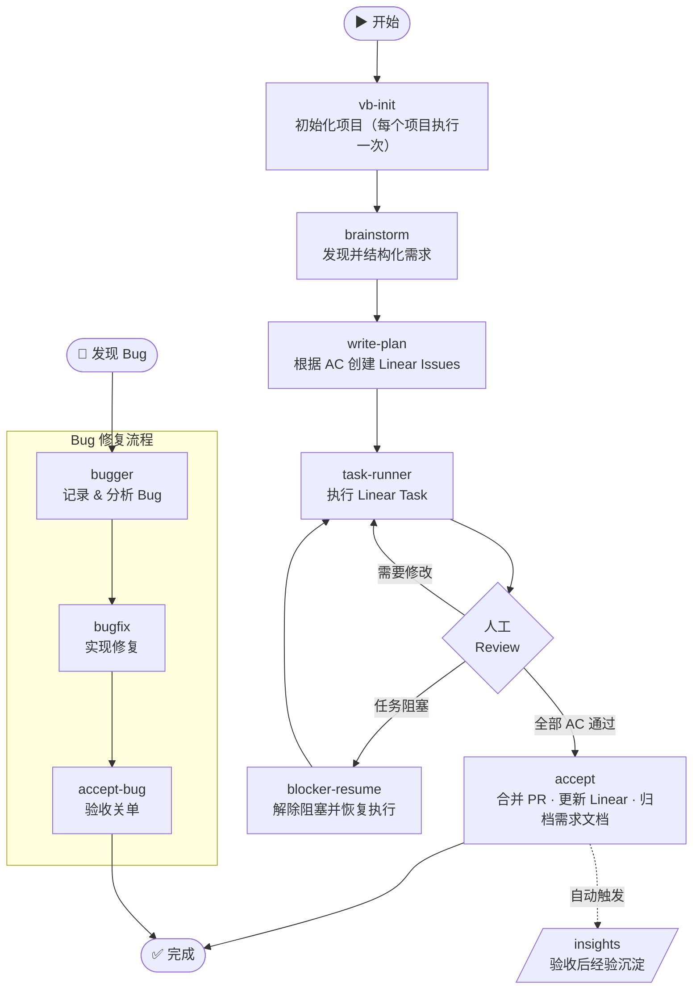

# VibeRig

VibeRig 是一个面向 Linear-native 软件交付的 Codex 插件。它把模糊需求整理成本地 Docs as Code 契约，把已确认的计划映射到 Linear issues，通过合适的 Codex subagents 执行任务，并把证据、验收结果和经验沉淀写回 Linear。

英文文档：[README.md](./README.md)



## 目录

1. [前置条件](#前置条件)
2. [安装](#安装)
3. [更新](#更新)
4. [人工使用方法](#人工使用方法)
5. [内置 skills 和 subagents](#内置-skills-和-subagents)
6. [运行流程](#运行流程)

## 前置条件

- Codex 已启用 plugin support。
- 拥有目标团队访问权限的 Linear 账号。VibeRig 自带 Linear MCP server 配置（`.mcp.json`），指向 `https://mcp.linear.app/mcp`——宿主需要连接该 server 并完成一次 Linear OAuth 授权。VibeRig 用它创建和更新 project、document、issue、comment 和状态流转。

## 安装

添加 VibeRig marketplace，并安装插件：

```sh
codex plugin marketplace add JsonLee12138/codex-marketplace --ref main
codex plugin add vibe-rig@jsonlee
```

当前 Codex CLI selector 格式是 `PLUGIN@MARKETPLACE`。本仓库中 marketplace 是 `jsonlee`，plugin 是 `vibe-rig`。

## 更新

刷新 marketplace snapshot：

```sh
codex plugin marketplace upgrade jsonlee
```

如果当前 Codex 安装不会自动刷新已安装插件缓存，可以重新安装插件：

```sh
codex plugin remove vibe-rig
codex plugin add vibe-rig@jsonlee
```

更新后重启 Codex，让新的 skills 生效。

## 人工使用方法

在目标项目中，直接让 Codex 使用对应的 VibeRig skill。

常用提示词：

- `Use vb-init for this repo.`
- `Use brainstorm for this requirement: ...`
- `Use write-plan for .vibeRig/requirements/<requirement-id>.`
- `Use task-runner for Linear issue ABC-123.`
- `Use accept: all ACs are accepted for ABC-123.`
- `Use accept-bug for Linear bug issue ABC-456.`
- `Use insights for the accepted Linear work.`

VibeRig 会创建或使用这些项目本地文件：

```text
.vibeRig/
  project.yaml
  requirements/
.worktrees/
  <issue-key>-<short-slug>/
```

Linear 是任务和状态界面。本地 requirement docs 是契约，不是 issues。

## 内置 Skills 和 Subagents

### 核心流程 Skills

- `vb-init`：初始化 `.vibeRig/project.yaml`、`.vibeRig/requirements/`、`.worktrees/`、Linear 项目注册、门禁策略、PR 策略、默认路由，并搭建项目 agent 团队。
- `brainstorm`：把粗略想法整理成本地 Docs as Code 需求契约。
- `write-plan`：根据本地验收标准创建或更新 Linear issues 和 sub-issues。
- `task-runner`：在当前 Codex 会话中执行 Linear task，委派合适 subagent，完成验证，提交 PR，并写入 Linear Proof Packet。
- `accept`：记录用户对需求/功能类 Linear issue（含 PR）的显式人工验收通过或拒绝；全量验收时合并 PR、更新 Linear 最终状态、运行 insights，通过 `skill-builder` 应用已确认的 skill 更新，归档已验收需求文档，并在安全时清理任务 worktree。
- `accept-bug`：记录用户对 Linear bug fix 的显式人工验收；无需 PR，修复已由 `bugfix` 提交。将 issue 更新为 Done。
- `insights`：从已验收工作中生成保守的经验候选项，并路由 skill library curation proposals。
- `blocker-resume`：检查被阻塞的 Linear work，并决定恢复执行或请求缺失决策。

### 实现类 Skills

- `agent-sop`：编排分阶段实现、验证、QA 和基于证据的 rework。
- `bugger`：把 bug 记录到 Linear，分析根因，并提出修复方向供用户确认。在 `bugfix` 之前使用。
- `bugfix`：执行已确认的 bug fix，提交代码，记录证据到 Linear，交由 `accept-bug` 完成收尾。
- `incremental-implementation`：以薄垂直切片方式交付变更，适用于涉及多个文件的任何改动。
- `source-driven-development`：对版本敏感的框架代码，以官方文档为实现决策的唯一依据。
- `test-driven-development`：以测试驱动实现和 bug fix（Prove-It Pattern）。

### 设计与质量 Skills

- `api-and-interface-design`：指导稳定的 REST/GraphQL 接口和 TypeScript 契约设计。
- `browser-testing-with-devtools`：通过 Chrome DevTools MCP 工具对前端功能进行调试和测试。
- `code-simplification`：降低复杂度、提升代码可读性，不改变行为。
- `documentation-and-adrs`：创建或更新架构决策记录（ADR）和 API 文档。
- `security-and-hardening`：针对不可信输入、认证、外部集成场景加固代码安全。
- `uiux-design`：路由 UI 设计、改版、评审、无障碍检查、交付规范和设计转代码等工作流。

### Skill Curation Skills

- `skillos-lite`：基于已验收工作提出 SkillOS 风格的 `insert`、`update`、`deprecate` 或 `noop` skill curation 操作；已确认的变更仍然必须通过 `skill-builder`。
- `skill-builder`：创建或更新 Codex skills，包含可靠的触发描述、简洁的 SKILL.md 工作流和验证清单。

### 路由与 Agent Skills

- `subagent-routing`：选择并 brief 专用 subagent，同时保证 Linear 更新和最终流程决策只在主 agent 中发生。
- `agent-creator`：帮助创建或更新项目本地 Codex custom subagents。

### 跨 Agent 工具 Skills

- `use-claude`：在任意 agent 会话中调用本地 Claude CLI。
- `use-codex`：在任意 agent 会话中通过 MCP server 工具调用 Codex。
- `use-gemini`：在任意 agent 会话中通过 MCP 工具调用 Gemini，用于网络搜索或大上下文分析。

### 内置 Subagents

- `code_review`：从正确性、可读性、架构、安全和性能五个维度进行代码审查。
- `gemini_research`：Gemini 驱动的深度网络搜索和大上下文仓库分析。
- `integrator`：协调多任务工作、依赖状态、分支/PR 就绪度和合并风险。
- `qa`：验收评审、测试策略、边界情况和验证证据。
- `researcher`：跨本地代码、文档和实现约束的技术调研。
- `security_auditor`：以安全为核心进行代码审查，包含漏洞检测和威胁建模。
- `self_learner`：在 accept/handoff 后提取经验教训并强化成功模式。
- `test_engineer`：测试策略、测试编写和覆盖率分析。
- `uiux_design`：产出或验证 UIFLOW.md 和 DESIGN.md，并准备组件级实现交付规范。

具体的实现、QA、review、调研或集成 subagent 是项目或用户自己的 agents。VibeRig 通过 `subagent-routing` 路由到它们；subagents 不应更新 Linear、不应做最终验收判断。

## 运行流程

1. 使用 `vb-init` 初始化项目。
2. 使用 `brainstorm` 发现和结构化需求。skill 会在 `.vibeRig/requirements/<requirement-id>/` 下生成一套本地 Docs as Code 契约：
   - `brief.md` — 需求标题与背景
   - `research.md` — 可选的技术调研笔记
   - `contract.json` / `contract.schema.json` — 结构化功能契约
   - `architecture.md` — 设计决策与组件边界
   - `acceptance.json` / `acceptance.md` — 验收标准
   - `validation.md` — 验证方式与边界场景
   - `diagrams/main-flow.mmd`、`diagrams/states.mmd` — 可选的 Mermaid 流程图

   在进入下一步前，审查并确认上述文件内容。
3. 使用 `write-plan` 把已确认的计划转成 Linear issues。
4. 使用 `task-runner` 执行 Linear issue；VibeRig 默认在项目内 `.worktrees/<issue-key>-<short-slug>/` worktree 中执行，验证结果，提交或更新 PR，把 Proof Packet 写到 Linear，并让 issue 进入人工验收或 review 状态。
5. 人工 review 后，显式调用 `accept`。全量验收会先把 PR 合并到目标 base branch，再更新 Linear 最终状态，随后运行验收后 insights 和 SkillOS-lite curation，并通过 `skill-builder` 应用已确认的 skill 更新，归档已验收需求文档，最后在安全时移除任务 worktree。
6. Bug 修复场景：先用 `bugger` 分析 bug 并记录到 Linear，再用 `bugfix` 实现修复，最后用 `accept-bug` 完成验收关单。
7. 只有在用户明确确认，或本次验收请求已预授权时，才应用 insights 提出的 skill、workflow 或 curation 更新。
