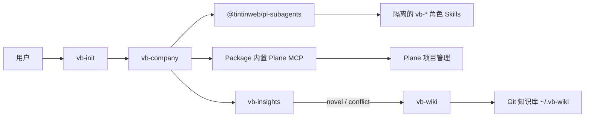

# VibeRig for Pi

VibeRig 是一套 Pi 原生虚拟软件公司。父级 delivery lead 负责协调相互隔离的项目分析、
架构、前端、后端、实现、测试、Review、安全、验证、调试、可靠性和知识整理 Agent。

此分支只服务 Pi，不保留 Codex、Claude Code、Cursor、Linear 或旧 VibeRig skill
兼容层。

英文文档：[README.md](./README.md)

## 架构


```mermaid
flowchart LR
  U["用户"] --> I["vb-init"]
  I --> C["vb-company"]
  C --> A["@tintinweb/pi-subagents"]
  A --> R["隔离的 vb-* 角色 Skills"]
  C --> M["Package 内置 Plane MCP"]
  M --> P["Plane 项目管理"]
  C --> N["vb-insights"]
  N -->|"novel / conflict"| W["vb-wiki"]
  W --> G["Git 知识库 ~/.vb-wiki"]
```

Plane 只负责 Project、Work Item、评论和里程碑等工作跟踪；`vb-wiki` 是长期知识的唯一
入口，不使用 Plane Pages 作为知识库。

## 安装

需要：

- Node.js 20.19 或更高；
- Pi 0.80 或更高；
- 用于启动固定版本 `plane-mcp-server==0.2.9` 的 `uvx`；
- Plane workspace 和 API Key。

```bash
pnpm install
pnpm run build
pi install /absolute/path/to/vb-plugin
```

启动 Pi 前，在父 Shell 配置：

```bash
export PLANE_BASE_URL="http://47.108.174.41:18090"
export PLANE_WORKSPACE_SLUG="<workspace-slug>"
export PLANE_API_KEY="<api-key>"
```

进入目标项目启动 Pi，然后运行：

```text
/skill:vb-init
```

`vb-init` 会查找或创建一个常驻 Plane Project，把非敏感 project ID 写入
`.pi/viberig.yaml`，并生成项目 Agent、角色 Skills、模型路由和安全策略。
`pi-mcp-adapter` 由 package 内置，不创建或修改项目 `.mcp.json`。

完整配置和验收流程见 [在 Pi 中使用 VibeRig + Plane](docs/install/zh-CN/pi-plane.md)。

## Skills

公开工作流入口：

- `vb-init`：初始化 Pi 项目和 Plane 绑定；
- `vb-company`：按任务选择最小员工团队；
- `vb-wiki`：查询和维护经过验收的长期知识。

项目初始化会安装 `vb-architecture`、`vb-frontend`、`vb-backend`、`vb-testing`、
`vb-review`、`vb-security`、`vb-verification` 等角色私有 Skills，供隔离 subagent
使用。`vb-insights` 只把已验收 Evidence 转成知识候选，只有父级可以通过 `vb-wiki`
写入。

## 模型路由

默认配置：

- 实现与测试用例编写：`xiaomi-token-plan-cn/mimo-v2.5`；
- Review、安全、架构、验证和 Council 聚合：`openai-codex/gpt-5.6-sol`；
- 知识整理：`openai-codex/gpt-5.6-sol`。

可在 `.pi/viberig.yaml` 修改项目模型层级。调用 Agent 时禁止临时覆盖模型。

## 验证

```bash
pnpm run lint
pnpm run test
pnpm run build
pnpm run test:pi-package-load
```
