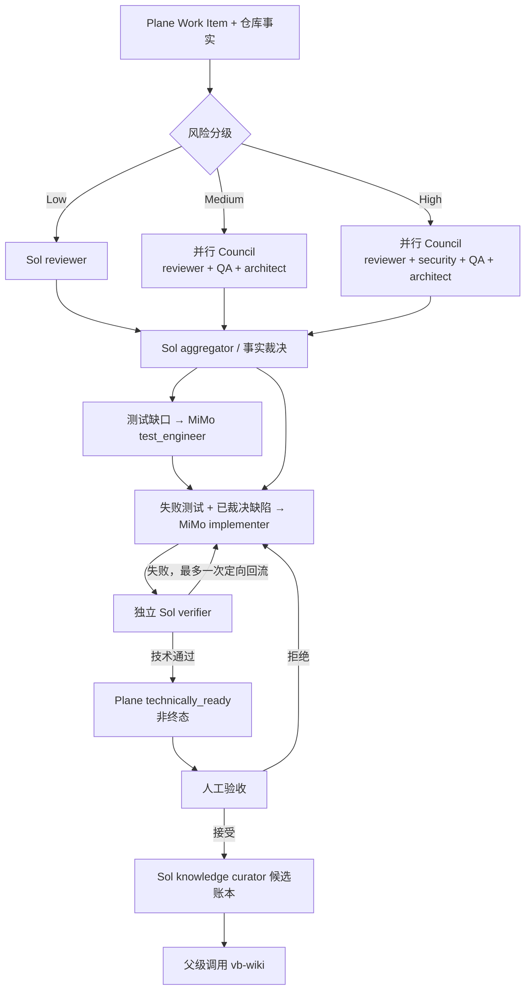

# Pi + Plane + Role-Isolated Council 方案与 A/B 结果

日期：2026-07-28  
分支：`codex/pi-company-plane`  
优先级：准确率 > 开发墙钟时间 > Token

## 结论

推荐采用风险分级的 Role-Isolated Council，而不是“MiMo 纯开发直接交付”，
也不建议把所有强模型角色机械串行执行。

最终可比实验中：

| 方案 | 隐藏测试 | 墙钟时间 | 有效 Token | 技术通过 |
| --- | ---: | ---: | ---: | ---: |
| MiMo 纯开发 | 9/14（64.3%） | 101.1s（1.69m） | 22,680 | 1/2，且无独立 verifier |
| 串行强门禁 | 14/14（100%） | 1,829.6s（30.49m） | 358,895 | 1/2 |
| Role-Isolated Council | 14/14（100%） | 1,106.4s（18.44m） | 265,547 | 1/2 |

在相同强模型角色、相同 MiMo 候选和相同最终 verifier 下，Council 相比串行：

- 墙钟时间减少 **39.5%**；
- 有效 Token 减少 **26.0%**；
- 累计 Agent 时间减少 **23.5%**；
- 输出 Token 减少 **39.3%**；
- 隐藏测试准确率保持 **14/14**。

但不能宣称“已经证明 100% 正确”：事件账本两种强校验方案虽然隐藏测试
7/7，最终 verifier 仍各自报告一个未覆盖的输入边界，所以技术通过只有 1/2。
这反而证明 verifier 不能被 review/security/测试替代。

## 推荐组织与模型路由

| 工作 | 角色 | 默认模型 | 权限 |
| --- | --- | --- | --- |
| 前端/后端/通用实现 | frontend/backend/implementer | MiMo-V2.5 | 隔离 worktree，可写 |
| 编写单元、集成、契约、E2E 等测试 | test_engineer | MiMo-V2.5 | 隔离 worktree，可写 |
| 正确性审查 | reviewer | GPT-5.6 Sol | 只读 |
| 安全审查 | security_auditor | GPT-5.6 Sol | 只读 |
| 需求-测试覆盖审查 | qa_reviewer | GPT-5.6 Sol | 只读 |
| 架构审查 | architect | GPT-5.6 Sol | 只读 |
| Council 裁决 | council_aggregator | GPT-5.6 Sol | 只读 |
| 最终验收 | verifier | GPT-5.6 Sol | 只读，可执行测试 |
| 知识候选整理 | knowledge_curator | GPT-5.6 Sol | 只读，不直接写 wiki |

MiMo 适合生产实现与测试资产编写，因为这两类任务可由编译、测试和强模型复核
约束。Sol 应保留给“判断工作”：安全、规格理解、架构取舍、裁决、最终验收和
跨会话知识候选。知识质量会影响后续所有任务，不能为了省一次 Token 将错误
长期放大。

## 最优流程



Council advisor 只提供不超过 600 Token 的角色证据；aggregator 必须拒绝重复、
风格偏好、无证据推断和规格收窄建议。QA 缺口路由给 test_engineer，生产缺陷
路由给 implementer。所有修复完成后仍由全新上下文 verifier 放行。

## 风险分级

| 风险 | Council 角色 | 适用任务 |
| --- | --- | --- |
| Low | reviewer + 独立 verify | 文档、小范围机械修改、可完全由确定性测试覆盖 |
| Medium | reviewer + QA + architect + 独立 verify | 常规业务开发、接口调整、跨文件重构 |
| High | reviewer + security + QA + architect + 独立 verify | 鉴权、租户隔离、支付、迁移、凭据、并发、外部输入 |

“MiMo 纯开发”只可作为候选生成，不应作为默认交付路径。OAuth 样例中它恰好
7/7，但事件账本只有 2/7；是否安全不能靠任务看起来简单来猜。对于低风险任务，
可以减少 Council 角色，但建议保留至少一个强 reviewer 和独立 verifier。

## Plane 与知识库设计

Plane 只承担：

- Work Item 的 list/search/read；
- states/modules/cycles 的项目结构；
- 幂等进度评论；
- 非终态生命周期投影；
- 人工验收前的可见进度。

`vb-wiki` 承担：

- 项目技术栈和约束检索；
- 已验收知识的 novel/conflict/zero-atoms 判断；
- 来源 revision、适用边界和失效信号；
- 后续开发可复用的长期知识。

Plane Pages 自动化固定关闭；`knowledge_curator` 只输出候选账本，父级在人工
验收后才可调用 `vb-wiki`。完整配置和 Linear 映射见
[Pi Agent + Plane 私有化接入](../../install/zh-CN/pi-plane.md)。

## 实验方法

两个开发 fixture：

1. `event-ledger`：租户隔离、JSON 等价、深度不可变、原子失败和错误语义；
2. `oauth-config`：输入验证、秘密处理、事务、审计 allowlist 和失败传播。

控制变量：

- 每个 fixture 只采样一次 MiMo 实现；
- 同一候选复制给三种方案；
- 同一份 MiMo 测试作者结果复制给两种强校验方案；
- 串行与 Council 使用相同的 Sol reviewer/security/QA/architect/verifier；
- Council 顾问通过真实 `Promise.all` 并行；
- 隐藏测试只在流程完成后评分，不进入模型上下文。

模型：

- 实现/测试：`xiaomi-token-plan-cn/mimo-v2.5`，thinking low；
- 校验/裁决/验收：`openai-codex/gpt-5.6-sol`，thinking high。

Token 口径：

`effectiveTokens = input + output + cacheWrite`。缓存读取单独保留，但不计入
有效 Token，避免把供应商缓存折扣与模型实际上下文输入混为一谈。

## 分任务结果

| Fixture | 方案 | 隐藏测试 | Verifier | 时间 | Token |
| --- | --- | ---: | --- | ---: | ---: |
| event-ledger | MiMo 纯开发 | 2/7 | 无 | 78.7s | 17,965 |
| event-ledger | 串行 | 7/7 | 失败：仍有错误类型边界 | 1,409.2s | 265,657 |
| event-ledger | Council | 7/7 | 失败：仍接受任意可强制转换日期对象 | 829.8s | 189,959 |
| oauth-config | MiMo 纯开发 | 7/7 | 无 | 22.4s | 4,715 |
| oauth-config | 串行 | 7/7 | 通过 | 420.4s | 93,238 |
| oauth-config | Council | 7/7 | 通过 | 276.5s | 75,588 |

观察：

- 复杂边界任务中，纯 MiMo 的速度优势无法补偿准确率风险。
- OAuth 明确了 transaction callback 的公共契约后，MiMo 可以一次实现正确；
  这说明高质量需求本身比堆更多 Agent 更划算。
- Council 主要通过并行读取和一次统一修复节约时间；Token 节省来自减少重复
  修订，而不是少做 security/verify。
- 隐藏测试 100% 仍可能漏掉 verifier 找到的边界，因此不能只优化 benchmark。

## 迭代审计

保留了三份原始报告：

- [第一轮](./pi-council-ab-2026-07-28.json)：尚无 QA owner 与 verifier 回流，
  用于证明旧流程缺口；
- [第二轮](./pi-council-ab-2026-07-28-iteration-2.json)：发现公共契约与隐藏
  transaction/date 假设不一致，未作为最终比较；
- [最终轮](./pi-council-ab-2026-07-28-final.json)：消除契约歧义后的可比结果。

MiMo 纯开发在不同轮次存在明显采样波动，因此本实验只能作为架构方向证据，
不能形成统计显著的模型排行榜。后续应扩展到至少 20 个真实历史任务、每任务
3 次重复，并按风险、语言、改动规模和缺陷类型分层。

## Plane 实例验收状态

`http://47.108.174.41:18090/` 当前可访问，公开实例信息显示 self-managed
Plane Community 1.3.1，且已有 workspace。由于缺少 API Key、workspace slug
和 project ID，本次未对真实项目执行鉴权 API 或写入；Plane 网关通过 mock
contract tests 验证了鉴权头、Work Items/States/Modules/Cycles 路径、HTML
转义、幂等评论、PATCH read-back 和禁止 completed 状态。

## 验证命令

```bash
pnpm run typecheck
pnpm run lint
pnpm run test:pi-company
pnpm run eval:pi-council-ab -- --dry-run
node scripts/run-pi-council-ab.mjs \
  --report docs/design/evidence/pi-council-ab-2026-07-28-final.json
```

## 参考资料

- [Plane API Introduction](https://developers.plane.so/api-reference/introduction)
- [Work Items 与旧 Issues API 退役](https://developers.plane.so/api-reference/issue/list-issues)
- [更新 Work Item](https://developers.plane.so/api-reference/issue/update-issue-detail)
- [Work Item Comments](https://developers.plane.so/api-reference/issue-comment/add-issue-comment)
- [States](https://developers.plane.so/api-reference/state/list-states)
- [自托管 Pages API 问题](https://github.com/makeplane/plane/issues/8986)
