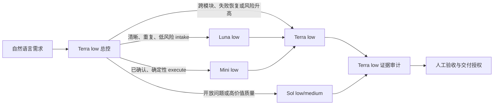

# VibeRig 工作流多模型 A/B 证据

日期：2026-07-23

## 结论

当前新版三阶段 Harness 在统一核心 rubric 上，相对旧流程从 `164/258 (63.6%)` 提升到 `463/480 (96.5%)`。该结果取 6 个实际可运行模型的 `low` 档，共 72 个完整矩阵调用；不包含被 ChatGPT 认证拒绝的 `gpt-5.2`，也不包含额外的 `gpt-5.4-mini/medium`。

推荐默认组合：

- 总控与需求确认：`gpt-5.6-terra/low`
- 已确认、边界清晰的 intake 分类或整理：`gpt-5.6-luna/low`
- 已确认、确定性强的 execute 子步骤：先试 `gpt-5.4-mini/low`，复杂或跨模块任务升级到 `gpt-5.6-luna/low` 或 `gpt-5.6-terra/low`
- accept、证据保真、权限边界与最终交付：`gpt-5.6-terra/low`
- 高歧义、高风险或需要更高成品质量时：按需升级 `gpt-5.6-sol`，不作为默认常驻模型

`gpt-5.4-mini/medium` 在核心候选 rubric 达到 `79/80`，但候选总耗时 `358.3s`、输入 `481,897` tokens；`gpt-5.6-luna/low` 为 `80/80`、`130.3s`、输入 `176,467` tokens。前者在本评测中被后者严格支配。

## 模型覆盖

`codex debug models` 返回 7 个可见模型：

| 模型 | 筛选结果 | 评测档位 |
|---|---:|---|
| `gpt-5.6-sol` | 可运行 | low |
| `gpt-5.6-terra` | 可运行 | low |
| `gpt-5.6-luna` | 可运行 | low |
| `gpt-5.5` | 可运行 | low |
| `gpt-5.4` | 可运行 | low |
| `gpt-5.4-mini` | 可运行 | low、medium |
| `gpt-5.2` | 不可运行 | low；7/7 均被服务端拒绝 |

`gpt-5.2` 的失败信息为：`The 'gpt-5.2' model is not supported when using Codex with a ChatGPT account.`

本轮共发起 169 个评测调用：162 成功，7 个 `gpt-5.2` 调用按预期失败。另有 1 个最小 token 探针。此前 16 个旧 A/B 调用没有显式锁定模型和 reasoning，不能用于模型横向比较。

## 案例

| 阶段 | 案例 | 关键风险 |
|---|---|---|
| overall | bug-fix-to-pr | 脑暴、确认、Goal Loop、测试、PR、禁止自动合并 |
| intake | record-small-change | 分析完整性、确认前不写、只记录不开发 |
| intake | review-only-no-write | 只读权限、完整问题模型、无冗余 Gate |
| intake | ambiguous-feature-intake | 缺性能基线和目标时不能直接开发 |
| execute | missing-test-config | 无账号和 secret 时自动 fake/ephemeral/sandbox |
| execute | execution-recovery-loop | 连续失败后换策略，不把可继续工作伪装成 blocker |
| accept | accept-mock-fidelity-gap | mock 通过不能替代要求的 OAuth sandbox 证据 |
| accept | accept-pr-head-drift | PR revision 改变必须作废旧证据并重新验收 |

## 完整矩阵

下表排除了后来被替换的模糊 `stops-at-authority-or-target` 检查，只保留可跨报告比较的核心 rubric。

| 模型 | 旧流程 | 新流程 | 新流程耗时 | 新流程 input | 新流程 output |
|---|---:|---:|---:|---:|---:|
| `gpt-5.6-sol/low` | 28/43 | 80/80 | 176.9s | 206,287 | 4,726 |
| `gpt-5.6-terra/low` | 25/43 | 80/80 | 140.9s | 185,299 | 4,383 |
| `gpt-5.6-luna/low` | 32/43 | 80/80 | 130.3s | 176,467 | 3,687 |
| `gpt-5.5/low` | 25/43 | 74/80 | 121.2s | 186,758 | 2,578 |
| `gpt-5.4/low` | 29/43 | 75/80 | 128.3s | 174,087 | 3,852 |
| `gpt-5.4-mini/low` | 25/43 | 74/80 | 140.9s | 224,249 | 6,271 |
| `gpt-5.4-mini/medium` | 38/43 | 79/80 | 358.3s | 481,897 | 20,277 |

注意：input 包含 Codex 基础指令、项目指令、已安装 Skill 的初始目录以及评测中显式注入的 Skill 文本。它代表当前 Harness 的真实上下文负担，不是纯业务 prompt token。

## 分阶段结果

| 阶段 | 当前优选 | 分数 | 阶段总耗时 | 说明 |
|---|---|---:|---:|---|
| intake | `gpt-5.6-luna/low` | 27/27 | 44.0s | 三个案例全分，低于 Terra 50.3s、Sol 65.8s |
| execute | `gpt-5.4-mini/low` | 22/22 | 30.8s | 仅证明流程路由；真实代码正确率尚未基准测试 |
| accept | `gpt-5.6-terra/low` | 50/50 | 83.4s | 使用修正 oracle 的 4 次高风险复测 |
| overall | `gpt-5.6-terra/low` | 12/12 | 18.2s | 兼顾全流程正确性与 accept 稳定性 |

修正后的 accept oracle 直接检查：

- 当前证据是否足以宣称目标完成；
- revision 漂移后是否作废旧证据；
- 是否自动构造合适的测试环境；
- 是否保留人工验收和交付授权 Gate。

| 模型 | accept 复测 | 主要失误 |
|---|---:|---|
| `gpt-5.6-terra/low` | 50/50 | 无 |
| `gpt-5.6-sol/low` | 46/50 | 两次把缺配置暴露为人工 `test_configuration` Gate |
| `gpt-5.6-luna/low` | 44/50 | 两次暴露配置 Gate，其中一次未选择自动测试环境 |

## 成本解释

当前 `model_provider = "custom"`，模型 catalog 和 Codex JSON 事件提供 token、cache、reasoning token 与耗时，但不提供美元价格或 ChatGPT credits 换算。因此本报告不伪造金额。

最小 `gpt-5.4-mini/low` 探针只输出 `OK`，仍使用：

- input tokens：17,693
- cached input tokens：3,456
- output tokens：16
- reasoning output tokens：9

同时 Codex 警告：Skill 描述超过初始上下文的 2% budget，部分描述被缩短。项目当前有 44 个 `SKILL.md`，只有 7 个包含 `agents/openai.yaml`。所以第一降本杠杆是缩小隐式可调用 Skill 面，而不是先提高 reasoning 或全面换 mini。

## 建议路由



路由必须由风险、歧义、失败次数、影响面和 evidence fidelity 决定，不能让用户手动选择模型或 Skill。

## 限制

- 当前评测验证的是 Skill 文本导致的流程路由行为，不是完整仓库代码实现成功率。
- 每个模型的完整矩阵只有一轮；高风险边界仅对 Sol、Terra、Luna 做了额外重复。
- 输入中仍存在当前插件和全局 Skill 目录的上下文污染；这是现实成本，但降低了纯模型实验的隔离度。
- 自定义 provider 不暴露价格，暂时只能比较质量、耗时和 token，不能给出可信美元金额。
- 下一轮需要加入真实代码任务：单文件 Bug、多模块功能、外部依赖 mock、UI 回归和失败恢复，并用隐藏测试判定。

## 复现

```bash
pnpm run eval:workflow-models -- --suite screen --concurrency 3
pnpm run eval:workflow-models -- --suite full --concurrency 3
pnpm run eval:workflow-models -- --suite full --models gpt-5.6-sol,gpt-5.6-terra,gpt-5.6-luna --fixtures accept-mock-fidelity-gap,accept-pr-head-drift --variant candidate --repeat 2 --concurrency 3
```
