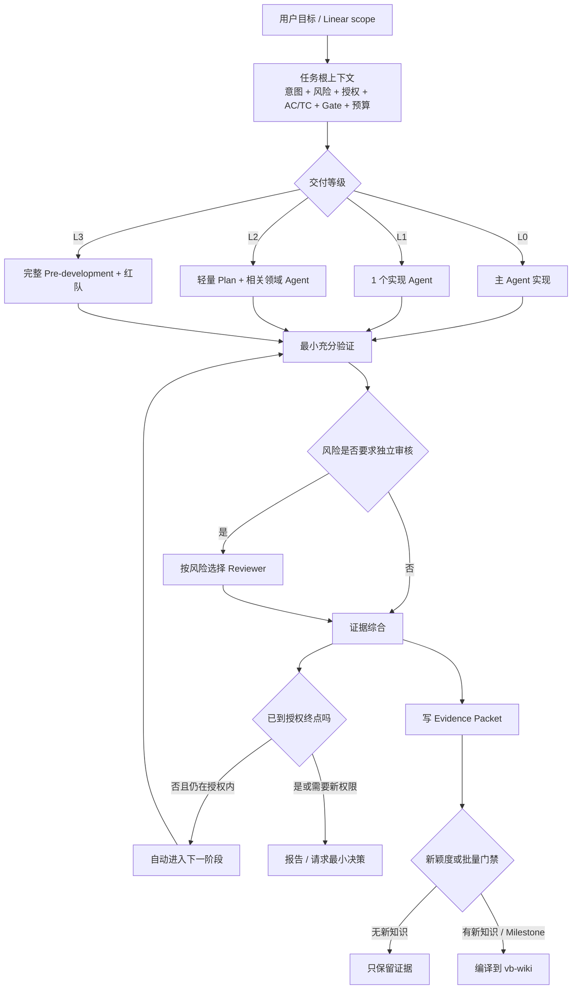
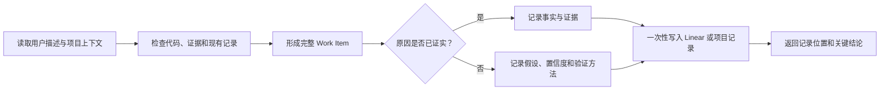
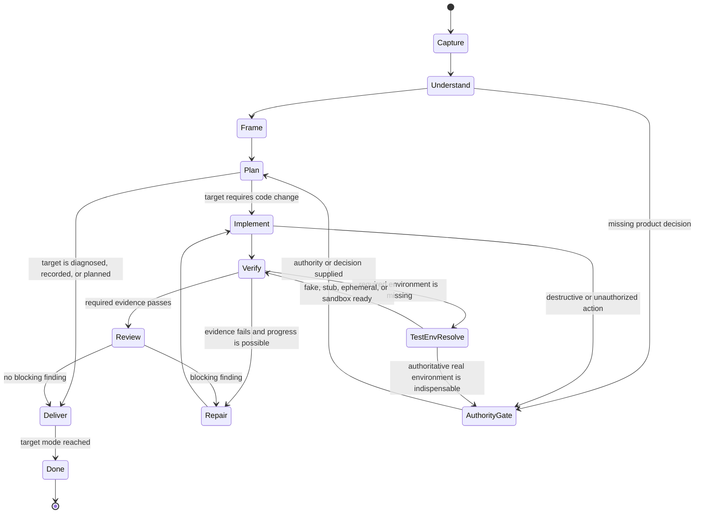
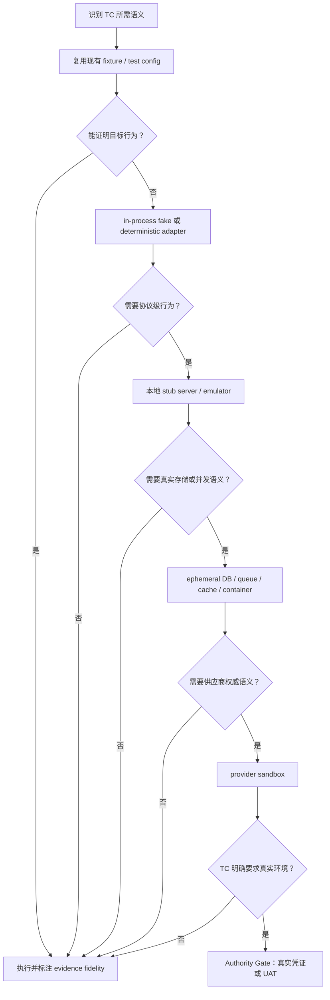
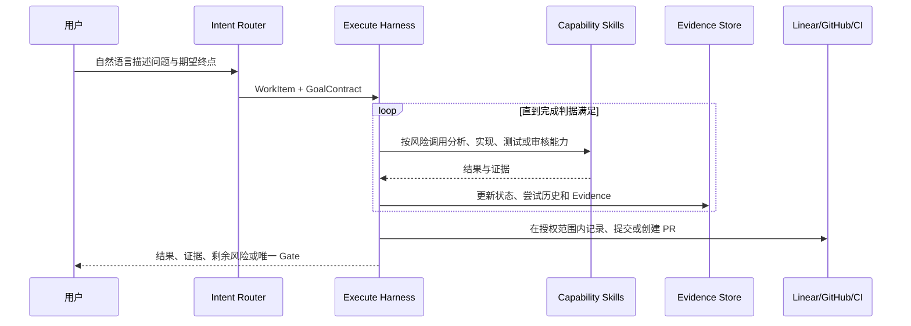
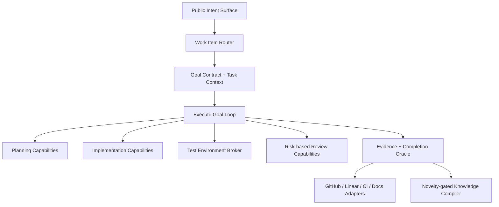
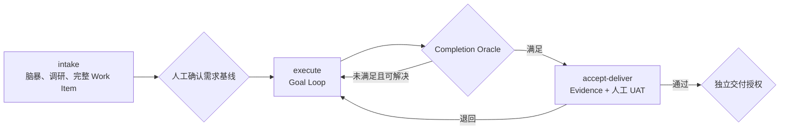
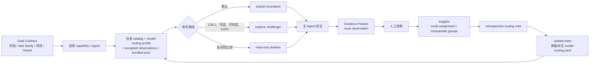

# VibeRig Skills 工作流与提示词优化设计

## 文档信息

| 属性 | 值 |
|---|---|
| 状态 | Proposed |
| 版本 | 1.2 |
| 日期 | 2026-07-23 |
| 适用范围 | VibeRig 的需求进入、规划、开发执行、验证、验收、交付与知识沉淀 Skills |
| 核心目标 | 以风险自适应的方式，低成本、少中断、可验证地完成软件开发 |
| 上游设计 | [开发前流程总体设计](./pre-development-workflow.zh-CN.md) |
| 相关设计 | [开发质量门禁与验收流程设计](./development-quality-gates.zh-CN.md) |
| 当前阶段 | 已落地三阶段人工流程、统一 Work Item、Execute Goal Loop、测试环境 Broker、旧入口兼容层和 Codex exec A/B 基线；后续继续扩充长尾评测 |

## 1. 执行摘要

VibeRig 当前已经具备较完整的软件交付能力：需求基线、开发前调研、架构设计、测试设计、Issue 执行、风险审核、人工验收、交付恢复和知识沉淀均有对应 Skill。

当前主要问题不是能力不足，而是可靠性成本没有随任务风险变化：

- 小任务仍可能支付建单、知识查询、Subagent、TDD、多路审核、人工验收和知识编译的固定成本；
- 相似的开发动作按 Bug、小改动、Issue、Milestone 被拆到多条独立流程，用户需要理解并触发下一阶段；
- 多个 Skill 重复定义相同的不变量、红线、检查清单和恢复规则，增加 Prompt 长度和规则漂移概率；
- 部分 Prompt 存在互相冲突的要求，导致不同模型或不同会话可能选择不同执行顺序；
- 知识沉淀被绑定到每次验收，哪怕最终没有新知识，也必须先加载和执行完整的学习协议。

本设计采用一个核心原则：

> Reliability should scale with risk. Ceremony should not.

VibeRig 应先判断风险、未知性和用户授权，再决定使用多少文档、Subagent、Reviewer、测试、人工门禁和知识处理。低风险任务走短路径；高风险任务继续保留当前完整流程。

## 2. 设计目标

| 目标 | 说明 |
|---|---|
| 风险自适应 | 测试、Agent、审核和文档深度由风险决定，不由“Bug/Feature”标签机械决定 |
| 单一执行入口 | 用户表达目标和交付终点后，系统在授权范围内自动推进，不要求用户记住 Skill 链 |
| 最小充分上下文 | 每个 Agent 只获得完成其任务所需的代码、契约、AC、TC 和历史结论 |
| 证据优先 | 是否完成由真实 diff、命令、CI、环境和 UAT 证据决定，而不是流程步骤数量 |
| 成本可控 | 每条任务显式设置 Subagent、Reviewer、上下文和验证预算 |
| 精准交付 | 保留主 Agent 独立验证、证据与 commit 绑定、风险审核和失败定向返工 |
| 少打断用户 | 仅在业务取舍、不可逆操作、真实 UAT 或未预授权外部副作用时暂停 |
| 渐进兼容 | 先将现有 Skills 变成兼容入口，再逐步收敛，不一次性破坏已有调用方式 |
| 可评测 | 通过固定任务集测量成本、准确率、返工率、人工轮次和尾部失败 |

## 3. 非目标

本设计不做以下事情：

- 不取消 Linear、Docs as Code、AC、TC、Proof Packet 或项目质量门禁；但不把 Linear 可用性作为本地执行前提；
- 不把所有任务都改成主 Agent 直接修改；
- 不取消高风险任务的独立安全、测试、性能或架构评审；
- 不从自动化测试推断用户已经完成业务验收；
- 不允许 Subagent 擅自更新 Linear、合并 PR、部署或作最终验收判断；
- 不把初始需求授权无限扩大为 merge、deploy、数据删除等外部副作用授权；
- 不要求第一阶段立即删除现有 Skill 名称；
- 不把知识沉淀等同于自动创建工具 Skill。

## 4. 当前问题与证据

### 4.1 固定流程成本

当前核心 Prompt 的相关文本规模如下。该数据表示跨阶段可能需要解释的 Prompt surface，不代表所有内容会在一个模型调用中同时加载。

| 路径 | 相关文件数 | 文本规模 | 主要固定成本 |
|---|---:|---:|---|
| Bug 执行至验收前 | 5 | 约 37.8k 字符 | 建单、知识查询、独立诊断、确认、实现委派、验证、提交、验收 |
| 普通 Issue 执行核心 | 3 | 约 26.5k 字符 | `task-runner`、`agent-sop`、`subagent-routing` |
| 开发前核心协议 | 10 | 约 31.7k 字符 | Intake、调研、架构、验收、拆分和路由；不含全部模板 |
| 验收后学习协议 | 14 | 约 190.2k 字符 | Insights、事件恢复、Wiki 编辑、检索、事务、项目身份和晋升 |

问题不只是 Token 数量。Prompt 越长、分支越多、同义规则越重复，模型遗漏边界和选择错误分支的概率越高。

### 4.2 已确认的 Prompt 冲突

| 编号 | 位置 | 冲突 |
|---|---|---|
| C-01 | `bugger` | 主 Workflow 要求用户确认后再写分析评论；Anti-Rationalization 与 Checklist 要求确认前写入 |
| C-02 | `quick` 与 `agent-sop` | `quick` 要求小任务产出 Code、Security、Test 并行审核；`agent-sop` 明确禁止所有任务默认拉全套审核 |
| C-03 | `pre-development` | Token 控制表允许轻量流程只用一个 Subagent；主流程仍默认独立架构红队、白队回应和 CTO 裁决 |
| C-04 | `quick` 与测试策略 | `agent-sop` 允许文档、静态内容和无行为配置不新增测试；`quick` 的红线与检查清单近似要求所有改动先产生 proving test |
| C-05 | `subagent-routing` | 声明非任务阶段可以主 Agent 直接完成，但所有 Linear task 无论风险均强制使用 Subagent |
| C-06 | `task-runner` | 即使上游用户已明确授权实现，其他 Skill 仍禁止自动进入执行，必须再次由用户手动触发 |

### 4.3 路由维度不正确

当前主要按任务类型分流：

- 新需求 → `intake`；
- 小改动 → `record-issue`；
- Bug → `bugger` → `quick`；
- Linear Issue / Milestone → `task-runner`；
- standalone 验收 → `accept-issue` → `merge-issue`；
- Milestone 验收 → `accept-milestone`。

任务类型不能准确代表成本和风险。一个修改错误文案的 Bug 可能比增加一个局部配置项更简单；一个名义上的“小改动”也可能触碰权限、支付或公共 API。

真正决定流程深度的因素是：

- 影响范围；
- 技术未知性；
- 可逆性；
- 外部副作用；
- 数据、安全和合规风险；
- 是否改变公共契约；
- 用户要求的交付终点。

### 4.4 人工交接过多

当前流程常把 Skill 边界变成人工边界：

```text
bugger → 等用户确认 → 用户调用 quick → 用户调用 accept-issue
task-runner → 用户调用 accept-issue → 用户调用 merge-issue
task-runner milestone → 用户调用 accept-milestone → 再确认 merge
```

当用户已经明确要求“修复并交付到 PR”时，分析、实现、验证和创建 PR 属于同一授权范围，不应为了 Skill 边界反复暂停。

人工暂停应绑定权限变化，而不是绑定 Skill 名称变化。

### 4.5 知识流程与交付热路径耦合

当前验收通过后立即进入 `insights → vb-wiki`，即使最终判断为 zero atoms，也要完成较重的上下文加载、事件恢复和知识判定。

这带来三个问题：

1. 普通成功任务为“可能没有的新知识”支付完整编译成本；
2. 知识系统异常会增加交付尾部延迟；
3. 相同任务在 `bugger`、`quick`、`task-runner` 中分别执行一次定向查询，查询属于阶段而非任务。

## 5. 核心设计原则

### 5.1 按风险购买可靠性

低风险任务使用更少流程并不代表降低质量。它仍必须有真实验证，只是不需要为无关风险启动独立角色和文档。

高风险任务继续使用完整开发前流程、独立领域结论、红队、回滚、专项测试和人工授权。

### 5.2 证据强度高于流程数量

以下证据按重要性优先于“运行了多少 Agent”：

1. 与当前 commit 绑定的 Required CI；
2. 能复现缺陷的 RED 与修复后的 GREEN；
3. 目标环境中的契约、E2E、Smoke 或 UAT；
4. 主 Agent 对 diff、范围和命令输出的独立检查；
5. 独立 Reviewer 的结构化 Findings；
6. Subagent 对自己工作的完成声明。

### 5.3 一次任务只建立一次根上下文

任务根上下文负责：

- 需求或 Issue 身份；
- 风险等级；
- 用户授权终点；
- 相关 AC/TC；
- 代码范围；
- 一次历史知识查询结果；
- 项目 Gate；
- 成本预算。

后续 Skill 或 Subagent 消费该上下文，不重复查询和重新分类。

### 5.4 人工门禁绑定权限变化

只有下列情况需要暂停：

- 缺失业务信息会改变产品方向；
- 存在两个互斥且有实质成本差异的方案；
- 操作不可逆或影响真实外部状态；
- 需要用户亲自执行 UAT；
- merge、deploy、发消息等动作未包含在初始授权中；
- 新发现使任务超出原批准范围或风险等级。

### 5.5 Prompt 使用渐进披露

顶层 SKILL.md 只包含路由和核心契约。只有命中某个分支时才读取相应 reference、schema 或模板。

不允许为了防止某个边缘失败，把所有恢复协议和反例都注入每次普通任务。

## 6. 风险等级模型

### 6.1 分类维度

| 维度 | 低信号 | 中信号 | 高信号 |
|---|---|---|---|
| 影响范围 | 1–2 个局部文件 | 单模块或单域 | 跨模块、跨服务、跨团队 |
| 技术未知性 | 模式明确、已有相邻实现 | 需要局部探索 | 需要 Spike、外部研究或方案竞争 |
| 可逆性 | 可直接回退 | 需要兼容或数据恢复 | 不可逆迁移、数据删除、长期契约 |
| 外部副作用 | 无 | PR、Linear、普通第三方调用 | 生产、支付、通知、真实用户数据 |
| 安全与数据 | 不涉及 | 普通输入、内部数据 | 鉴权、权限、隐私、敏感数据、合规 |
| 契约变化 | 无公共契约 | 向后兼容扩展 | 破坏性 API、Schema 或行为变化 |

### 6.2 交付等级

| 等级 | 判定 | 默认流程 |
|---|---|---|
| L0 Fast | 局部、清晰、可逆；无公共契约、数据、权限和真实外部副作用 | 主 Agent 直接实现；定向验证；无需独立 Subagent 或 Reviewer |
| L1 Standard | 单域、可回滚、AC 清晰；普通业务逻辑或局部 Bug | 一个实现 Subagent；主 Agent 验证；非简单代码增加一个 Code Review |
| L2 Complex | 跨模块、公共契约、数据变化或明显技术未知 | 轻量 Plan；相关领域 Agent；架构/测试/回滚评审；PR CI |
| L3 Critical | 权限、支付、隐私、不可逆数据、核心链路、合规或生产发布 | 完整 Pre-development；独立红队；多路专项审核；UAT 与发布门禁 |

以下任一条件默认至少为 L2：

- 修改公共 API、事件契约或持久化 Schema；
- 需要多个模块或多个 Issue 协同；
- 需要新外部依赖或第三方服务；
- 需要迁移、兼容或灰度方案；
- 失败会阻塞主要用户流程。

以下任一条件默认至少为 L3：

- 鉴权、越权、敏感数据或隐私边界；
- 支付、计费、资金、配额或不可逆数据操作；
- 生产部署、数据回填、删除或高成本外部副作用；
- 法务、审计或合规要求；
- 用户明确要求最高保障模式。

## 7. 用户授权模型

任务入口必须识别用户期望的执行终点。

| 模式 | 授权范围 | 默认停止点 |
|---|---|---|
| `analyze_only` | 只读诊断、方案和证据 | 给出原因与建议，不修改 |
| `implement_to_worktree` | 允许修改和本地验证 | 工作区通过验证，不提交 |
| `implement_to_commit` | 允许修改、验证和提交 | 产生范围干净的 commit |
| `implement_to_pr` | 允许提交、push 和创建/更新 PR | PR 与 CI 证据就绪 |
| `deliver_after_gates` | 允许在既定 Gate 通过后交付 | 仍不自动包含未明确授权的生产部署或不可逆动作 |

规则：

- 上游授权在范围和风险未变化时向后传递；
- Skill 切换不使授权失效；
- 新增不可逆副作用时必须重新确认；
- 用户可在任意时刻缩小或撤销尚未执行的授权；
- 用户只说“看看”“分析”时不得推断为实现授权；
- 用户明确说“修复”“实现”“完成并开 PR”时，不应再要求一次同义确认。

## 8. 目标工作流



## 9. 各等级的默认执行预算

| 项目 | L0 Fast | L1 Standard | L2 Complex | L3 Critical |
|---|---:|---:|---:|---:|
| 实现 Subagent | 0 | 1 | 1–2 | 按领域 |
| 独立 Reviewer | 0 | 0–1 | 1–2 | Code/Security/Test/Operational 按风险 |
| 开发前文档 | 无或一页 Task Brief | Task Brief | Plan + 契约 + AC/TC + 风险 | 完整需求资料包 |
| 主 Agent 验证 | 必须 | 必须 | 必须 | 必须 |
| 全量 CI | 按项目策略 | PR Required Checks | 必须 | 必须 |
| 人工 UAT | 通常不需要 | 按 AC | 通常需要 | 必须 |
| Wiki 编译 | 新颖度命中才执行 | 新颖度命中或批量 | Milestone 批量 | 验收后执行 |

预算不是绝对上限。执行过程中发现风险升级信号时，可以提升等级；必须记录升级原因，不得静默扩大成本。

## 10. Skill 架构调整

### 10.1 目标分层

| 分层 | 职责 | 对用户可见性 |
|---|---|---|
| Entry Skills | 识别用户意图、范围、风险和授权终点 | 可直接触发 |
| Orchestrator Skills | 推进计划、执行、验收和交付状态 | 由入口自动调用，也允许高级用户直接调用 |
| Capability Skills | TDD、安全、API、架构、浏览器测试等专业能力 | 仅在路由命中时加载 |
| Shared References | Linear、证据有效性、Agent Brief、权限和恢复不变量 | 不作为独立用户工作流触发 |
| Compilers | Evidence、Insights、Wiki、Skill promotion | 异步、批量或显式触发 |

### 10.2 现有 Skill 到目标职责的映射

| 当前 Skill | 目标处理 | 说明 |
|---|---|---|
| `intake` | 保留为统一规划入口 | 增加风险分类；L0/L1 不自动进入完整 Pre-development |
| `pre-development` | 变成 L2/L3 编排器 | L2 使用轻量产物；L3 保留完整流程和红队 |
| `record-issue` | 兼容入口，转 `execute` 的 `change` mode | 建单不再成为执行前的人工停止点 |
| `bugger` | 兼容入口，转 `execute` 的 `diagnose` mode | 用户授权修复时允许诊断后自动进入实现 |
| `quick` | 兼容入口，转 `execute` 的 `fast` mode | 不再固定要求 Subagent、完整 TDD 和三路审核 |
| `task-runner` | 目标 `execute` 主编排器 | 支持继承上游授权；保留 worktree、PR 和 Milestone 模式 |
| `agent-sop` | 内部执行与验证协议 | 只在需要委派或独立审核时加载 |
| `subagent-routing` | Shared Reference / 内部 Router | 删除“所有 Linear task 必须 Subagent”的绝对规则 |
| `accept-issue` | `accept-deliver` 的 issue mode | 保留用户验收边界和事件恢复 |
| `accept-milestone` | `accept-deliver` 的 milestone mode | 保留 UAT、聚合、交付和发布验证 |
| `merge-issue` | `accept-deliver` 的 delivery mode | 已有有效授权时由前一阶段自动进入 |
| `insights` | Evidence → Knowledge 的判定器 | 不再是每个普通成功任务的强制热路径 |
| `vb-wiki` | 批量知识编译器和查询接口 | 只消费通过新颖度门禁或显式请求的 Evidence |
| `vb-linear` | Shared Reference | 继续集中工具选择、状态映射和写入规则 |
| `test-driven-development` | Capability Reference | 由行为变化和测试价值触发，不因“实现”一词自动全局触发 |
| `security-and-hardening` | Capability Reference | 由安全边界信号触发 |

### 10.3 兼容策略

第一阶段不删除现有 Skill 名称：

- `bugger`、`quick`、`record-issue` 继续接受旧调用；
- 旧入口内部生成统一 Task Context，并路由到新的执行协议；
- 旧 Prompt 中重复的实现、验证和学习细节逐步删除；
- 当兼容入口稳定后，再决定是否从插件公开列表中隐藏内部 Skill。

## 11. Prompt 设计规范

### 11.1 顶层 SKILL.md 结构

面向工作流的顶层 Skill 应优先保持在 80–120 行，复杂 Skill 不应超过约 200 行。推荐结构：

1. Frontmatter：只写触发意图和排除条件；
2. Goal：本 Skill 负责完成什么；
3. Authority：允许和禁止的副作用；
4. Router：如何选择模式或风险等级；
5. Workflow：正常主路径；
6. Stop Conditions：真正需要暂停的条件；
7. Output Contract：结构化输出；
8. References：仅列条件加载的资源；
9. Validation：可执行的完成标准。

### 11.2 删除重复防御文本

同一规则不得在 Workflow、Red Flags、Anti-Rationalization 和 Checklist 中重复四次。

推荐保留：

- Workflow 中写正向规则；
- Stop Conditions 中写必须暂停的情况；
- Validation 中写可执行判定；
- 真正跨 Skill 的不变量放入 Shared Reference。

仅当某种错误在评测中反复出现时，才增加一条短反例；反例必须绑定具体失败样本。

### 11.3 Frontmatter Trigger 规则

Frontmatter description 只回答：

- 用户表达了什么意图时触发；
- 哪些相邻意图不适用；
- 是否是用户入口或内部能力。

不得把完整 Workflow 写进 description。内部 Shared Reference 不使用“whenever work may benefit”这类宽泛触发词。

### 11.4 统一 Task Context

所有开发执行使用同一结构：

```yaml
task:
  scope_id: "VB-123"
  intent: "fix"
  delivery_level: "L1"
  authority: "implement_to_pr"
  objective: "修复登录超时后的错误恢复"
  code_scope:
    - "src/auth/**"
  acceptance:
    - "AC-2"
  tests:
    - "TC-4"
  knowledge_hits: []
  gates:
    - "pnpm test"
  budget:
    max_subagents: 1
    max_reviewers: 1
    max_context_files: 12
    max_rework_rounds: 2
  stop_on:
    - "public_contract_change"
    - "irreversible_data_change"
```

同一任务后续阶段复用该结构，只追加证据和状态，不重新解释完整需求。

### 11.5 Subagent Brief

Subagent Brief 只包含：

- 一个目标；
- 相关文件或模块；
- 必须遵守的契约和 AC/TC；
- 不允许修改的范围；
- 需要返回的 diff、命令和风险；
- 可使用的上下文预算。

不得给 Subagent：

- 全量需求目录；
- 无关历史评论；
- 其他 Issue 的全部 TC；
- 完整知识库搜索结果；
- 与任务等级无关的恢复协议。

### 11.6 验证升级阶梯

默认从最便宜、信息量最高的检查开始：

1. 语法、类型或 schema 检查；
2. 直接受影响的单元或契约测试；
3. 相关模块测试；
4. 必要的 build、Smoke 或浏览器验证；
5. PR Required Checks；
6. L2/L3 的 E2E、性能、安全或发布验证。

只有风险等级、失败证据或项目 Gate 要求时才升级。不得为了形式完整默认运行所有检查。

## 12. Subagent 使用策略

### 12.1 何时不使用

满足以下条件时，主 Agent 可以直接实现：

- L0 Fast；
- 改动模式明确；
- 不需要独立领域判断；
- 验证可以由明确命令完成；
- 主 Agent 当前上下文已经足够；
- 没有要求职责隔离的合规或项目策略。

### 12.2 何时使用一个实现 Agent

L1 默认使用一个实现 Agent，当：

- 任务需要修改多处相关逻辑；
- 需要隔离实现上下文；
- 主 Agent需要保留独立验证视角；
- 实现可以用一个有边界的 Brief 描述。

### 12.3 何时增加 Reviewer

| Reviewer | 触发条件 |
|---|---|
| Code | 非简单行为变化、复杂控制流、公共接口或高回归风险 |
| Test | 测试策略不清、历史缺陷、边界复杂或自动化价值高 |
| Security | 鉴权、权限、外部输入、敏感数据、供应链和第三方集成 |
| Performance | 性能预算、容量、核心高频路径、查询和批处理变化 |
| Architecture | 跨模块、跨服务、契约、迁移和长期边界变化 |

Reviewer 数量由风险触发条件决定，不由 Task 是否在 Linear 中决定。

## 13. 开发前产物预算

当前完整流程产生大量独立文件。目标设计按等级生成最小充分产物：

| 产物 | L0 | L1 | L2 | L3 |
|---|---|---|---|---|
| Task Context | 必须 | 必须 | 必须 | 必须 |
| 独立 Intake 文档 | 否 | 按需 | 是 | 是 |
| Architecture | 否 | 只写关键决策 | 是 | 是 |
| Acceptance / TC | 内嵌简要结果 | 相关 AC/TC | 结构化文件 | 完整结构化文件 |
| Risk Register | 否 | 内嵌残余风险 | 是 | 是 |
| Release / Rollback | 否 | 按需 | 适用时 | 必须 |
| Traceability | 不需要 | Issue 内映射 | 结构化 | 完整结构化 |
| Pre-development Review | 不需要 | 不需要 | 轻量审批包 | 完整审批包 |

“不适用”不再要求创建一个文件专门说明不适用；Task Context 中的风险分类已经提供可审计理由。

## 14. 验收与交付优化

### 14.1 验收边界

工程验证和人工验收继续分离：

- 自动化 Gate、Code Review 和 CI 证明实现是否可靠；
- UAT 证明业务结果是否符合用户预期；
- 用户已经在当前对话明确验收时，不要求重复相同措辞；
- L0/L1 且无独立 UAT 的任务，可由初始可判定 AC 与验证证据完成技术交付，但不得伪造人工验收。

### 14.2 连续交付

当用户选择 `implement_to_pr`：

- 系统自动完成分析、实现、验证、commit、push 和 PR；
- 不因 `record-issue`、`quick`、`task-runner` 的 Skill 边界暂停；
- PR 创建后停止，不自动推断 merge 权限。

当用户选择 `deliver_after_gates` 且明确包含 merge：

- Required Checks、审批和内容一致性满足后，可复用同一授权；
- head、base、范围或风险发生实质变化时重新请求授权；
- 仍保留 delivery intent 和幂等恢复。

## 15. Evidence-First 学习设计

### 15.1 每个任务只强制生成轻量 Evidence Packet

Evidence Packet 至少包含：

- scope 和目标；
- 风险等级；
- commit 或不可变成果身份；
- 改动摘要；
- 执行的 TC/Gate；
- 失败与返工；
- 残余风险；
- 用户验收状态；
- 可选的新颖度信号。

它是交付流程的一部分，应短小、结构化、低成本。

### 15.2 新颖度门禁

只有出现下列信号时才立即运行知识编译：

- 新的稳定失败模式；
- 新的项目级约束或不可见不变量；
- 可复用的诊断或恢复方法；
- 重复出现且已验证的实现模式；
- 会改变未来技术决策的架构结论；
- 用户明确要求沉淀。

普通成功、重复已知模式、只与当前任务相关的实现细节默认只保存 Evidence。

### 15.3 批量编译

以下时点可以批量执行 `insights → vb-wiki`：

- Milestone 验收完成；
- 累积达到配置的 Evidence 数量；
- 用户显式要求复盘；
- 项目阶段结束；
- 高风险事件验收完成。

批量编译应按 event ID 去重，并只提取相对现有知识的增量。

## 16. 状态与恢复原则

复杂幂等和事务协议仍然重要，但不应完整出现在每个业务 Skill 中。

目标拆分：

- Skill 只声明要执行的状态动作；
- Shared Reference 定义 event、phase、delivery intent 和恢复不变量；
- 可确定计算逐步下沉到 CLI 或脚本，包括 ID、hash、schema 校验和状态归并；
- 普通路径只加载当前 phase 所需规则；
- 只有恢复或冲突时加载完整恢复协议。

这可以保留当前 fail-closed 能力，同时减少正常任务的 Prompt 负担。

## 17. 分阶段迁移计划

### Phase 0：消除矛盾

目标：让同一任务在不同模型上得到一致流程。

动作：

- 统一 `bugger` 分析评论的写入时机；
- 删除 `quick` 固定三路审核，完全服从风险路由；
- 统一静态改动、配置改动和行为改动的测试规则；
- 明确轻量 Pre-development 不强制独立红队；
- 将“所有 Linear task 必须 Subagent”改成风险条件；
- 为这些冲突增加静态契约测试和行为 fixture。

退出条件：Prompt 不再存在可直接证明的相反指令。

### Phase 1：引入 Task Context 与风险路由

目标：所有入口使用相同的风险和授权模型。

动作：

- 定义 Task Context schema；
- 在 `intake`、`record-issue`、`bugger` 和 `task-runner` 中生成或复用 Task Context；
- 实现 L0–L3 分类规则；
- 将成本预算写入 Subagent Brief；
- 记录升级与降级理由。

退出条件：固定评测任务能稳定选择相同等级和预算。

### Phase 2：合并执行热路径

目标：用户授权范围内不再因 Skill 边界暂停。

动作：

- 建立统一 `execute` 协议；
- 让 `bugger`、`quick`、`record-issue` 成为兼容入口；
- 允许上游授权自动进入实现、验证、commit 或 PR；
- 将 qmd 查询移到任务根上下文；
- 保留风险变化和权限变化时的停止门禁。

退出条件：L0/L1 任务从用户请求到约定终点最多需要一次非 UAT 澄清。

### Phase 3：收敛验收与交付

目标：验收、merge 和恢复共享一个状态机，不重复加载和判断。

动作：

- 建立 `accept-deliver` 编排层；
- 将 issue、milestone、delivery 作为不同 mode；
- 复用已有授权和 Evidence；
- 保留独立的人类验收、merge 和 deploy 权限；
- 将确定性 ID、hash 和状态归并下沉到工具。

退出条件：重试不会重复验收、重复 merge 或重复生成 canonical record。

### Phase 4：Evidence-First 学习

目标：学习系统不再阻塞普通交付热路径。

动作：

- 定义轻量 Evidence Packet；
- 实现 novelty gate；
- 支持 Milestone 和定量阈值批量编译；
- zero-atoms 普通任务不加载完整 Wiki 编辑协议；
- 保持工具 Skill 晋升需要独立授权。

退出条件：无新知识任务只产生 Evidence，不执行完整 Wiki transaction。

### Phase 5：Prompt 压缩与公开入口收敛

目标：降低自动触发冲突和长期维护成本。

动作：

- 顶层 SKILL.md 收敛到 Router 和核心契约；
- 重复不变量迁入 Shared References；
- 内部能力取消宽泛 frontmatter trigger；
- 旧入口保留兼容期并记录使用量；
- 根据评测决定是否隐藏或弃用旧入口。

退出条件：L0/L1 默认路径只加载与当前分支直接相关的 Prompt。

## 18. 评测与验收指标

### 18.1 固定评测集

至少包含以下任务：

| 类别 | 示例 | 期望等级 |
|---|---|---|
| 文档 | 修正文档中的错误链接 | L0 |
| 静态配置 | 增加一个无行为风险的配置项 | L0 |
| 局部 Bug | 修复纯函数边界条件 | L1 |
| UI Bug | 修复已有页面状态错误 | L1 |
| 普通功能 | 增加单域 API 与测试 | L1/L2 |
| 公共契约 | 修改 SDK 或 API 响应 | L2 |
| 数据迁移 | 增加字段并回填历史数据 | L2/L3 |
| 安全 | 修改权限和鉴权逻辑 | L3 |
| 支付 | 修改计费、余额或幂等事件 | L3 |
| 发布 | 生产部署与回滚验证 | L3 |

### 18.2 成本指标

| 指标 | 目标 |
|---|---|
| L0 Subagent 调用 | 0 |
| L1 实现 Subagent | 默认 1 |
| L1 Reviewer | 默认不超过 1 |
| L0/L1 非权限性人工暂停 | 0–1 次 |
| L0/L1 Prompt surface | 相比当前相关路径下降至少 60% |
| 重复知识查询 | 每个 Task Context 最多一次 |
| 无新知识任务的 Wiki 编译 | 0 次 |
| 相同 commit 的重复验证 | 0 次，除非环境或证据失效 |

### 18.3 精准度指标

| 指标 | 说明 |
|---|---|
| AC/TC 覆盖率 | Required AC/TC 均有有效 Evidence |
| 首次通过率 | 不返工即通过定向验证和 CI 的比例 |
| 逃逸缺陷率 | 合并后发现的任务范围内缺陷 |
| 错误路由率 | 任务被低估或高估等级的比例 |
| 人工纠偏率 | 用户需要纠正实现方向或重复解释需求的比例 |
| 恢复正确率 | 中断重试不产生重复写、重复验收或重复交付 |
| 新颖知识命中率 | 编译到 Wiki 的内容中真正可复用的比例 |

### 18.4 尾部测试

March of Nines 的重点是尾部行为。评测必须注入：

- Subagent 返回不完整或错误结论；
- 测试 flaky；
- PR head 在验收后变化；
- Linear 写入成功但响应丢失；
- Wiki commit 成功但 phase 未更新；
- 用户在中途撤销 merge 授权；
- worktree 已存在或包含未提交改动；
- CI 与当前 commit 不一致；
- 同一 event 出现重复或冲突记录；
- 风险从 L1 升级为 L3。

## 19. 风险与权衡

| 风险 | 说明 | 缓解 |
|---|---|---|
| 低估任务风险 | Fast/Standard 可能漏掉隐含影响 | 明确升级信号；主 Agent 检查 diff 后可升级 |
| 入口合并后职责过大 | 统一 execute 可能成为新的巨型 Prompt | 入口只做 Router；各 mode 条件加载 reference |
| 减少 Reviewer 导致漏检 | 小任务不再固定多路审核 | 主 Agent 验证必须保留；用评测校准触发条件 |
| 学习批量化延迟知识 | 新结论不会每次立即入库 | 高风险和强 novelty 仍即时编译 |
| 兼容入口造成双重逻辑 | 迁移期旧 Skill 与新 Router 并存 | 旧入口只适配 Task Context，不保留独立实现 |
| 授权继承过度 | 自动推进可能越过用户预期 | 授权终点结构化；新副作用和风险升级必须停 |

## 20. 关键决策

| 编号 | 决策 |
|---|---|
| D-01 | VibeRig 的主路由依据改为风险、未知性、可逆性和授权终点，而不是任务类型 |
| D-02 | L0 允许主 Agent 直接实现，不强制 Subagent |
| D-03 | L1 默认一个实现 Subagent，Reviewer 按风险增加 |
| D-04 | L2/L3 才进入结构化开发前设计；独立红队默认只属于 L3，或由 L2 风险信号触发 |
| D-05 | 用户授权在范围和风险不变时跨 Skill 继承 |
| D-06 | qmd 查询属于 Task Context，不属于每个阶段 |
| D-07 | 每次任务强制写 Evidence Packet，但 Wiki 编译由 novelty 或批量门禁触发 |
| D-08 | Prompt 不变量集中到 Shared References，顶层 Skill 使用渐进披露 |
| D-09 | 验收、交付和知识状态仍保持幂等恢复，但确定性逻辑逐步下沉到工具 |
| D-10 | 迁移采用兼容入口，先消除冲突，再合并工作流，最后收敛公开 Skill |

## 21. 推荐的第一批修改

第一批不再分别修补 `bugger`、`quick`、`record-issue` 和 `task-runner`，而是先建立能承接这些入口的统一内核：

1. 定义 `WorkItem`、`GoalContract`、`TaskContext`、`EvidencePacket` 四个共享契约；
2. 新增内部 `execute` Router 和 Goal Loop，先让旧入口适配到新内核；
3. 将 `record-issue` 与 `bugger` 改成兼容门面，不再保留两套分析和写入逻辑；
4. 将测试环境 Broker 接入验证阶段，缺少测试配置时自动选择 fake、stub、ephemeral dependency 或 sandbox；
5. 将 `subagent-routing` 改成风险与信息增益路由，删除“每个 Linear task 必须使用 Subagent”的绝对规则；
6. 将 `quick` 的固定三路审核替换为风险触发审核；
7. 把 qmd 查询结果放入 Task Context，后续阶段只消费一次查询结果；
8. 建立固定评测集，对比旧流程与新内核的成功率、Token、人工轮次和尾部失败；
9. 评测通过后再缩小公开 Skill 面，旧名称进入一个版本周期的兼容与弃用阶段。

完成第一批修改的判据不是“新 Skill 文件存在”，而是同一批 fixture 经旧入口和自然语言入口进入后，均落到同一个 Work Item、同一个 Goal Loop 和同一套完成判据。

## 22. 深挖结论：当前缺少的不是更多 Skills，而是 Harness

从 Karpathy 式系统设计视角看，当前架构把很多模型内部的认知动作暴露成了用户需要理解的命令：

```text
用户识别问题类型
→ 用户选择 record-issue 或 bugger
→ 用户决定何时调用 quick 或 task-runner
→ 用户决定何时验收
→ 用户决定何时 merge
```

这相当于要求用户充当 Agent Runtime。真正的软件开发 Harness 应把以下职责放在系统内部：

| Harness 职责 | 当前表现 | 目标表现 |
|---|---|---|
| 意图识别 | 用户按 Bug、Change、Issue 选择 Skill | 系统从自然语言识别目标与交付终点 |
| 问题建模 | `record-issue` 与 `bugger` 字段和深度不同 | 所有问题统一形成完整 Work Item |
| 流程推进 | Skill 边界经常变成人工接力点 | 授权范围内自动推进到目标状态 |
| 验证环境 | 缺配置时容易询问用户或停住 | 自动建立最低成本且充分保真的测试环境 |
| 完成判断 | 依赖步骤是否走完 | 依赖可执行完成判据和 Evidence |
| 失败恢复 | 由 `blocker-resume` 单独接管 | Goal Loop 内建重试、换策略、重规划和恢复 |
| 成本控制 | 按 Skill 类型固定加载流程 | 按风险、未知性和信息增益分配预算 |
| 知识沉淀 | 每次验收都可能触发重型学习链 | Evidence 优先，按 novelty 或批次编译 |

因此，本轮最重要的架构调整是：

> Skill 不再代表一段必须由用户手工拼接的流程，而是 Harness 在满足目标时按需调用的一项内部能力。

## 23. 统一 Work Item：先理解问题，再决定动作

### 23.1 `record-issue` 与 `bugger` 不应是两条主流程

两者的表面区别是：

- `record-issue` 面向“我想改什么”；
- `bugger` 面向“什么坏了”。

但这不是足以决定执行流程的边界。需求、缺陷、技术债、限制和风险都需要回答同一组核心问题：

- 当前观察到了什么；
- 预期结果是什么；
- 为什么当前状态不能满足预期；
- 原因是已确认事实、待验证假设，还是不适用；
- 推荐改什么，为什么；
- 还考虑过哪些替代方案；
- 会影响谁、哪些行为和哪些系统；
- 代码与数据的修改范围是什么；
- 用什么判据证明已经解决；
- 需要什么测试和交付证据。

类型应成为 Work Item 的元数据，而不是用户选择流程的开关。

### 23.2 Work Item 最小契约

| 字段 | 含义 | 约束 |
|---|---|---|
| `origin` | `defect`、`limitation`、`opportunity`、`maintenance`、`risk` | 由系统推断，可随证据修正 |
| `problem` | 当前问题或机会的可观察描述 | 不把解决方案伪装成问题 |
| `expected_outcome` | 完成后可观察的结果 | 必须可验证 |
| `evidence` | 代码、日志、复现、截图、文档或用户事实 | 区分事实和推断 |
| `causal_model.status` | `confirmed`、`hypothesis`、`not_applicable` | 不强迫 feature 编造 root cause |
| `causal_model.explanation` | 原因、限制或机会模型 | 标注置信度和待验证项 |
| `proposed_change` | 推荐修改方案 | 说明为何足够且不过度 |
| `alternatives` | 被考虑但未选择的方案 | 记录关键权衡，不求数量 |
| `impact` | 用户、行为、契约、数据、安全和运维影响 | 包含 blast radius |
| `scope` | 预计涉及的模块、文件、接口和数据 | 允许探索后收敛 |
| `acceptance_oracle` | 判断完成的可执行判据 | 映射到 AC/TC 或检查 |
| `test_strategy` | 单元、集成、E2E、UAT 及环境保真度 | 由风险决定 |
| `risk` | L0–L3 及升级信号 | 不是由 origin 直接决定 |
| `dependencies` | 外部服务、权限、顺序和阻塞项 | 标明是否可模拟 |
| `delivery_target` | 诊断、记录、验证、提交、PR、合并或发布 | 决定 Goal Loop 终点 |

### 23.3 原因分析的诚实边界

“所有问题都要思考原因”是正确方向，但不能退化成所有事项都必须输出一个虚假的 root cause：

| Work Item 类型 | 应回答的因果问题 |
|---|---|
| 缺陷 | 导致观察行为的直接原因与系统性原因；未确认时标记假设 |
| 性能问题 | 瓶颈、资源约束和负载条件；必须用测量支持 |
| 新功能 | 当前能力为什么无法满足目标，即 limitation 或 opportunity model |
| 技术债 | 当前设计如何增加变更成本、错误率或认知负担 |
| 安全风险 | 威胁、入口、前置条件、影响和已有控制 |
| 纯维护 | 为什么现在需要修改，以及不修改的成本 |

这能保证 Work Item 足够深入，同时避免模型为了填字段制造确定性。

### 23.4 记录行为

当用户说“记录这个问题”时，Harness 应执行：



如果用户只要求分析，不创建外部记录；如果用户明确要求记录，则先分析、后写入一次。不能先创建一个信息贫乏的 Issue，再依赖用户或后续 Agent 补全。

## 24. 自然语言意图与目标模式

用户不需要知道 Skill 名称。Router 从动作、对象、上下文和授权推断 `target_mode`：

| 用户表达示例 | 默认 `target_mode` | 完成状态 |
|---|---|---|
| “看看为什么会这样”“分析一下” | `diagnosed` | 原因或因果假设、影响和建议已形成 |
| “记录一下”“建个 Issue” | `recorded` | 完整 Work Item 已写入目标记录系统 |
| “给个方案”“规划一下” | `planned` | 范围、方案、AC/TC、风险和步骤可执行 |
| “修一下”“实现这个” | `verified` | 修改完成且所需证据有效 |
| “修好并提交” | `committed` | verified commit 已创建 |
| “做到 PR” | `pr_ready` | PR 已创建，CI 与 head commit 对齐 |
| “合并掉” | `merged` | 明确授权下已合并 |
| “发布上线” | `released` | 明确授权下已发布并验证 |

如果用户使用“完成”“交付”一类模糊词，Router 优先结合项目默认交付策略、当前分支状态和上下文推断；只有不同解释会造成明显外部副作用时才询问。

`origin` 与 `target_mode` 是两个正交维度：

- `origin` 说明为什么有这个工作；
- `target_mode` 说明 Harness 应把工作推进到哪里。

一个 `defect` 可以只诊断，也可以直接做到 PR；一个 `opportunity` 可以只记录，也可以完整实现。这样才能摆脱 `bugger`、`record-issue`、`quick` 之间的流程分裂。

## 25. Execute Goal Loop

### 25.1 状态机

`execute` 不应只是另一个编排 Skill，而应是持有目标、状态、预算和证据的 Runtime：



### 25.2 Goal Contract

Goal Loop 每次迭代读取同一个 `GoalContract`：

| 字段 | 作用 |
|---|---|
| `objective` | 用户真正想得到的结果 |
| `target_mode` | Loop 的终止状态 |
| `scope` | 允许修改的系统与文件范围 |
| `authority` | 已授权的写入、提交、PR、合并和发布边界 |
| `required_evidence` | 完成必须具备的证据 |
| `risk` | 决定计划、测试、审核和人工 Gate 深度 |
| `budget` | Token、Agent、Reviewer、重试和时间预算 |
| `current_state` | 当前状态与已完成步骤 |
| `attempt_history` | 失败模式、采取策略和结果 |
| `external_gates` | 只能由用户或真实环境解除的 Gate |

### 25.3 完成判据

Loop 只有在以下条件同时满足时才能结束：

```text
target_mode 已达到
AND required_evidence 全部有效
AND 当前 diff 未越出授权 scope
AND 不存在 blocking finding
AND evidence、CI、PR 与当前 commit 对齐
```

“代码已经写完”“测试跑过一次”“Subagent 说完成了”都不是独立的完成判据。

### 25.4 未完成时不中断

只要下一步满足以下条件，Loop 就应自动继续：

- 在用户已授权范围内；
- 可逆或风险没有升级；
- 不需要真实凭证或不可模拟的外部环境；
- 没有必须由用户做出的产品取舍；
- 仍有新的证据、策略或修复路径可尝试。

失败处理应遵循进展守卫：

1. 第一次失败：读取证据，定向修复；
2. 相同失败第二次出现：禁止机械重跑，必须改变假设、工具、测试层级或实现策略；
3. 连续三次没有新增证据或状态进展：合并为一个 Blocker，说明已尝试内容、最小所需输入和可继续执行的后续动作。

因此，“不中断”不是无限循环，而是在能够自主推进时不把协调成本转嫁给用户。

### 25.5 真正允许暂停的 Gate

| Gate | 示例 |
|---|---|
| 权限边界 | merge、deploy、删除数据或产生费用未获授权 |
| 产品决策 | 两种行为均合理且会显著改变产品语义 |
| 不可逆操作 | 数据迁移回滚不可保证、外部通知即将发送 |
| 权威环境 | TC 明确要求真实支付、真实身份或生产数据且无法 sandbox |
| 范围跃迁 | 从局部修复升级为公共协议破坏性修改 |
| 外部状态 | 第三方故障或权限只能由用户解除 |

所有可独立解决的问题应先完成，最后只提交一个收敛后的 Gate，而不是在每个 Skill 边界打断一次。

## 26. 自动测试环境 Broker

### 26.1 原则

缺少本地测试配置时，不应默认询问用户。Harness 应自动构造测试所需的最低成本环境。

但“所有配置都使用 mock”也会制造虚假的通过。正确策略是：

> 自动选择能满足当前完成判据的最低成本、充分保真的测试替身或环境。

推荐顺序不是一条僵硬的优先级，而是保真度与成本的决策阶梯：



### 26.2 依赖处理矩阵

| 依赖 | 默认自动方案 | 何时升级 |
|---|---|---|
| 测试 Token、Secret | 生成语法有效、无权限的本地假值 | 真实签名或授权语义必须验证时 |
| 外部 HTTP API | 本地 stub，覆盖成功、错误、超时、限流和畸形响应 | 供应商协议兼容性必须验证时用 sandbox |
| 邮件、短信、Webhook | capture sink 或本地 stub | 真实送达只在 UAT |
| 支付 | provider sandbox，或协议级 fake | 真实小额交易只在明确授权的 UAT |
| 数据库 | ephemeral real database 与迁移 | 查询、事务、锁或迁移语义不可用 repository mock 替代 |
| Queue / Cache | disposable service；语义简单时用 fake | 顺序、可见性、TTL、重投递或并发语义关键时 |
| 时间、随机数、UUID | 可注入的 deterministic provider | 无需真实环境 |
| 文件系统 | 临时目录与 fixture | 权限、文件锁或平台差异关键时用目标环境 |
| 浏览器 API | 组件级 test double | 用户旅程和扩展权限用真实浏览器 E2E |
| Auth / JWKS | 本地 fake issuer 与 JWKS | IdP 集成和租户策略在 sandbox/UAT 验证 |

### 26.3 证据保真度

每条 Evidence 必须记录：

- `fidelity`: `mock`、`fake`、`stub`、`ephemeral`、`sandbox` 或 `real`；
- 使用的 fixture 或环境版本；
- 覆盖的行为和未覆盖的真实环境差异；
- 对应的 commit；
- 是否满足当前 TC 的最低保真度。

如果 TC 要求 sandbox 或 real，mock 通过不能把任务标记为完成。Harness 可以先完成所有可模拟工作，再把唯一剩余的权威验证作为一个收敛后的 Gate。

### 26.4 自动化红线

- 不向用户索取只为跑单元或本地集成测试而需要的“测试 Secret”；
- 不让假值连接真实生产系统；
- 不用 mock 掩盖数据库迁移、事务、并发或供应商协议语义；
- 不把 mock pass 表述为真实集成已通过；
- 不把缺少非必要配置当作停止实现的理由；
- 任何真实外部写入、费用或通知仍受 authority 控制。

## 27. 插件交互流程优化

### 27.1 用户体验目标

用户只需要说目标，不需要学习 Skill 拓扑：



### 27.2 默认行为

| 场景 | 目标行为 |
|---|---|
| Linear 暂不可用 | 本地执行不中断；持久化待同步记录，恢复后幂等写入 |
| 用户要求修复 | 默认分析、修改和验证连续完成，不要求再调用 `quick` |
| 用户要求做到 PR | 实现、验证、审核、提交、push、PR 连续推进 |
| 用户只要求 review | 只读分析，不自动写 Linear、改代码或发评论 |
| 用户要求记录问题 | 先形成完整 Work Item，再写入一次 |
| 测试配置缺失 | Test Environment Broker 自动解析 |
| 自动测试已通过 | 仅证明机器验证；真实 UAT 仍按风险和 TC 决定 |
| 新风险在执行中出现 | 自动升级计划和验证；越过 authority 才暂停 |

### 27.3 授权继承

初始请求定义授权边界，不应由 Skill 切换重新索取：

- “修复”授权在范围不变时覆盖分析、代码修改和验证；
- “修复并提交”额外覆盖 commit；
- “做到 PR”额外覆盖 push 和创建 PR；
- merge、deploy、数据删除、生产写入和费用默认仍需明确授权；
- 只读 review 不隐含任何外部写入。

## 28. Skill 全量去留矩阵

### 28.1 核心流程 Skills

| 当前 Skill | 决策 | 目标归属 | 主要修改 |
|---|---|---|---|
| `intake` | 修改并内化 | `execute.capture/frame` | 从“需求入口”改为自然语言 Work Item Router；不排斥 Bug |
| `record-issue` | 合并、弃用公开入口 | `execute` 的 `recorded` mode | 与 `bugger` 共用分析契约；保留一个版本的兼容门面 |
| `bugger` | 合并、弃用公开入口 | `execute` 的 defect origin | 删除独立确认链和重复写入逻辑；原因未证实时标注 hypothesis |
| `quick` | 合并、弃用公开入口 | `execute` 的 Fast/Standard path | 删除固定三路审核；不再要求用户在诊断后手动调用 |
| `task-runner` | 由 `execute` 取代 | Goal Loop Runtime | 从手动触发 Issue/Milestone runner 改为持有目标与证据的持续 Loop |
| `blocker-resume` | 内化 | `execute.recovery` | 恢复成为 Loop 原生状态，不再是一条独立用户工作流 |
| `pre-development` | 修改并内化 | `execute.plan` | 只在 L2/L3 进入结构化设计；L2 不默认完整红队 |
| `accept-issue` | 合并 | `accept-deliver` | 统一 Evidence 和 UAT gate；不再绑定单 Issue 独立链 |
| `accept-milestone` | 合并 | `accept-deliver` | 作为批量聚合模式，不维护第二套验收协议 |
| `merge-issue` | 合并 | `accept-deliver` | merge 是显式授权后的 delivery mode，不是独立流程 |
| `insights` | 内化 | Knowledge Compiler | 从每次验收的固定步骤改成 novelty/批量触发 |

### 28.2 规划与执行能力 Skills

| 当前 Skill | 决策 | 目标归属 | 主要修改 |
|---|---|---|---|
| `agent-sop` | 保留并内化 | Execute Protocol | 作为共享执行不变量；顶层不再重复整套 SOP |
| `subagent-routing` | 重写并内化 | Cost/Risk Router | 按风险、并行价值和信息增益调用；删除所有 Linear task 强制委派 |
| `prd-brainstorm` | 内化，可显式调用 | Planning Capability | 只有需求模糊或用户明确要求脑暴时加载 |
| `tech-research` | 内化，可显式调用 | Planning Capability | 只在知识缺口可能改变决策时触发 |
| `architecture-design` | 内化，可显式调用 | Planning Capability | L2/L3 或用户明确要求时触发 |
| `define-acceptance` | 内化 | Work Item / Goal Contract | 所有改动共享 acceptance oracle，不再作为人工阶段 |
| `split-milestones` | 合并并内化 | Planner | 与 `split-issues` 使用同一分解器，规模参数化 |
| `split-issues` | 合并并内化 | Planner | 以依赖、可验证增量和并行安全性拆分 |
| `incremental-implementation` | 保留并内化 | Execute Strategy | 作为 Loop 的切片策略，不作为独立用户流程 |
| `test-driven-development` | 修改并内化 | Verification Capability | 接入 Test Environment Broker；按行为风险决定 proving test |
| `api-and-interface-design` | 保留能力 | Conditional Capability | 公共契约、SDK 或接口风险触发 |
| `browser-testing-with-devtools` | 保留能力 | Conditional Capability | 浏览器旅程或前端行为需要真实 E2E 时触发 |
| `code-simplification` | 保留能力 | Conditional Capability | 复杂度、重复或变更后可读性风险触发 |
| `documentation-and-adrs` | 保留能力 | Conditional Capability | 公共决策、运维契约或持久化架构决策触发 |
| `security-and-hardening` | 保留能力 | Conditional Capability | 鉴权、权限、Secret、数据或依赖风险触发 |
| `source-driven-development` | 保留能力 | Conditional Capability | 外部协议、规范或上游行为是权威来源时触发 |
| `uiux-design` | 保留公开专用入口 | Specialized Router | 允许自然语言设计任务；实现阶段仍回到统一 Goal Loop |

### 28.3 知识、初始化与共享适配器

| 当前 Skill | 决策 | 目标归属 | 主要修改 |
|---|---|---|---|
| `vb-init` | 保留公开入口 | Project Bootstrap | 本地优先、幂等初始化；Linear 等外部集成可选且不阻塞本地开发 |
| `vb-wiki` | 保留公开查询，写入内化 | Knowledge Runtime | 用户可显式查询；写入由 Evidence Compiler 批量或 novelty 触发 |
| `vb-learn` | 保留公开入口 | Learning / Promotion | 只在用户明确要求学习或晋升工具时运行 |
| `skillos-lite` | 合并 | `vb-learn audit/propose` | 从核心 Skill 面移除，作为学习系统的轻量审计模式 |
| `vb-linear` | 保留共享参考 | Tracking Adapter | 继续只描述读写能力，不成为用户工作流或本地执行前置条件 |

### 28.4 管理、Provider 与可选 Skills

| 当前 Skill | 决策 | 目标归属 | 主要修改 |
|---|---|---|---|
| `agent-creator` | 保留管理入口 | Admin Pack | 仅显式调用，不参与默认软件交付 |
| `agent-doctor` | 保留管理入口 | Admin Pack | 仅诊断 Agent 配置 |
| `built-in-agents` | 保留管理参考 | Admin Pack | 避免在普通任务自动加载 |
| `update-team` | 保留管理入口 | Admin Pack | 仅显式更新团队配置 |
| `skill-builder` | 保留管理入口 | Admin Pack | 创建 Skill 必须是显式目标 |
| `use-claude` | 移出 Core | Provider Adapter Pack | 只在指定 Provider 或跨模型评测时加载 |
| `use-codex` | 移出 Core | Provider Adapter Pack | 同上 |
| `use-gemini` | 移出 Core | Provider Adapter Pack | 同上 |
| `andrej-karpathy-perspective` | 移出 Core | Optional Perspective Pack | 这是审视系统的视角，不是默认开发工作流 |
| `cursor-plugin-creator` | 删除空目录 | 无 | 当前没有 `SKILL.md`，只含空 `assets`，不构成有效 Skill |

### 28.5 删除策略

不应立即物理删除所有被合并的入口。推荐分三步：

1. `compat`: 旧 Skill 只解析原参数并转发到统一契约，发出弃用提示；
2. `hidden`: 从默认可发现入口移除，但保留显式兼容；
3. `removed`: 在固定评测通过、一个版本周期无关键使用后删除旧实现。

可立即删除的只有无有效 `SKILL.md`、无引用、无兼容价值的孤儿目录，例如当前的 `cursor-plugin-creator` 空目录。`record-issue`、`bugger` 等应删除的是独立逻辑，不是第一天就删除名称。

## 29. 目标 Skill 架构

### 29.1 用户可见面

默认公开入口收敛为：

| 入口 | 用户用途 |
|---|---|
| `vb-init` | 初始化或修复 VibeRig 项目能力 |
| `execute` | 分析、记录、规划、实现、验证和交付自然语言目标 |
| `accept-deliver` | 显式人工验收、批量验收或交付授权 |
| `vb-wiki` | 查询项目知识 |
| `vb-learn` | 显式学习、审计和 Skill 晋升 |
| `uiux-design` | 专门的 UI/UX 设计入口 |

用户仍可以直接说“修复这个问题并做到 PR”，而不需要显式输入 `execute`。公开入口的作用是提高可发现性，不是把自然语言重新变成命令行。

### 29.2 内部层次



公开 Skill 只负责意图和边界；内部能力只负责一个明确职责；共享适配器处理确定性 I/O；Goal Loop 持有状态并决定下一步。

## 30. Prompt 重构规则

### 30.1 顶层 Prompt 只保留五类信息

1. 触发意图；
2. 输入和输出契约；
3. 不变量与权限边界；
4. Router 决策；
5. 完成判据。

模板、工具细节、领域规则、恢复表和长示例通过 references 渐进加载。

### 30.2 禁止项

- 不在多个 Skill 重复同一套 SOP；
- 不用“必须调用某 Skill”替代目标状态；
- 不把 Skill 边界定义为必须用户确认的边界；
- 不把任务类型等同于风险级别；
- 不在 frontmatter 中让多个入口竞争同一自然语言；
- 不为所有任务默认加载所有 Reviewer；
- 不为所有事项伪造 root cause；
- 不让外部记录系统承担 Runtime 状态机职责。

### 30.3 Capability Contract

每个内部能力 Prompt 应声明：

| 字段 | 说明 |
|---|---|
| `use_when` | 什么证据或风险信号下调用 |
| `do_not_use_when` | 哪些情况不值得加载 |
| `inputs` | 最小上下文 |
| `outputs` | 结构化结果和 Evidence |
| `cost_hint` | 预期 Token、工具和 Agent 成本 |
| `fidelity` | 结果能证明到什么层级 |
| `failure_modes` | 常见失败及升级条件 |
| `completion_check` | 能否交还 Goal Loop 的判据 |

这样，Router 可以基于预期信息增益选择能力，而不是根据名字猜测。

## 31. 迁移路线

### Phase A：共享契约与评测基线

- 固化 Work Item、Goal Contract、Task Context 和 Evidence Packet；
- 建立缺陷、功能、文档、API、数据迁移、安全、支付和发布 fixture；
- 记录当前成功率、Token、人工轮次、Subagent 数和总耗时。

退出条件：同一任务可用统一契约表示，且旧流程有可重复基线。

### Phase B：新内核与旧入口适配

- 实现 Goal Loop、Completion Oracle 和 Test Environment Broker；
- `bugger`、`record-issue`、`quick`、`task-runner` 只做兼容适配；
- 暂不删除旧名称。

退出条件：所有兼容入口进入同一个 Runtime，结果无语义分叉。

### Phase C：验收交付与恢复内化

- 合并 `accept-issue`、`accept-milestone`、`merge-issue`；
- 将 `blocker-resume` 状态迁入 Goal Loop；
- 保证 commit、CI、Evidence、PR head 和外部记录幂等对齐。

退出条件：授权内流程无需用户手工串联。

### Phase D：Prompt 压缩与公开入口收敛

- 能力 Skill 改成窄触发或内部 reference；
- Provider、Perspective 和 Admin Skills 移出 Core discovery；
- 旧入口进入 hidden/deprecated。

退出条件：默认开发请求只激活一个公共 Router，Prompt surface 下降至少 60%。

### Phase E：知识闭环

- Evidence 默认持久化；
- 只有 novelty、重复缺陷、Milestone 或阈值触发 Wiki 编译；
- `skillos-lite` 合入 `vb-learn audit/propose`；
- Skill 晋升继续需要显式授权。

退出条件：无新知识任务不加载重型 Wiki 写入协议。

## 32. 新增评测

除第 18 节已有指标外，必须新增以下 Harness 指标：

| 指标 | 目标 |
|---|---|
| 意图识别正确率 | 用户无需改说 Skill 名称即可进入正确 target mode |
| Work Item 完整率 | 问题、因果状态、方案、影响、范围、判据和测试策略均可用 |
| 非权限中断率 | L0/L1 为 0；L2 只在真实决策 Gate 中断 |
| Goal Loop 假完成率 | 0；不得以代码生成或 Subagent 声明代替 Evidence |
| 相同失败机械重试 | 0；第二次相同失败必须改变策略 |
| 测试配置询问率 | 可模拟场景为 0 |
| Evidence 保真度误报 | 0；mock/sandbox/real 不得混淆 |
| 外部系统耦合失败 | Linear/GitHub 临时不可用不丢失本地进度 |
| 旧入口结果分叉 | 0；兼容入口与自然语言入口共享内核 |
| 公开 Skill 数 | Core 默认公开入口收敛到约 6 个 |

必须重点加入以下尾部 fixture：

- 用户只说“这个不对，处理一下”，Router 需要推断并验证目标；
- Bug 原因最初假设错误，Loop 必须根据测试证据修正；
- 缺少 `.env.test`，但全部依赖可 fake 或 ephemeral；
- mock 通过但 sandbox 失败，任务不能错误完成；
- Linear 写入失败但本地实现和 Evidence 继续完成；
- 修复过程中发现公共 API 破坏，风险从 L1 升到 L2/L3；
- 同一测试连续失败两次，第二次必须换策略；
- PR head 在验证后变化，Evidence 自动失效并重验；
- 用户只要求 review，系统不得自动记录 Issue；
- 用户要求“做到 PR”，流程不得在分析、实现或验证 Skill 边界停下。

## 33. 最终建议

当前最值得优先投入的不是继续完善每个旧 Skill 的长 Prompt，而是实现三个可运行的 Harness 原语：

1. **统一 Work Item**：任何问题都先形成问题、原因或假设、方案、影响、范围、判据和测试策略；
2. **Execute Goal Loop**：持有目标和完成判据，在授权范围内持续迭代，不把 Skill 边界变成人工中断；
3. **Test Environment Broker**：缺少配置时自动选择充分保真的 fake、stub、ephemeral dependency 或 sandbox，并诚实标注 Evidence。

一旦这三个原语稳定，删除、合并和缩短旧 Skills 才是低风险的机械工作；在此之前直接删文件，只会把分散的流程问题转移到一个新的巨型 Skill 中。

## 34. v1.2 实施记录

本轮已将目标架构落地为三个用户阶段：



已完成：

- 新增 `execute` 及 Work Item、Goal Contract、Evidence Packet schema；
- 新增 Test Environment Broker 和 Goal Loop reference；
- 新增 `accept-deliver`，统一 Issue、Milestone 和 Delivery 状态；
- 将 `intake` 扩展为功能、Bug、小改动、技术债和风险的统一需求 Gate；
- 将 `record-issue`、`bugger`、`quick`、`task-runner`、`blocker-resume`、`accept-issue`、`accept-milestone`、`merge-issue` 改成兼容门面；
- 将 `pre-development` 收敛为 L2/L3 内部技术规划；
- 将 `subagent-routing` 从 Linear 来源路由改成风险/信息增益路由；
- 将 `test-driven-development` 接入自动测试环境与 Evidence fidelity；
- 将 `insights` 改为 novelty/batch gate；
- 更新 Codex、Claude、Cursor 插件说明与中英文 README；
- 增加确定性工作流校验和 Codex exec A/B runner。

## 35. Codex exec A/B 首轮结果

评测使用 4 个 fixture，每个 fixture 分别对 Git `HEAD` 中的旧 Prompt 和工作区中的新 Prompt 执行只读、ephemeral `codex exec`。共运行两轮、16 次；两组使用同一 JSON 输出 schema 和确定性评分器。

| Fixture | Baseline | Candidate | Candidate 关键行为 |
|---|---:|---:|---|
| Bug 修复做到 PR | 3/12 | 12/12 | `intake → execute → accept-deliver`；只保留需求确认和人工验收 |
| 小改动只记录 | 7/9 | 9/9 | 完整 Work Item 后一次写 Issue |
| 缺测试配置 | 11/13 | 13/13 | 自动环境策略；无 Skill/config 人工 Gate |
| 只读 Review | 5/9 | 9/9 | 无外部写入；完整问题分析 |
| **第二轮合计** | **26/43** | **43/43** | Candidate 无评分失败项 |

Evidence 位于 [workflow-ab-2026-07-23.json](./evidence/workflow-ab-2026-07-23.json)。

后续锁定模型、reasoning、耗时和 token 的 169 次多模型矩阵见 [workflow-model-matrix-2026-07-23.zh-CN.md](./evidence/workflow-model-matrix-2026-07-23.zh-CN.md)。旧 runner 使用 `--ignore-user-config` 且未显式传 `-m`，因此本节 16 次结果只用于流程版本对比，不用于判断具体模型能力。

第一轮 Baseline 为 23/43，第二轮为 26/43；Candidate 两轮均为 43/43。该重复结果说明新 Prompt 在当前 rubric 下比旧 Prompt 更稳定，但两轮仍不足以估计生产置信区间。

该结果只证明 Prompt 路由行为符合当前 rubric，不证明生产任务成功率为 100%。下一阶段应扩充：

- 原因假设首次错误；
- PR head 漂移；
- mock pass / sandbox fail；
- Linear、GitHub 或 CI 暂时不可用；
- L1 执行中升级到 L3；
- 连续失败但仍有新证据；
- 用户中途撤销 delivery authority；
- 并发 Issue 与集成冲突。

## 36. 自适应 Subagent / Model 路由

模型不是 Agent 的身份。Agent 表示 capability 和边界，model/reasoning 是每次派发时可替换的执行后端。VibeRig 采用 capability-first contextual routing：



设计边界：

- `subagent-routing` 先选 capability，再按 provider/platform/task family/risk 选 model/reasoning；
- `update-team` 聚合当前 catalog、bundled prior 和 accepted retrospective observations，刷新可重建的 `.vibeRig/model-routing.yaml`；
- `insights` 保存 raw route observation，区分模型、Agent prompt、上下文、Skill/policy、环境、工具和主 Agent 返工，不从单个结果做全局归因；
- 少于 5 个可比 accepted samples 不改变默认；5–19 为 provisional；20+ 才有资格成为 trusted；
- challenger 只有在质量不低、无 Critical 失败且 median latency/provider cost/non-cached tokens 至少改善 15% 时才可晋升；
- accept、security、merge、release、生产写入、破坏性和不可逆路径只 exploit；额外模型只能 read-only shadow；
- provider 不提供价格时只保存 token、cache 和 latency，不伪造美元或 credits；
- model/catalog、Skill/policy、Oracle 或证据保真变化会使旧画像降级或失效。

当前 Codex prior 来自 [多模型 A/B Evidence](./evidence/workflow-model-matrix-2026-07-23.zh-CN.md)：overall/accept 默认 `gpt-5.6-terra/low`，bounded intake 默认 `gpt-5.6-luna/low`，确定性 execute 暂用 `gpt-5.4-mini/low`，复杂开放问题升级 `gpt-5.6-sol`。这些都是版本化先验，不是永久排行榜；Claude Code 和 Cursor 在没有各自 provider-specific accepted evidence 时保持 `inherit`。
