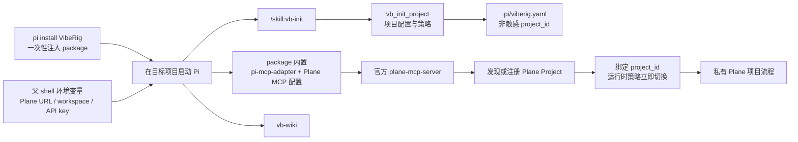

# 在 Pi 中使用 VibeRig + Plane MCP

Plane 负责项目工作项和流程投影，`vb-wiki` 继续负责经过验收的长期项目知识。
用户入口是 Pi package 和 Pi skill，不需要在项目外编排 VibeRig CLI。

## 1. 工作方式



Pi package 包含：

- VibeRig company extension；
- `vb-init` 和公司开发 skills；
- `@tintinweb/pi-subagents`；
- `pi-mcp-adapter`；
- `plane-mcp-server==0.2.9`、Plane MCP 白名单和固定 project 策略。

## 2. 一次性注入 VibeRig Pi package

开发分支使用本地 package：

```bash
cd /Users/jsonlee/Projects/vb-plugin
pnpm install
pnpm run build
pi install /Users/jsonlee/Projects/vb-plugin
pi list
```

安装是用户级的，之后每个项目不需要重复安装。Pi package 具有完整进程权限，
只安装已经审阅过的来源。

## 3. 启动 Pi 前配置环境变量

官方 Plane MCP stdio 模式需要且只需要以下三个 Plane 环境变量：

| 环境变量 | 是否秘密 | 示例/用途 |
| --- | --- | --- |
| `PLANE_BASE_URL` | 否 | `http://47.108.174.41:18090` |
| `PLANE_WORKSPACE_SLUG` | 否 | Plane workspace slug |
| `PLANE_API_KEY` | 是 | Plane API Key，不得写入仓库 |

Plane project UUID/API ID 不是环境变量。`vb-init` 会先查询当前 workspace：
有唯一匹配就绑定，没有匹配则在人工确认后创建，并把返回 ID 保存到
`.pi/viberig.yaml`。

在启动 Pi 的父 shell 注入：

```bash
export PLANE_BASE_URL="http://47.108.174.41:18090"
export PLANE_WORKSPACE_SLUG="<workspace-slug>"
read -r -s 'PLANE_API_KEY?Plane API Key: '
export PLANE_API_KEY
echo
```

然后从同一个 shell 启动目标项目：

```bash
cd /absolute/path/to/project
pi
```

不要在 Pi 的 `bash` 子进程中执行 `export`：子进程不能把环境变量反向注入已经
运行的 Pi。如果变量缺失，退出 Pi、在父 shell 设置后重新启动。

模型认证不由 Plane 配置负责。使用 Pi 自身的 `/login` 或对应 provider 的认证方式。

## 4. 在 Pi 内初始化项目

进入 Pi 后运行：

```text
/skill:vb-init
```

也可以直接描述：

```text
使用 vb-init 初始化当前项目。
先禁用所有 Plane 写入。
```

skill 会调用 `vb_init_project`，生成或合并：

- `.pi/viberig.yaml`；
- `.pi/agents/*.md`；
- `.pi/skills/*`；
- `.pi/subagents.json`；
- `.pi/settings.json`。

Plane MCP 配置由已安装的 VibeRig package 内置并交给 `pi-mcp-adapter`，初始化不会
创建、读取或修改项目 `.mcp.json`。`.pi/viberig.yaml` 只保存非敏感 Plane
`project_id` 和写入策略。

初次初始化固定使用：

```text
planeEnabled: true
writesEnabled: false
allowHeadlessWrites: false
```

skill 不会询问、读取或回显 API Key。它只检查当前 Pi 进程中三个变量是否存在。

## 5. 在 Pi 内注册 Plane Project

package 的 MCP 工具表固定包含经过审计的能力集合；运行时策略会在未绑定阶段只允许
`list_projects` 和 `create_project`：

1. skill 使用官方 MCP 调用 `list_projects`；
2. 对项目名称和 identifier 做精确查重；
3. 唯一匹配时复用已有 Project；
4. 没有匹配时展示拟创建的名称和 identifier；
5. 只有人工确认后才调用 `create_project`；
6. 对返回 Project read-back，并把 ID 写入 `.pi/viberig.yaml`；
7. 绑定写入 `.pi/viberig.yaml` 后策略立即生效，bootstrap 工具随即被拒绝，不需要
   `/reload` 或重启。

Project 是常驻容器，不按每个需求重复创建。出现多个或冲突候选时初始化停止，
由用户选择，不能猜测。

## 6. 在 Pi 内执行只读验收

初始化成功后让 Pi 执行：

```text
连接 vb-plane，读取固定项目，列出前 10 个 Work Item，
再读取 states、modules、cycles 和 milestones。不要执行任何写入。
```

底层调用等价于：

```text
mcp({ connect: "vb-plane" })

mcp({
  server: "vb-plane",
  tool: "vb_plane_retrieve_project",
  args: {}
})

mcp({
  server: "vb-plane",
  tool: "vb_plane_list_work_items",
  args: { "per_page": 10 }
})
```

调用方无需传 `project_id`。VibeRig 自动注入 `.pi/viberig.yaml` 的固定值；
显式传入其他 project 会在请求到达 Plane 前被拒绝。

## 7. 在 Pi 内开启写入验收

只读验收通过后，在 Pi 中明确要求：

```text
重新运行 vb-init，为当前固定 Plane 项目开启 writesEnabled，
但保持 allowHeadlessWrites=false。
```

运行时策略立即切换，不需要重新生成 MCP 配置或重启 Pi。随后可在专用测试 Work Item
上验证评论：

```text
mcp({
  server: "vb-plane",
  tool: "vb_plane_create_work_item_comment",
  args: {
    "work_item_id": "<test-work-item-uuid>",
    "comment_html": "<p>VibeRig Plane MCP UAT</p>",
    "external_source": "viberig-uat",
    "external_id": "uat-20260729-001"
  }
})
```

交互 Pi 会显示工具、固定 project 和参数，并要求人工确认。测试后通过
`vb-init` 恢复 `writesEnabled: false`。

## 8. 工具和权限边界

| 能力 | 默认 |
| --- | --- |
| 初始化阶段 `list_projects` | 临时开放 |
| 初始化阶段 `create_project` | 仅交互人工确认 |
| 固定项目、Work Item、states、labels、cycles、modules、milestones、评论读取 | 开放 |
| Work Item、评论和 milestone 写入 | `writesEnabled: true` 后开放 |
| 交互写入 | 每次人工确认 |
| Headless 写入 | 默认拒绝 |
| Workspace 全局搜索、任意项目读取、delete、Pages | 不开放 |
| 子 Agent 使用 Plane | 不开放，`extensions: false` |
| 项目知识 | 使用 `vb-wiki` |

## 9. 维护 CLI

`viberig pi init/doctor/plane-probe` 保留给插件开发、CI 和故障诊断，不是正常用户
工作流。正常使用顺序始终是：`pi install` → 父 shell 注入环境 → 启动 Pi →
`/skill:vb-init` → 在 Pi 中完成开发、Council、验证和知识沉淀。

## 参考资料

- [Pi Packages](https://github.com/earendil-works/pi-mono/blob/main/packages/coding-agent/docs/packages.md)
- [Plane 官方 MCP Server](https://github.com/makeplane/plane-mcp-server)
- [pi-mcp-adapter](https://pi.dev/packages/pi-mcp-adapter)
- [uv 安装](https://docs.astral.sh/uv/getting-started/installation/)
