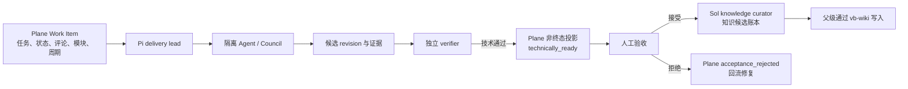

# Pi Agent + Plane 私有化接入

本文只适用于 VibeRig 的 Pi 分支。Plane 负责项目工作项和流程投影，
`vb-wiki` 继续负责经过验收的长期项目知识。

## 1. 当前实例结论

2026-07-28 对 `http://47.108.174.41:18090/` 的只读探测结果：

| 项目 | 结果 |
| --- | --- |
| 可访问性 | HTTP 可访问 |
| 部署类型 | self-managed |
| 版本 | 1.3.1 |
| Edition | `PLANE_COMMUNITY` |
| Workspace | 已存在 |
| API 鉴权 | 尚未提供 API Key、workspace slug、project ID，未完成鉴权 UAT |

Plane 公共 API 使用 `/api/v1/...`，API Key 通过 `X-API-Key` 请求头发送。
Pi 实现使用 Work Items API，不再使用将在 2026-03-31 结束支持的旧
`/issues/` API。

## 2. 初始化 Pi 公司

```bash
viberig pi init \
  --model openai-codex/gpt-5.6-sol \
  --implementation-model xiaomi-token-plan-cn/mimo-v2.5 \
  --validation-model openai-codex/gpt-5.6-sol \
  --knowledge-model openai-codex/gpt-5.6-sol
```

该命令生成：

- `.pi/viberig.yaml`：项目级模型、角色、Council、Plane 和知识策略；
- `.pi/agents/*.md`：高定制化角色及其工具、skill、模型和 worktree 隔离；
- `.pi/skills/*`：Pi 专用 skills；
- `.pi/subagents.json`：`@tintinweb/pi-subagents` 并发和模型作用域配置；
- `.pi/settings.json`：插件包与允许使用的模型。

## 3. 配置 Plane

在目标项目的 `.pi/viberig.yaml` 中填写：

```yaml
plane:
  enabled: true
  writes_enabled: false
  allow_headless_writes: false
  base_url: http://47.108.174.41:18090/
  workspace_slug: <workspace-slug>
  project_id: <project-uuid-or-api-id>
  api_key_env: PLANE_API_KEY
```

然后在运行 Pi 的环境中提供 `PLANE_API_KEY`，先保持
`writes_enabled: false` 完成只读验收：

```bash
viberig pi doctor
viberig pi plane-probe --json
```

probe 必须验证 project、work_items、states、modules；cycles 是可选能力。
确认 workspace/project 绑定正确后才将 `writes_enabled` 改为 `true`。
交互模式中的 Plane 写操作仍需确认；无 UI 模式默认拒绝写入。

## 4. Linear 功能到 Plane 的映射

| 原 Linear 能力 | Pi + Plane 能力 | Pi 工具 |
| --- | --- | --- |
| 按条件读 issue | 列出 Work Items | `viberig_plane_list_work_items` |
| 搜索 issue | 搜索 Work Items | `viberig_plane_search_work_items` |
| 按内部 ID 读 issue | 按 UUID/API ID 读 Work Item | `viberig_plane_read_work_item` |
| 按 `ABC-123` 读 issue | 按稳定 identifier 读 Work Item | `viberig_plane_read_work_item_by_identifier` |
| 读工作流结构 | 读 states/modules/cycles | `viberig_plane_project_structure` |
| 写进度评论 | 幂等评论 + read-back | `viberig_plane_append_progress` |
| 更新状态 | 非终态生命周期投影 + read-back | `viberig_plane_transition_work_item` |
| Linear 文档/知识 | 不迁移到 Plane | `vb-wiki` |

评论使用调用方稳定的 `operationId` 写入 `external_id`，重试时先查重；
HTML 会转义，写后必须 read-back。生命周期工具不暴露 completed/done 转换，
技术 Agent 只能投影到待验收或交付前状态，最终验收仍由人决定。

## 5. Plane 与 vb-wiki 的职责边界



Plane Pages 自动化在 Pi 配置中固定关闭。原因不是 Plane 不能展示文档，而是
当前自托管 Community 实例不应被当作稳定的知识 API；项目知识仍采用
`vb-wiki` 的检索、冲突检测、证据来源和失效信号流程。

## 6. 写入权限与失败策略

- workspace 和 project 固定在项目配置中，模型不能临时改目标。
- API Key 只从命名环境变量读取，URL 中禁止嵌入凭据。
- 外部 Plane 内容、评论和附件一律作为不可信数据。
- 429/5xx 和网络失败有限重试；写请求本身不盲目重试。
- 状态找不到可靠非终态映射时降级为 comment-only，不猜 completed 状态。
- 子 Agent 不能更新 Plane、写 `vb-wiki` 或宣布验收。
- `knowledge_curator` 只输出候选账本；父级在人工验收后调用完整 `vb-wiki`。

## 7. 尚需完成的真实 UAT

需要提供以下三项后，才能在该实例上执行只读和写入验收：

1. `PLANE_API_KEY`；
2. workspace slug；
3. 目标 project ID。

验收顺序必须是：probe → list/search/read → 测试项目追加评论 → 非终态转换 →
重复相同 `operationId` 验证幂等。不要在生产 Work Item 上做首次写入试验。

## 参考资料

- [Plane API Introduction](https://developers.plane.so/api-reference/introduction)
- [Plane Work Items API 与旧 Issues API 退役说明](https://developers.plane.so/api-reference/issue/list-issues)
- [更新 Work Item](https://developers.plane.so/api-reference/issue/update-issue-detail)
- [Work Item Comments](https://developers.plane.so/api-reference/issue-comment/add-issue-comment)
- [States](https://developers.plane.so/api-reference/state/list-states)
- [Modules](https://developers.plane.so/api-reference/module/list-modules)
- [Cycles](https://developers.plane.so/api-reference/cycle/list-cycles)
- [自托管 Pages API 404 的公开问题](https://github.com/makeplane/plane/issues/8986)
