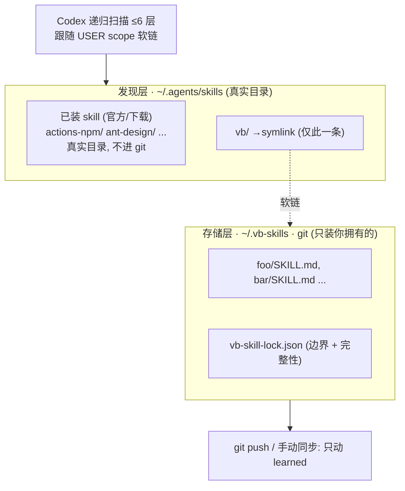
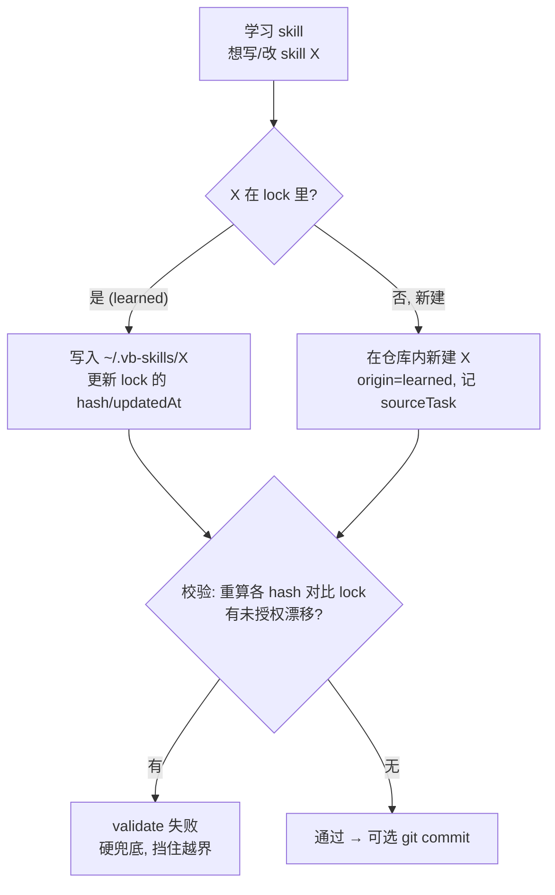

# VibeRig 自学习技能库设计方案

> 状态:设计已定稿,待落地
> 日期:2026-06-24
> 适用:VibeRig (vb-plugin) 在 Codex 下的自学习技能沉淀与跨项目复用

---

## 1. 背景与问题

原 `self_learner` 方案有两个痛点:

| # | 痛点 | 根因 |
|---|---|---|
| ① | 不同项目间 skill 不通用 | 学到的 skill 落在项目本地 `.agents/skills`,天然不共享 |
| ② | 优化时分不清该改哪个、且会污染官方 skill | 官方 / 下载 / 学习来的 skill 混在一个目录,无写入边界 |

**为什么不用 OpenSpace**:它能解这两点,但代价是一整套常驻服务 + dashboard + 独立 LLM 鉴权 + 跨平台开机启动,且 `execute_task` 是一个会跑最多 30 轮的自主 agent——对"把一次 bug fix 总结成一条经验"是错配工具(贵、不可控)。它真正不可替代的只有云端市场 / 大规模语义检索,而这两者都不是当前需求。

**结论**:用"原方案(in-context LLM 总结)+ 全局 git 仓库 + lock 文件边界"替代,以极小成本同时解掉 ① 和 ②。

---

## 2. 设计目标与非目标

**目标**
- 学到的 skill 跨项目可用(全局)。
- 学习只能改"自己拥有的"skill,从机制上不可能污染官方 / 下载来的 skill。
- 复用 Codex 自身的 skill 发现与 LLM,不引入常驻服务、不引入独立鉴权。
- 同步由用户自己掌控(git push / 任意同步盘)。

**非目标(明确不做)**
- 不做 DB / 向量检索(Codex 原生按 `description` 匹配已够;撞到瓶颈再作为 phase 2)。
- 不做自动回滚的版本树(git 历史足够;不在 lock 里自造快照/diff)。
- 不做云端技能市场。

---

## 3. 架构总览:三层解耦



- **发现层** `~/.agents/skills`:Codex 默认读取处,真实目录。已安装的官方 / 下载 skill 直接平铺在此(不进 git);learned 的唯一入口是软链子目录 `vb/`。
- **存储层** `~/.vb-skills`:干净的 git 仓库,只装你拥有的 learned skill + lock 文件。`.git` 不污染 `~/.agents`。
- **边界层** `vb-skill-lock.json`:记录每个 learned skill 的来源、血缘、内容 hash;既是"可改清单",又是完整性校验基线。

> 关键事实(已从 Codex 源码确认):`MAX_SCAN_DEPTH = 6`,`discover_skills_under_root` 递归扫描子目录到 6 层;USER scope(`$HOME/.agents/skills`)的软链会被跟随。`vb/<name>/SKILL.md` 仅 2 层,稳定命中。
>
> 反例提醒:软链**必须**落在名为 `.agents/skills` 的目录之下。`~/.agents/vb`(skills 的兄弟目录)不在 Codex 扫描范围,skill 永远不会被发现——这是本方案唯一容易踩错的点。

---

## 4. 目录与软链布局

```
~/.agents/skills/                      # 发现层(Codex 读这里)
├── actions-npm/SKILL.md               # 已装官方/下载 skill, 真实目录, 不进 git
├── ant-design/SKILL.md
├── ...
└── vb  ->  ~/.vb-skills               # 软链(唯一一条 learned 入口)

~/.vb-skills/                          # 存储层(独立 git 仓库)
├── .git/
├── vb-skill-lock.json                 # 边界 + 完整性基线
├── foo/SKILL.md
└── bar/SKILL.md
```

**物理边界(最强保证)**:学习流程的写入目标**只有** `~/.vb-skills/`。其余平铺在 `~/.agents/skills/` 的官方 / 下载 skill 不在这个仓库里 → 学习按构造就无法触碰它们。

> 软链 `vb` 指向 `~/.vb-skills` 根;根下的 `vb-skill-lock.json` 因为不是 `SKILL.md`,不会被当成 skill 发现,无副作用。

---

## 5. `vb-skill-lock.json` Schema

### 5.1 示例

```json
{
  "version": 1,
  "skills": {
    "casdoor-id-mapping-fix": {
      "skillPath": "casdoor-id-mapping-fix/SKILL.md",
      "computedHash": "sha256:696dae25ba1ca805bafe7f2099fe9c6b9428797dd736d017fc0568b431f04756"
    }
  }
}
```

### 5.2 字段说明

lock 只负责两件事:**可改清单**(skill 在不在 `skills` map 里)+ **完整性基线**(`computedHash`)。其余只放 skill 自身相关数据,不放溯源/历史。

| 字段 | 必填 | 含义 |
|---|---|---|
| `version` | ✅ | lock 文件结构版本,当前恒为 `1` |
| `skills` | ✅ | learned skill 名 → 条目的映射;key 必须等于 skill 目录名 |
| `skills.<name>.skillPath` | ✅ | 相对仓库根的 SKILL.md 路径,如 `foo/SKILL.md` |
| `skills.<name>.computedHash` | ✅ | 该 skill 目录内容的 sha256(`sha256:` 前缀);完整性校验基线,每次写入后更新 |

> 沿用现有 `skills-lock.json` 的 `version` / `skills` / `computedHash` 约定。**刻意不放** `sourceTask` / `parent` / `createdAt` / `updatedAt`——它们是溯源与历史,git 已经记录(commit 历史 = 时间线 + 血缘,commit message 携带 Linear key);放进 lock 是重复造轮子。项目根 `skills-lock.json`(管 imported 的 github 来源)是**正交的另一套**,作用域不同,互不影响。

### 5.3 JSON Schema(draft 2020-12)

落地时存为 `schemas/vb-skill-lock.schema.json`,对齐项目现有 `insights.schema.json` 的 draft 与 `$id` 约定。

```json
{
  "$schema": "https://json-schema.org/draft/2020-12/schema",
  "$id": "https://viberig.local/schemas/vb-skill-lock.schema.json",
  "title": "VibeRig Learned Skill Lock",
  "type": "object",
  "required": ["version", "skills"],
  "additionalProperties": false,
  "properties": {
    "version": {
      "type": "integer",
      "const": 1,
      "description": "Lock file structure version."
    },
    "skills": {
      "type": "object",
      "description": "Map of learned skill name -> lock entry. Key MUST equal the skill directory name.",
      "propertyNames": { "pattern": "^[a-z0-9][a-z0-9-]*$" },
      "additionalProperties": { "$ref": "#/$defs/skillEntry" }
    }
  },
  "$defs": {
    "skillEntry": {
      "type": "object",
      "required": ["skillPath", "computedHash"],
      "additionalProperties": false,
      "properties": {
        "skillPath": {
          "type": "string",
          "pattern": "^[^/]+/SKILL\\.md$",
          "description": "Path to SKILL.md relative to the store root, e.g. 'foo/SKILL.md'."
        },
        "computedHash": {
          "type": "string",
          "pattern": "^sha256:[0-9a-f]{64}$",
          "description": "SHA-256 over the skill directory contents; integrity baseline."
        }
      }
    }
  }
}
```

---

## 6. 写入边界:两道闸

痛点 ② 的根因是"LLM 不守边界",所以边界不能只靠 LLM 自觉。



- **软闸(写在学习 skill 指令里)**:写入目标恒为 `~/.vb-skills/`;官方 / 下载 skill 平铺在 `~/.agents/skills/`,不在该仓库,按构造不可达。
- **硬闸(独立校验脚本)**:落地时提供 `scripts/validate-skill-lock`,重算每个 `skillPath` 的 sha256 与 `computedHash` 比对;任何未在本次写入清单内的 skill 发生漂移 → 退出非零。在写入前和(可选)CI 中运行,作为 LLM 不听话时的硬拦截。

---

## 7. 学习流程(独立学习 skill + accept/accept-bug 调用)

新增一个**学习 skill**(参考 `skill-builder` 规范编写),由 accept/accept-bug 在验收后调用,或用户手动触发。它替换原先调用 OpenSpace `execute_task` 的步骤,改为本地三步:

1. **总结**:在 Codex 当前上下文内,读本次 Linear 任务(标题 / 描述 / 验收标准 / 根因 / 提交 hash),提炼一条可复用经验。
2. **落盘(按 skill-builder 规范)**:写入 `~/.vb-skills/<skill-name>/SKILL.md`
   - 新模式 → 新建目录;已有相近 skill → 精炼它;
   - **trigger-first**:把激活条件写进 `description`,正文 <200 行、imperative,确定性逻辑入 `scripts/`;
   - **务必写出高质量 `description` frontmatter**(这是 Codex 隐式匹配的唯一依据,也是是否需要 phase 2 检索的命门)。
3. **更新 lock + 校验**:重算该 skill 的 `computedHash`、写回 lock,运行 `validate-skill-lock`;通过后 `git commit`,**commit message 携带 Linear key**(如 `vb-learn: capture casdoor-id-mapping-fix (VB-123)`)——溯源与血缘交给 git,不进 lock。

> 学习是"沉淀经验",不是"自主执行任务"——只做一次 LLM 总结,不跑 agent 循环。
> 学习 skill 的职责与 `skill-builder` 不同:`skill-builder` 通用造 skill;学习 skill 专做"从已验收任务沉淀 learned skill 到 `~/.vb-skills` 并维护 lock 边界",但**编写质量遵循 skill-builder 规范**。

---

## 8. 同步策略

- `~/.vb-skills` 是普通 git 仓库,同步完全由用户掌控:`git push` 到任意远端,或放进同步盘。
- 跨机器:另一台机器 `git clone` 到 `~/.vb-skills`,建立同样的 `~/.agents/skills/vb` 软链即可,lock 随仓库一起到位。

**已知取舍**:不内建 git 自动化也不做版本树,因此 lock 只记"当前版本"。完整性校验能检测越权篡改,但**自动回滚依赖 git 历史**——learned skill 被改坏时,用 `git revert/checkout` 手动恢复。这是用简单度换来的代价,可接受。

---

## 9. 决策记录(取舍一览)

| 决策 | 选择 | 理由 |
|---|---|---|
| 用 OpenSpace? | 否 | 重运维 + 自主 agent 对"总结经验"错配;唯一独占价值(云市场/语义检索)非当前需求 |
| 用 DB? | 否(phase 2 再说) | Codex 原生按 `description` 匹配已够;命门在写好 description |
| lock 用 `.db` 还是 `.json`? | **`.json`** | 同步靠 git:JSON 可 diff/合并/人眼审;`.db` 二进制 blob 无法 merge,且 phase 1 无查询需求 |
| 用 git? | 是,但放独立仓库 `~/.vb-skills` | 仓库装独立目录,经软链暴露;`.git` 不进 `~/.agents` |
| 软链放哪? | `~/.agents/skills/vb` | **必须**在 `.agents/skills` 之下才会被 Codex 发现;`~/.agents/vb` 不可见 |
| 整目录软链? | 否,只软链 `vb` 一个命名空间 | 否则平铺的官方/下载 skill 会被一起拖进 git 与同步 |
| 边界靠约定? | 否,软闸 + 硬闸 | 痛点 ② 根因是 LLM 不守边界,必须有 hash 硬校验兜底 |

---

## 10. 落地步骤(待执行,本文档仅设计)

- [ ] `vb-init` 新增(幂等,已存在则跳过):`git init ~/.vb-skills`、写入空 `vb-skill-lock.json`、建软链 `~/.agents/skills/vb -> ~/.vb-skills`。
- [ ] 新增 `schemas/vb-skill-lock.schema.json`(本文第 5.3 节)。
- [ ] 新增 `scripts/validate-skill-lock`(重算 hash 对比 lock,漂移即失败)。
- [ ] 新增**学习 skill**(参考 `skill-builder`):trigger-first description、正文 <200 行、确定性逻辑入 `scripts/`、validation 用真实命令;写入目标恒为 `~/.vb-skills`。
- [ ] 改 `accept` / `accept-bug`:移除 OpenSpace `execute_task` 调用,改为调用学习 skill。
- [ ] 移除 `.codex/config.toml` 的 `openspace` MCP 配置与相关启动服务(若确认弃用)。
- [ ] 文档:在 README 标注全局 learned 库位置(`~/.vb-skills`)与软链约定(`~/.agents/skills/vb`)。

---

## 11. 未来可选(phase 2,撞到瓶颈再做)

- skill 数量大到 `description` 匹配不准时:加一层 **MCP 接口 + 向量 DB 索引**做语义检索;接口与索引是同一升级包的两半,不是二选一。
- 触发条件:实测发现 Codex 选错/选不到 skill,而非提前预设。
