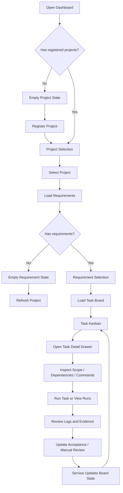

# VibeRig Dashboard UI Flow

## 1. Flow Goal

VibeRig Dashboard is the operational surface for task execution and acceptance. Users should select a project first, select a requirement next, operate tasks from the board, then use the task drawer to inspect runs, review evidence, and complete human acceptance.

Core path:

```text
Project Selection
-> Requirement Selection
-> Task Kanban
-> Task Detail Drawer
-> Acceptance Review
-> Run Evidence
```

## 2. Primary Navigation Model

Dashboard uses a single-page operational layout.

```text
Top Bar:
  Project Selector | Requirement Selector | Refresh | Register Project

Main Area:
  Task Kanban

Right Drawer:
  Task Detail | Acceptance | Runs | Evidence | Review
```

URL query state should preserve:

- active project
- active requirement
- active task drawer

This lets users refresh or share a link while returning to the same requirement board and task detail.

## 3. Main User Flow



## 4. Screen Flow Details

### 4.1 Project Selection

Purpose: choose a project before showing any task board.

User sees:

- registered project list
- project status
- project root path
- last refresh/import time
- requirement count
- running/blocked/failed task counts
- register project action
- refresh project action

Flow:

```text
Open dashboard
-> Fetch /api/projects
-> Show project list
-> User selects project
-> Fetch project requirements
```

Empty state:

```text
No registered projects
-> Show register project action
-> User registers project
-> Service creates project record
-> Project list reloads
```

Error state:

```text
Project refresh/register fails
-> Keep current list visible
-> Show service reason
-> Allow retry
```

### 4.2 Requirement Selection

Purpose: choose the requirement board to operate within the active project.

User sees:

- requirement list grouped by status
- requirement title and id
- imported source revision/hash status
- task count and accepted count
- failed/blocked count
- last import time

Flow:

```text
Project selected
-> Fetch /api/projects/:project_id/requirements
-> User selects requirement
-> Query state updates
-> Fetch board data
```

Empty state:

```text
Project has no imported requirements
-> Explain no requirements are available
-> Offer refresh project action
```

### 4.3 Task Kanban

Purpose: operate task state and quickly identify blocked, failed, and acceptance progress.

Columns:

```text
Backlog
Ready
Running
Self Accepted
Human Review
Accepted
Blocked
Failed
```

Task card fields:

- task id
- task title
- roadmap item
- dependency count
- acceptance progress
- latest run status
- human review status
- blocked/failed reason when present

Primary interactions:

```text
Drag card between valid columns
-> Service validates transition
-> Board reloads or applies accepted state

Reorder card within column
-> PATCH task order
-> Preserve service-provided ordering

Open card
-> Right drawer opens
-> Query state stores task id

Use explicit status menu
-> Same service validation as drag/drop
```

Invalid transition flow:

```text
User attempts invalid move
-> Service rejects transition
-> Card returns to previous server state
-> UI shows failed transition and service reason
```

Live update flow:

```text
Run state changes
-> /api/events/stream emits update
-> Board card status/counts refresh
-> No full page reload
```

### 4.4 Task Detail Drawer

Purpose: inspect and operate one task without leaving the board.

Drawer sections:

- summary
- scope include/exclude
- dependencies
- validation commands
- acceptance checklist
- run history
- evidence files
- activity timeline

Flow:

```text
User opens task card
-> Fetch /api/tasks/:task_id
-> Fetch acceptance/runs/evidence
-> Render detail drawer
```

Dependency flow:

```text
User clicks dependency
-> Board focuses dependency task
-> Drawer switches to dependency detail
```

Deep link flow:

```text
URL contains task id
-> Dashboard loads project/requirement
-> Board loads
-> Drawer opens selected task
```

### 4.5 Acceptance Matrix

Purpose: make self-acceptance and human acceptance visible, traceable, and actionable.

User sees:

- acceptance criteria
- result state: Not Run, Pass, Fail, Partial, Blocked
- linked evidence or preview
- reviewer and review result
- residual risk notes

Flow:

```text
User reviews criteria
-> Updates checklist item
-> PATCH /api/acceptance/:acceptance_id/status
-> Service validates rule
-> Board acceptance progress updates
```

Manual review flow:

```text
User submits human review
-> POST /api/tasks/:task_id/manual-review
-> Service checks evidence/override rules
-> Task moves toward Accepted or remains Human Review
```

Guardrail flow:

```text
Accepted review lacks required evidence
-> Service rejects unless override is allowed
-> UI shows guardrail reason
-> User adds evidence or submits explicit override
```

### 4.6 Run Log And Evidence

Purpose: prove whether a task actually executed and provide review evidence.

User sees:

- run list with status, start/end time, exit code
- live run log viewer
- validation result summary
- changed files list
- self-acceptance markdown preview
- evidence file open/copy path action

Run flow:

```text
User triggers run
-> POST /api/tasks/:task_id/runs
-> Card and drawer show pending state
-> Run logs stream or poll
-> Evidence list refreshes
-> Board state updates from service
```

Failed run flow:

```text
Run fails
-> Preserve logs
-> Preserve evidence
-> Show failed reason
-> Task can move to Failed or remain actionable based on service state
```

Successful run flow:

```text
Run succeeds
-> Show validation summary
-> Show evidence needed for review
-> Acceptance matrix becomes reviewable
```

## 5. Cross-Screen Interaction Rules

- Every mutation must go through the service.
- Drag/drop and status menus must share the same backend transition rules.
- UI should not silently mutate task state.
- Long-running actions show pending state on both card and drawer.
- Error messages must name the failed transition and service reason.
- SQLite paths are not exposed.
- Project roots and evidence file paths may be shown.
- Keyboard users must be able to use status actions without drag/drop.

## 6. Responsive Flow

Desktop:

```text
Top bar fixed
Kanban fills main area
Task drawer opens on right
```

Narrow screens:

```text
Top selectors stack
Kanban columns stack vertically or switch to compact list mode
Task drawer becomes full-screen panel
Card actions remain reachable
```

## 7. State Model

```text
Global state:
  selectedProjectId
  selectedRequirementId
  selectedTaskId
  boardData
  eventConnectionState

Project state:
  loading
  loaded
  empty
  error

Requirement state:
  loading
  loaded
  empty
  error

Task mutation state:
  idle
  pending
  accepted
  rejected

Run state:
  queued
  running
  success
  failed
  canceled
```

## 8. Service Endpoints Used By Flow

Reads:

```text
GET /api/projects
GET /api/projects/:project_id/requirements
GET /api/projects/:project_id/board
GET /api/tasks/:task_id
GET /api/tasks/:task_id/acceptance
GET /api/tasks/:task_id/runs
GET /api/tasks/:task_id/evidence
GET /api/runs/:run_id/log
GET /api/events/stream
```

Writes:

```text
POST  /api/projects/register
POST  /api/projects/:project_id/refresh
PATCH /api/tasks/:task_id/status
PATCH /api/tasks/:task_id/order
PATCH /api/acceptance/:acceptance_id/status
POST  /api/tasks/:task_id/runs
POST  /api/tasks/:task_id/manual-review
```

## 9. Acceptance Criteria For UI Flow

- Project selector appears before any board is shown.
- Requirement selector is scoped to the active project.
- Board shows all task states and counts.
- Task cards show acceptance progress and latest run status.
- Drag/drop and explicit status actions both work.
- Invalid transitions are rejected with service reasons.
- Task detail shows scope, dependencies, acceptance, runs, evidence, and activity.
- Human review can be completed from the dashboard.
- Live run changes update without a full page reload.
- Dashboard does not write files or SQLite directly.
