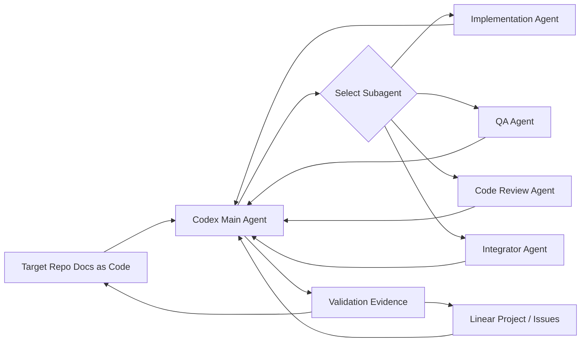

# VibeRig Linear-Native Redesign Plan

版本：2026-06-08

## 1. 背景

当前 VibeRig 已经实现了本地 `.vibeRig/requirements/*` 文档、`tasks.yaml`、SQLite 运行状态、dashboard、本地 task engine、Codex CLI/MCP runner 等能力。这条路线可以独立运行，但和当前 Codex 插件环境存在重复：

- Codex 已经内置 Linear 插件和 Linear skill，可以直接读写 Linear project、issue、document、comment。
- VibeRig 运行时本身已经在 Codex 中，不需要再通过命令模式从插件里启动另一个 Codex。
- 需求、验收、架构契约属于工程文档，应随代码版本化；任务、状态、负责人和协作记录属于项目管理，应放在 Linear。

因此 VibeRig 需要从“本地任务控制面”重建为“Codex + Linear + 本地 Docs as Code 的工程治理协议层”。

## 2. 核心结论

新的事实源分层如下：

| 层级 | 事实源 | 放什么 | 不放什么 |
| --- | --- | --- | --- |
| 本地 Docs as Code | 目标项目仓库 | 需求契约、架构约束、Acceptance Matrix、Mermaid 图、验证策略、CI/gate policy | issue 状态、负责人、执行进度 |
| Linear | Linear project / issue / sub-issue / comment | 任务单元、状态、优先级、负责人、验收结论、证据链接 | 大篇幅工程文档、长期架构契约 |
| Codex 主 agent | 当前 Codex 会话 | 上下文汇总、任务派发、subagent 选择、最终验证、Linear 更新 | 长期项目状态 |
| Codex subagent | 短生命周期执行者 | 根据 Task Brief 执行实现、测试、审查或集成 | context-mode、跨任务记忆、项目状态管理 |

## 3. 非目标

- 不把 Linear issue 当成完整文档仓库。
- 不继续把 `.vibeRig/requirements/*/tasks.yaml` 作为任务事实源。
- 不再默认通过 `codex-cli-mcp` 或 shell 命令启动 Codex 执行任务。
- 不要求所有使用 VibeRig 的目标项目采用同一套 CI 模板。
- 不让 subagent 使用 context-mode。

## 4. 目标架构



主 agent 负责读取本地文档和 Linear issue，压缩上下文并派发给合适 subagent。subagent 只根据明确的 Task Brief、文档路径、AC refs 和必要代码上下文工作。主 agent 回收结果后执行验证、汇总证据，并更新 Linear。

## 5. 本地文档层

本地文档仍然保留，但用途要收缩为工程契约。建议结构：

```text
.vibeRig/
  project.yaml
  requirements/
    <requirement-id>/
      brief.md
      research.md
      contract.schema.json
      contract.json
      architecture.md
      acceptance.schema.json
      acceptance.json
      acceptance.md
      validation.md
      diagrams/
        main-flow.mmd
        states.mmd
```

默认 docs root 是 `.vibeRig/requirements/`。它保留了当前 VibeRig 用户已经熟悉的目录语义，但目录里的文件职责需要重写：不再把本地 `tasks.yaml` 作为任务事实源，而是把每个 requirement 目录作为可版本化的工程契约包。

### 5.1 project.yaml

```yaml
version: 1
project:
  name: "example-project"
  root: "."
docs:
  root: ".vibeRig/requirements"
workspace:
  worktrees_root: ".worktrees"
pull_request:
  required: "true"
  provider: "auto"
  base_branch: ""
  draft: "false"
linear:
  team_id: "<linear-team-id>"
  project_id: "<linear-project-id>"
  project_document_id: "<linear-project-document-id>"
  project_document_title: "VibeRig Project Registration"
subagents:
  default_implementation: "implementation"
  default_qa: "qa"
  default_review: "code_review"
  default_integration: "integrator"

gate_policy:
  ci_required: "project_decides"
  required_commands:
    - npm test
  manual_checks: []
context_mode:
  main_agent_only: true
```

`workspace.worktrees_root` 默认是项目内 `.worktrees/`。`task-runner` 为 Linear issue 创建的默认路径是：

```text
<project-root>/.worktrees/<issue-key>-<short-slug>
```

### 5.2 Acceptance Matrix

Acceptance Matrix 应本地版本化。Linear issue 只引用 AC ID。

```md
# Acceptance Matrix

| AC ID | Source | Preconditions | Action | Expected Result | Evidence | Mode |
| --- | --- | --- | --- | --- | --- | --- |
| AC-001 | BR-001 |  |  |  | automated test | automated |
| AC-002 | Path-001 |  |  |  | screenshot + notes | manual |
```

### 5.3 Mermaid 图

策略 3 保留，但要做成可验证的文档资产：

- Mermaid 源码放在本地文件。
- `acceptance.md` 或 `architecture.md` 引用 Mermaid 文件。
- Linear issue 可以引用图文件路径和相关 AC ID。
- 主 agent 可以在任务开始前读取 Mermaid 图来确认状态机或时序流。

## 6. Linear 协作层

Linear 是任务与状态事实源。推荐映射：

| VibeRig 概念 | Linear 对象 |
| --- | --- |
| 项目注册 | Linear Project + 本地 `project.yaml` |
| 需求/功能 | 本地 requirement 文档 + Linear 父 issue |
| 实现任务 | Linear Issue |
| 子任务 | Linear Sub-issue |
| 验收结果 | Issue comment 或 status update |
| 证据包 | Issue comment，引用 commit、测试输出、本地文档 AC |
| 阻塞关系 | Linear issue relation |

### 6.1 Linear issue 模板

```md
## Task

<短任务描述>

## Source Docs

- `.vibeRig/requirements/REQ-001/brief.md#G-001`
- `.vibeRig/requirements/REQ-001/architecture.md#state-flow`
- `.vibeRig/requirements/REQ-001/acceptance.md#AC-003`

## Acceptance References

- AC-003
- AC-007

## Validation

- `npm test`
- Manual: `[AC-007] verify keyboard focus order and record notes`

## Subagent

implementation

## Proof Packet

Pending.
```

### 6.2 项目注册说明

项目注册建议采用双记录：

- 本地 `project.yaml` 是机器可读配置，记录 repo root、docs root、Linear project id、team、gate policy、默认 subagent 映射。
- Linear Project Document 是人类可发现的注册说明，记录项目用途、repo 链接、docs root、协作规则、验收流程、CI/gate policy 摘要。

两者不应承载同一类细节。本地路径、命令、subagent 配置以 `project.yaml` 为准；Linear Project Document 用于让团队成员和主 agent 快速确认“这个 Linear Project 绑定哪个仓库、采用什么流程”。`init-viberig` 应能对两者做 reconcile：缺哪个补哪个，冲突时要求用户确认。

## 7. init-viberig 修改

`init-viberig` 不再只初始化本地 `.vibeRig/requirements/` 和本地 task engine。新流程：

1. 解析当前目标项目 root 和 git remote。
2. 检查 Linear 插件是否可用。
3. 查询 Linear 中是否已有当前项目注册：
   - 通过 repo URL、project name、slug 或 `project.yaml` 中的 `linear.project_id`。
   - 使用 `_search(type="project")` 或 `_list_projects`。
4. 若不存在：
   - 通过 `_list_teams` / `_get_team` 确认团队，然后使用 `_save_project` 创建 Linear Project。
   - 通过 `_list_documents` 查询注册说明，并用 `_save_document` 创建或更新 Linear Project Document，包含 repo、docs root、gate policy、subagent routing 摘要。
5. 创建或更新本地 `project.yaml`。
6. 检查 `.vibeRig/requirements/` 是否存在，不存在则生成最小 Docs as Code 模板。
7. 检查目标项目 CI/gate policy：
   - 有 CI：记录 required checks。
   - 无 CI：记录 required local commands 和 manual gate。
8. 不再启动本地 VibeRig daemon 作为必要步骤。

## 8. brainstorm 修改

`brainstorm` 需要重写。原流程把 requirement、research、roadmap、spec、acceptance 串成固定文档流水线，容易产生“看起来完整但审查成本很高”的文档。新流程采用更强的阶段门禁和结构化产物。

### 8.1 新阶段

1. Intake Brief
   - 目标：把用户原始想法压缩成可审查的业务目标、非目标、成功信号、风险。
   - 产物：`.vibeRig/requirements/<requirement-id>/brief.md`
   - 门禁：用户确认目标、非目标和人工决策点。

2. Evidence Research
   - 目标：只调研会影响实现决策或验收标准的事实。
   - 产物：`research.md`
   - 门禁：区分事实、推断、待验证假设；不能把未经证实的趋势判断写成硬约束。

3. Structured Contract
   - 目标：用 JSON Schema 约束需求、业务规则、状态、接口、非功能约束。
   - 产物：`contract.schema.json`、`contract.json`
   - 门禁：schema validation 通过；每条业务规则有稳定 ID。

4. Architecture and Flow
   - 目标：记录关键架构约束和 Mermaid sequence/state diagram。
   - 产物：`architecture.md`、`diagrams/*.mmd`
   - 门禁：关键状态流、失败路径、边界条件可从图中读出来。

5. Acceptance Matrix
   - 目标：把业务规则和用户路径转成可观察、可证伪、可执行的 AC。
   - 产物：`acceptance.schema.json`、`acceptance.json`、`acceptance.md`
   - 门禁：每条 AC 有 source、precondition、action、expected result、evidence、mode。

6. Adversarial Review
   - 目标：使用 QA/security/compliance 视角审查缺失边界、权限、资损、并发、回滚和可维护性风险。
   - 产物：写回 `acceptance.md` 的 review section 或 `research.md` 的 risk appendix。
   - 门禁：P0/P1 风险都有 AC 或明确的非目标说明。

7. Linear Issue Synthesis
   - 目标：从本地契约生成 Linear issues/sub-issues。
   - 产物：Linear issues。
   - 门禁：issue 只引用 source docs 和 AC IDs，不复制完整文档。

### 8.2 subagent 使用

`brainstorm` 也可以使用 subagent，但必须由主 agent 编排：

- researcher subagent：只做 Evidence Research。
- analyst/planner subagent：提出候选结构和拆分。
- qa subagent：做 Adversarial Review。
- 主 agent：使用 context-mode 管理上下文、合并结果、维护最终文档。

subagent 不直接写 Linear，不使用 context-mode，不做最终业务确认。

## 9. write-plan 修改

`write-plan` 不再生成本地 `tasks.yaml` 作为任务事实源。新职责：

1. 读取 `.vibeRig/requirements/<requirement-id>/` 下的本地 Docs as Code。
2. 将 Acceptance Matrix 拆分为 Linear issues/sub-issues。
3. 每个 Linear issue 必须包含：
   - source docs 路径；
   - AC refs；
   - validation；
   - 推荐 subagent；
   - dependencies/blockers；
   - manual acceptance 标记。
4. Linear issue 的 title、description、sub-issue 名称、plan sync comment 等面向人的内容应尽量跟随用户当前工作语言；用户用中文沟通则写中文，用户用英文沟通则写英文。稳定 ID、路径、命令、issue key、schema 字段和代码符号不翻译。
5. 如果 Linear 中已有对应 issue，则更新而不是重复创建。
6. 不再生成本地任务事实源；如需审查，可临时渲染预览，但不提交为长期状态文件。

## 10. task-runner 修改

当前命令式 runner 应删除，不保留 legacy 路线。新 `task-runner` 是 Codex 主 agent 的执行协议。

### 10.1 主 agent 规则

主 agent 必须：

1. 从 Linear 选择或确认任务。
2. 读取 issue 中的 source docs 和 AC refs。
3. 使用 context-mode 汇总历史决策、相关文档、代码上下文。
4. 判断执行 workspace：默认在 `<project-root>/.worktrees/<issue-key>-<short-slug>` 创建或复用 git worktree；只有用户明确要求、任务非常轻量/文档化、worktree 不可用或继续当前未提交任务更安全时，才直接在当前 main workspace 开发。
5. 生成 Task Brief，并写明 workspace mode、path 和原因。
6. 根据任务类型选择 subagent。
7. 调用 subagent 执行。
8. 回收 subagent 输出。
9. 运行验证命令或记录无法运行的原因。
10. 提交或更新 PR：提交任务分支、push、创建/更新 PR，并记录 PR URL、branch、commit、base branch、CI/check 链接。
11. 汇总 Proof Packet。
12. 更新 Linear issue/comment/status 到等待人工验收或 review 状态；不得直接标记 Done。若 PR 必须提交但失败，则进入 blocked/waiting，不得请求人工验收。

### 10.1.1 Linear 状态语义映射

VibeRig 不硬编码 Linear workflow 状态名。`task-runner` 必须使用 `_list_issue_statuses` 读取团队已有状态，并映射到最接近的语义：

- `Backlog` / `Triage`：任务存在但未准备执行。
- `Ready`：source docs、AC refs、validation 和 subagent 推荐已经完整。
- `In Progress`：已经开始在 worktree 或当前 workspace 执行。
- `In Review` / `QA`：实现完成，正在验证或 review。
- `Human Acceptance`：Proof Packet 已写入，等待用户显式人工验收。
- `Done` / `Accepted` / `Completed`：只能由 `human-acceptance` skill 在用户显式验收后设置。
- `Blocked`：缺少用户决策、凭据、外部状态或产品判断。

如果团队没有 `Human Acceptance` 状态，使用最接近的 review/waiting 状态，并在 comment 中说明 VibeRig 语义是等待人工验收。

### 10.2 subagent 规则

subagent 必须：

- 只使用主 agent 提供的 Task Brief、文档路径和必要代码上下文。
- 不使用 context-mode。
- 不更新 Linear。
- 不做最终验收签字。
- 不修改本地 Docs as Code，除非任务明确要求更新文档。
- 输出必须包含：
  - changed files；
  - validation attempted；
  - acceptance coverage；
  - residual risks；
  - handoff notes。

### 10.3 Task Brief 格式

```md
# Task Brief

Linear issue: <KEY>
Recommended subagent: implementation

## Goal

<one paragraph>

## Source Docs

- `.vibeRig/requirements/REQ-001/acceptance.md#AC-003`
- `.vibeRig/requirements/REQ-001/architecture.md#state-flow`

## Acceptance

- AC-003: <summary>
- AC-007: <summary>

## Constraints

- Do not modify `.vibeRig/project.yaml`.
- Keep API compatibility with `<endpoint>`.

## Validation

- `npm test`
- Manual: `[AC-007] ...`

## Output Contract

Return changed files, validation results, acceptance coverage, risks.
```

## 11. context-mode 边界

context-mode 只属于主 agent。

原因：

- 主 agent 需要长期上下文、跨任务记忆、历史决策和统计。
- subagent 应短生命周期、输入封闭、输出可审计。
- subagent 使用 context-mode 会扩大上下文污染面，使任务执行不可复现。

规则：

```text
主 agent: 可以使用 context-mode。
subagent: 禁止使用 context-mode。
subagent: 只能根据 Task Brief、source docs、代码上下文执行。
```

## 12. 通用 subagent 路由规则

subagent 不是 `task-runner` 专用机制。任何阶段只要需要专门视角，都可以由主 agent 选择 subagent 执行，例如调研、需求审查、架构评审、QA 对抗、代码审查、集成收口。

### 12.1 路由原则

主 agent 在以下情况必须考虑 subagent：

- 任务需要专门角色判断，例如 QA、安全、架构、研究、代码审查。
- 任务输出需要独立审查，不能由同一个 agent 自写自审。
- 当前阶段需要并行候选方案或对抗性反驳。
- Linear issue 或本地文档显式指定 recommended subagent。

主 agent 可以直接处理：

- 简单文件定位、状态查询、格式修正。
- 用户只要求解释或决策建议。
- subagent 调用会让任务边界变模糊的小修改。

### 12.2 通用 Subagent Brief

```md
# Subagent Brief

Stage: research | planning | implementation | qa | code_review | integration
Recommended subagent: <name>

## Objective

<single objective>

## Inputs

- Linear: <project/issue/comment references when relevant>
- Local docs: `.vibeRig/requirements/<requirement-id>/...`
- Code context: <files or modules>

## Boundaries

- Do not use context-mode.
- Do not update Linear.
- Do not make final acceptance decisions.
- Do not change docs unless explicitly asked.

## Required Output

- Findings or changes:
- Evidence:
- Risks:
- Recommendation:
```

### 12.3 Skill 或 rule 需求

需要新增一个项目级规则或 skill，例如 `subagent-routing`：

- 定义什么时候必须使用 subagent。
- 定义各类 subagent 的职责边界。
- 定义 brief 输入格式和输出格式。
- 强制 context-mode 只归主 agent 使用。
- 强制主 agent 负责合并、验证和 Linear 更新。

这个规则应被 `brainstorm`、`write-plan`、`task-runner`、`insights` 等 skill 共同引用，而不是只写在 `task-runner` 内。

## 13. Proof Packet 策略

Proof Packet 不写入本地长期目录。最终证据写入 Linear issue comment，并引用可追溯材料：

- commit sha 或 branch；
- workspace mode 和 path；
- validation command 和结果摘要；
- 关键日志路径或 CI run URL；
- changed files；
- 覆盖的 AC IDs；
- 未覆盖项和人工验收要求；
- reviewer/subagent handoff notes。

本地只允许保留验证过程中自然产生的日志或测试产物，不新增 `.vibeRig/proof/` 作为长期事实源。

## 14. 人工验收策略

新增 `human-acceptance` skill，作为唯一的人工验收签字入口。

硬性规则：

- 只能由用户显式调用，不能由 `task-runner`、`agent-sop`、`write-plan` 或 `insights` 自动触发。
- 不能从测试通过、QA pass、Proof Packet 存在等信号推断人工验收通过。
- 必须读取 Linear issue、comments、Proof Packet、AC refs 和必要的本地 docs。
- 全量验收时必须合并 Proof Packet 中记录的 PR；如果 PR 缺失、冲突、权限不足或检查未通过，则不得进入 Done/Accepted/Completed。
- 必须用 `_save_comment` 写入 Human Acceptance comment，记录 accepted/rejected AC、人工检查、风险接受或拒绝原因。
- 必须用 `_save_issue` 按团队已有状态更新 issue：全量验收才进入 Done/Accepted/Completed；部分验收或拒绝进入 rework/in-progress/blocked 等非终态。
- PR 合并成功后，必须先写入 Human Acceptance comment 并将 Linear issue 更新到 Done/Accepted/Completed，再运行 `insights`。
- `insights` 生成保守学习候选项；已确认或本次验收预授权的 skill_update 必须通过 `skill-builder` 修改对应 VibeRig skill。
- Linear 终态更新成功后，才清理项目内 `.worktrees/` 下对应任务 worktree；不得清理当前 main workspace 或项目 `.worktrees/` 之外的路径。

## 15. 需要废弃或重写的当前模块

| 当前模块 | 新状态 | 说明 |
| --- | --- | --- |
| 本地 SQLite task engine | 删除 | Linear issue 成为任务事实源 |
| dashboard board | 删除 | 直接使用 Linear 自带项目/issue/board 能力 |
| `tasks.yaml` | 删除为事实源 | Linear issue/sub-issue 承载任务 |
| Codex CLI/MCP runner | 删除 | 插件内不再命令式启动 Codex |
| `.vibeRig/requirements/<name>/` 旧五件套 | 重写 | 保留目录，改为 Docs as Code 契约包 |
| Linear export | 重写 | Linear 不再是 export，而是任务事实源 |

## 16. 迁移计划

### Phase 1: 文档与 skill 重写

- 重写 `init-viberig` skill。
- 重写 `brainstorm` skill。
- 重写 `write-plan` skill。
- 重写 `task-runner` skill。
- 新增 `human-acceptance` skill。
- 新增 `subagent-routing` skill 或项目规则。
- 明确 context-mode 只允许主 agent 使用。

### Phase 2: Linear 注册与同步

- 实现项目注册查询逻辑。
- 记录 Linear Project 到本地 `project.yaml`。
- 创建或更新 Linear Project Document 作为人类可发现的项目注册说明。
- 支持从本地 docs 生成或更新 Linear issues。
- 支持读取 Linear issue 反查 source docs。

### Phase 3: 移除本地任务事实源

- 删除 SQLite task engine 的主路径。
- 删除本地 dashboard 主路径。
- 删除 `tasks.yaml` 事实源。
- 删除 Codex CLI/MCP runner 主路径。
- 移除默认 daemon 启动要求。

### Phase 4: 执行协议落地

- `task-runner` 强制选择 subagent。
- `task-runner` 默认使用项目内 `.worktrees/` 下的 git worktree，必要时才在当前 workspace 直接执行。
- 主 agent 生成 Task Brief。
- subagent 执行后返回结构化结果。
- 主 agent 验证、提交或更新 PR，并写回 Linear Proof Packet，将 issue 移动到等待人工验收状态。
- 用户显式调用 `human-acceptance` 完成验收签字；全量验收时先合并 PR，再更新 Linear 终态，然后运行 insights 并通过 `skill-builder` 应用已确认的 skill 更新，最后安全清理项目内任务 worktree。

## 17. 验收标准

- `init-viberig` 可以在目标项目中查询或注册 Linear Project。
- 本地存在 `.vibeRig/requirements/` Docs as Code root。
- Linear Project Document 可以说明项目注册关系、repo、docs root 和 gate policy。
- `write-plan` 可以从本地 Acceptance Matrix 创建或更新 Linear issues。
- Linear issue 中只保留任务摘要和 source docs 引用，不承载完整工程文档。
- `task-runner` 不再调用命令式 Codex runner。
- `task-runner` 默认使用 `<project-root>/.worktrees/<issue-key>-<short-slug>`，并在 Proof Packet 中记录 workspace 决策。
- `task-runner` 在验证通过后提交或更新 PR；PR 失败时不得进入人工验收。
- 每次执行任务必须声明并使用合适 subagent。
- subagent 不使用 context-mode。
- 主 agent 负责最终验证、Proof Packet 和等待人工验收状态更新。
- `human-acceptance` 只能由用户显式调用，并负责全量验收后的 PR merge、最终验收状态更新、验收后 insights/skill-builder 更新和项目内 worktree cleanup。
- Proof Packet 只写 Linear comment，不写入本地长期 proof 目录。

## 18. 已决策事项

- 本地 docs root 默认使用 `.vibeRig/requirements/`。
- 不保留本地 dashboard；直接使用 Linear。
- 不保留 legacy runner。
- 项目注册采用 `project.yaml` + Linear Project Document 双记录。
- Proof Packet 只写 Linear comment，并引用验证日志、CI run、commit 或本地临时产物路径。
- 任务执行默认使用项目内 `.worktrees/` 的 git worktree；可以由用户或明确原因选择当前 workspace。
- `task-runner` 完成实现后必须提交或更新 PR；`human-acceptance` 全量验收后负责 merge PR、更新 Linear 终态、运行 insights/skill-builder，并在安全时清理项目内任务 worktree。
- 最终 Done/Accepted 状态只能由人工验收流程写入。

## 19. 已关闭问题

- `.vibeRig/requirements/<requirement-id>/` 不强制跟 Linear issue key 对齐；如果用户提供的 id 本身类似 Linear key，则保留。
- Linear Project Document 默认标题为 `VibeRig Project Registration`，可通过 `project.yaml` 的 `linear.project_document_title` 或初始化参数覆盖。
- `subagent-routing` 已做成独立 skill，并由 `brainstorm`、`write-plan`、`task-runner`、`blocker-resume`、`insights` 和 `agent-sop` 共同引用。

## 20. 当前落地状态

2026-06-08 已完成非破坏性主路径切换：

- `.codex-plugin/plugin.json` 已移除 VibeRig MCP server 声明，插件默认成为 skill-only。
- `.mcp.json` 已删除，避免继续暴露本地 `api/server.py mcp` 入口。
- `init-viberig` 已改为生成 `.vibeRig/project.yaml` 和 `.vibeRig/requirements/`，不再启动 daemon、dashboard、`codex-cli-mcp` 或本地 task engine。
- `init-viberig` 已明确 Linear 注册必须调用 `_list_teams` / `_get_team`、`_search` / `_list_projects`、`_save_project`、`_list_documents` 和 `_save_document`；Linear 未认证时只能报告 partial local init。
- `brainstorm` 已改为 Docs as Code 阶段门禁，输出 brief、research、contract、architecture、acceptance、validation 和 Mermaid diagrams。
- `write-plan` 已改为根据本地 Acceptance Matrix 通过 `_save_issue` 创建或更新 Linear issues，并通过 `_save_comment` 写 plan sync comment，不再生成 `tasks.yaml`。
- `task-runner` 已改为当前 Codex 主 agent 协议：选择 subagent、默认在项目内 `.worktrees/` 执行、验证结果、提交或更新 PR、通过 `_save_comment` 写 Linear Proof Packet comment，并通过 `_save_issue` 更新 issue 到等待人工验收状态。
- 已新增 `human-acceptance` skill，作为用户显式调用的人工验收签字入口，负责全量验收后的 PR merge、最终状态更新、验收后 insights/skill-builder 更新和项目内 worktree cleanup。
- 已新增 `subagent-routing` skill，并让 `brainstorm`、`write-plan`、`task-runner`、`agent-sop` 引用该边界。
- README 中的推荐工作流已切到 Linear-native。

2026-06-08 后续清理已完成：

- `api/` 本地 backend / MCP / SQLite task engine 已移除。
- `dashboard/` 本地看板前端已移除。
- `schemas/tasks.schema.json`、`scripts/validate_tasks.py`、`scripts/render_linear_children.py` 已移除。
- 旧 Codex runner、本地 task engine、dashboard 相关测试已移除。
- 旧 runner/dashboard/task-engine 设计文档已移除，保留本 redesign plan 作为迁移依据。
- 旧本地 insights/context-mode 辅助脚本已移除，insights 以 Linear proof/retrospective comment 和本地 Docs as Code 为证据源。

2026-06-08 验收收口已完成：

- `task-runner` 已收紧为每个 Linear task execution 都必须声明并使用合适 subagent；如果没有合适 subagent 或 subagent 工具不可用，应在实现前停止并报告缺失能力。
- `subagent-routing` 已收紧为 subagent 必须不使用 context-mode、必须不更新 Linear/project status、必须不做最终验收判断。
- 已新增 `scripts/audit_linear_native_plan.py`，用于本地审计 manifest、旧架构删除、Docs as Code、Linear skill 协议、subagent 边界和 Proof Packet 策略。
- `tests/test_init_project.py` 已纳入本地 redesign audit，避免后续改动重新引入旧 MCP runner、dashboard、`tasks.yaml` 或弱化 subagent/context-mode 边界。
- 本地已验证 `python3 scripts/audit_linear_native_plan.py` 通过。
- 本地已验证 `python3 -m pytest -q` 通过。

边界说明：Linear Project 查询/创建、Linear Project Document 创建/更新、issue/sub-issue 创建/更新和 Proof Packet comment 写入依赖 Codex 的 Linear skill/plugin 以及已认证的 Linear 会话。VibeRig skill 必须使用当前 Linear app 的具体工具：`_list_teams`、`_get_team`、`_search`、`_list_projects`、`_save_project`、`_list_documents`、`_save_document`、`_list_issues`、`_get_issue`、`_save_issue`、`_list_comments`、`_save_comment`、`_list_issue_statuses`、`_list_issue_labels`、`_create_issue_label`。本仓库的本地测试验证的是 VibeRig 插件协议、禁止项、初始化产物和 skill 编排约束；外部 Linear 写入需要在实际 Codex + Linear 环境中执行验收。
