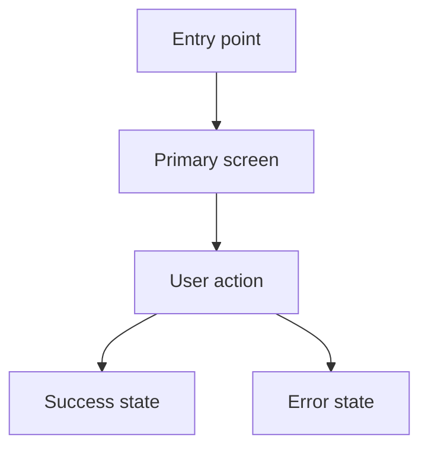
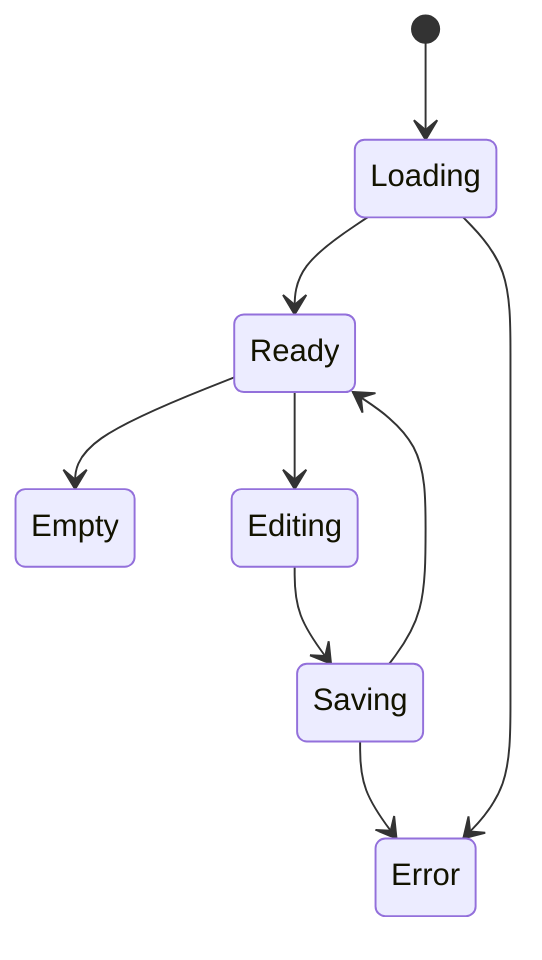
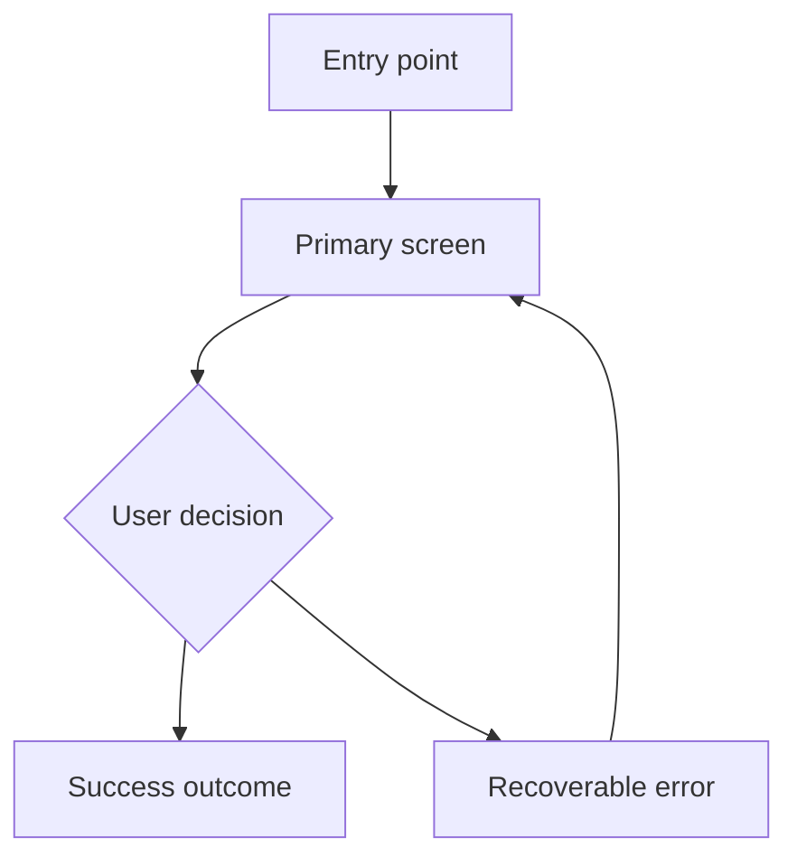
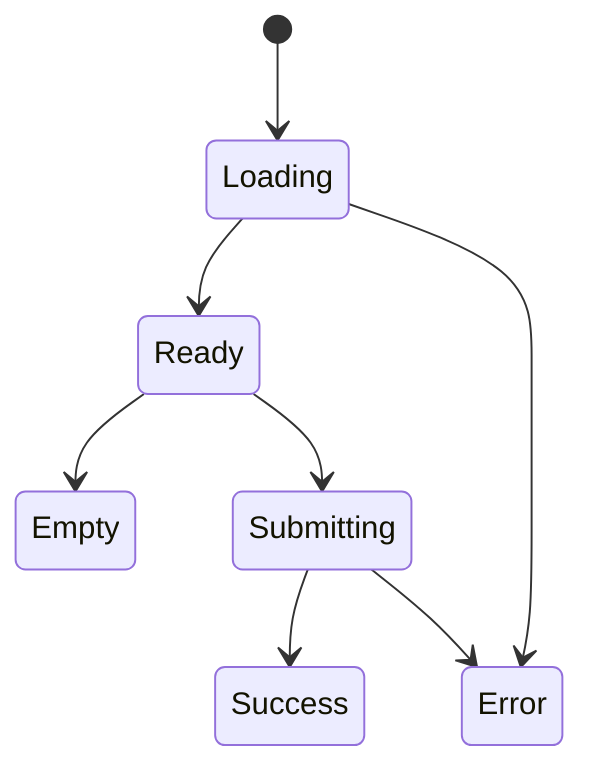
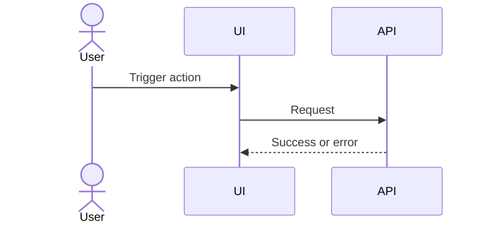

# /confirm-uiflow

> If you see unfamiliar placeholders or need to check which tools are connected, see [CONNECTORS.md](./CONNECTORS.md).

Confirm that the UI flow is implementation-ready. `UIFLOW.md` owns how the interface behaves; `DESIGN.md` owns how it looks; `design-handoff.md` translates a chosen design into engineering specs; `ui-to-codex.md` applies both contracts in code.

## Usage

```
/confirm-uiflow $ARGUMENTS
```

## Contract

Use this reference to inspect an existing `UIFLOW.md`, draft one from a feature request, or ask for the missing decisions needed before UI implementation.

Do not put visual tokens, typography scales, brand palette, component styling, or asset art direction here. Put those in `DESIGN.md` and route design-readiness checks to `confirm-design.md`.

## Required Decisions

Confirm these before coding:
- Scope: product area, page, component, route, and target platform.
- Source of truth: related `DESIGN.md`, handoff, acceptance, research, or component docs.
- Users and goals: who uses the flow and what task must complete.
- Non-goals: what this flow explicitly does not solve.
- Entry and exit points: where the flow starts, where it can end, and what success means.
- Interaction depth: `spec_only`, `static`, `interactive`, or `full_interactive`.
- Navigation: route changes, modal/drawer steps, tabs, breadcrumbs, and back behavior.
- State model: default, loading, empty, error, disabled, selected, expanded, success, and permission states.
- Data contract: real API, existing store/query, mock data, fixture, or static content.
- Validation and errors: client validation, server errors, retry paths, destructive confirmations.
- Responsive behavior: which flow changes by breakpoint or device class.
- Accessibility behavior: focus movement, keyboard shortcuts, announcements, and escape routes.
- Acceptance: the smallest observable checks that prove the flow is implemented.

## Interaction Depth

Use one of these defaults unless the user gives a clearer instruction:

| Depth | Use when | Implementation expectation |
|-------|----------|----------------------------|
| `spec_only` | The user wants planning or handoff, not code | Produce the flow contract and open questions; do not edit app code. |
| `static` | The UI is mainly visual and speed matters | Show the right screens and simple transitions; complex data side effects may use fixtures. |
| `interactive` | Most UI implementation requests | Controls, validation, navigation, and visible state transitions work. |
| `full_interactive` | The flow has async, permissions, retries, rollback, or cross-page state | End-to-end behavior, recovery paths, focus behavior, and core data behavior work. |

When the depth is unclear, ask one concise question with these four choices. Record one primary depth and a short rationale.

## Mermaid Requirements

Every substantial `UIFLOW.md` should include Mermaid only when it clarifies implementation. Prefer the minimum useful set: one main flow diagram and, when state changes matter, one state diagram.

Required for multi-step flows:



Required when states are non-trivial:



Use optional diagrams only when they answer implementation questions:
- `journey` for cross-persona or long-running user journeys.
- `sequenceDiagram` for client/API/auth handshakes.
- `flowchart` subgraphs for responsive route differences.

Do not add diagrams that only restate obvious button clicks.
Do not put pixel layout, token tables, full component APIs, CSS, implementation pseudocode, full test matrices, or exhaustive breakpoint specs in `UIFLOW.md`.

## UIFLOW.md Template

Use this template when creating or repairing `UIFLOW.md`:

````markdown
---
flow_id: feature-or-flow-id
status: draft
interaction_depth: interactive
platforms:
  - web
source_docs:
  - DESIGN.md
  - design-handoff.md
---

# UIFLOW: Feature or Screen Name

## Purpose
- Goal:
- Primary user:
- Success outcome:
- Depth rationale:

## Scope
- In scope:
- Out of scope:

## Source Of Truth
- DESIGN.md:
- Handoff:
- Acceptance:
- Research or product notes:

## Flow Map



## Screen And Component Matrix
| Node ID | Type | Route or container | Entry | Exit | Key components | Next |
|---------|------|--------------------|-------|------|----------------|------|
| main | screen | `/path` | Nav/item/deep link | Success/back/cancel | Form, table, CTA | success/error |

## Interaction Model
| Element | User action | System response | Notes |
|---------|-------------|-----------------|-------|
| Primary action | Click/tap/Enter | Validate and continue | Disable during submit |

## State Model



| State | Trigger | UI behavior | Data behavior | Recovery |
|-------|---------|-------------|---------------|----------|
| Loading | Initial fetch | Skeleton/spinner | Fetch data | Retry on error |
| Empty | No records | Empty-state copy and CTA | No rows | Create/import |
| Error | Request fails | Error message | Preserve input | Retry/cancel |

## Data And Permissions
| Need | Source | Permission | Loading | Empty | Error | Recovery |
|------|--------|------------|---------|-------|-------|----------|
| List data | API/store/mock/static | Required role | Skeleton | Empty state | Inline error | Retry |

## Responsive Flow
| Device or breakpoint | Flow difference |
|----------------------|-----------------|
| Desktop | Persistent navigation or side panel |
| Mobile | Stack steps, bottom sheet, or full-screen modal |

## Async Or Permission Sequence

Use only when async, auth, permission, retry, rollback, or cross-service behavior affects the UI.



## Accessibility Flow
- Initial focus:
- Focus after modal/drawer opens:
- Escape/back behavior:
- Keyboard submission:
- Screen reader announcements:

## Acceptance
- AC-001:
- AC-002:

## Open Questions
- Blocking:
- Non-blocking:
````

## Output

Return one of:
- `ready`: `UIFLOW.md` exists and covers the required decisions.
- `needs-update`: list exact missing sections and propose patch content.
- `blocked`: name the missing product decision that cannot be inferred safely.

## Common Mistakes

- Putting visual tokens in `UIFLOW.md`; use `DESIGN.md`.
- Hiding interaction depth in prose; record it explicitly.
- Omitting empty/error/permission states because the happy path is clear.
- Drawing a flowchart but not specifying route, data, or focus behavior.
- Treating optional async sequence diagrams as mandatory when the UI has no meaningful async or permission behavior.
